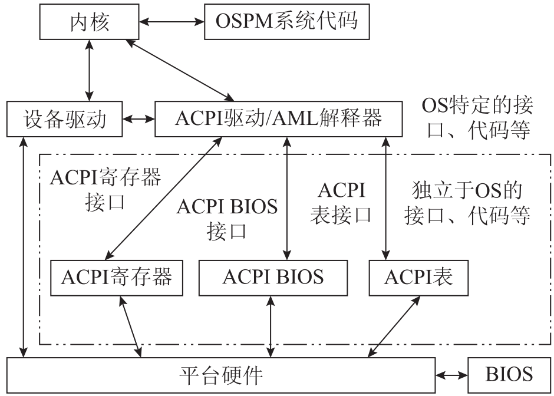

# 什么是ACPI
高级配置与电源接口（Advanced Configuration and Power Interface，ACPI）的应用已经广泛分布在计算机领略的各个细分市场

从手机、笔记本电脑、台式机到工作站和服务器上都可以找到它的身影

从体系架构上来看，不光X86阵营，ARM生态圈也加入进来。那究竟什么是ACPI,为什么要采用ACPI呢？

# 为什么会有ACPI
PC生态圈玩家众多，有OS 厂商（OSV）定期发布操作系统，如Windows，Ubuntu；芯片厂商提供CPU等，如Intel, AMD；主板厂商（OEM）提供电脑主板；扩展板提供显卡等等PCIE扩展卡；内存厂家推出一代一代不同的内存条等等

DIY玩家可以自由选择搭配合适/兼容的产品搭配出自己心仪的机器，休闲上网用户花2000多元就可以搭配出一套可用的电脑，而游戏玩家则可能花费上万元才能满足游戏配置需求。

DIY市场的存在使一个厂商（例如苹果MacBook）垂直整合整个链条成为不可能

这样，OS厂家就面临一个难题:如何能够让一个OS可以在所有这些搭配中得到一致的运行感受？

能不能抽象出一层接口，它既能用统一形式报告硬件的不同，又留给主板厂商足够的灵活性可以做出大胆的创新应用？

# ACPI诞生
在ACPI诞生前，高级电源管理(APM, Advanced Power Management）将电源管理几乎完全交给BIOS，呆板而限制很多，这让微软十分不爽，它希望在电源管理和硬件配置上能有更多的自主权，这也是合理的，谁比操作系统更懂现在用户在干什么呢？

1997年由英特尔、微软、东芝公司共同提出、制定了ACPI 1.0规范, ACPI，顾名思义，就是配置硬件和管理电源的规范

2000年8月康柏和凤凰科技加入，推出 ACPI 2.0规格, 2004年9月惠普取代康柏，推出 ACPI 3.0规格。2009年6月16日則推出 ACPI 4.0规格。2011年11月23日推出ACPI 5.0规格

由于ACPI技术正被多个操作系统和处理器架构采用，该规格的管理模式需要与时俱进。2013年10月，ACPI的推广者们一致同意将ACPI的属有归到UEFI论坛,从那以后新的ACPI规格将由UEFI论坛制定

# ACPI整体框架

可以看出它并不包含古老的PIC,CMOS，PIT等等规范，这些我们称之为Legacy支持

ACPI可以实现的功能包括
- 系统电源管理（System power management）
- 设备电源管理（Device power management）
- 处理器电源管理（Processor power management）
- 设备和处理器性能管理（Device and processor performance management）
- 配置/即插即用（Configuration/Plug and Play）
- 系统事件（System Event）
- 电池管理（Battery management）
- 温度管理（Thermal management）
- 嵌入式控制器（Embedded Controller）
- SMBus控制器（SMBus Controller）

# 参考资料
- [ACPI与UEFI](https://zhuanlan.zhihu.com/p/25893464)