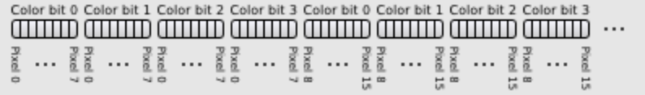
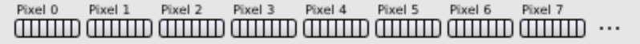
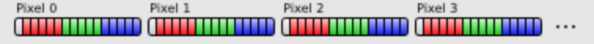
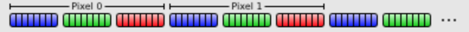
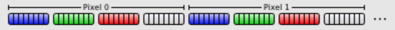

# 前言
Bochs VGA BIOS 在一定程度上支持 VBE 规范。由于 Bochs 仅模拟硬件级别的 VGA 卡（如果启用，则为 Cirrus 显卡，但这与 Bochs VBE 扩展无关），因此它模拟了 VBE BIOS 可以驱动的非常简单的图形硬件

这样做的好处是，如果您在 Bochs（或 QEMU，使用 Bochs VGA BIOS，甚至 VirtualBox）中运行操作系统，则可以使用此模拟硬件直接设置视频模式，而无需使用 VBE（这需要实模式）或 v86）。

# 概述
Bochs 仿真图形硬件（以下称为 Bochs 图形适配器(Bochs Graphics Adaptor) 为 BGA）通过两个 16 位 IO 端口访问

第一个是索引端口，第二个是数据端口（类似于 VGA 处理其寄存器组的方式）

通过这些端口，可以启用或禁用 VBE 扩展、更改屏幕分辨率和位深度以及管理更大的虚拟屏幕

BGA 有六个版本（0xB0C0 到 0xB0C5），但是如果您使用最新版本的 Bochs，您只需要关注最新版本 (0xB0C5)。

QEMU（带有 -std-vga 命令行参数）也使用最新版本

Bochs 源代码在位于子目录 iodev/ 中的 vga.h 中定义了许多对 BGA 编程有用的定义。这些定义的名称都以 VBE_DISPI 开头。它们在下面的部分中使用，它们的数值在括号之间。

# BGA 版本
随着 Bochs 的发展，BGA 也在发展。 BGA 已经存在六个版本，其中 0xB0C5 是当前版本（截至 2009 年，Bochs 版本 2.4）。每个版本的主要特点
- 0xB0C0: 设置 X 和 Y 分辨率和位深度（仅限 8 BPP），存储模式
- 0xB0C1: 虚拟宽度和高度，X 和 Y 偏移
- 0xB0C2: 5、16、24、32 BPP模式，支持线性帧缓冲，支持模式切换时保留内存内容
- 0xB0C3: 支持获取能力，支持使用8位DAC
- 0xB0C4: 显存增加到 8 MB
- 0xB0C5: VRAM 增加到 16 MB

# BGA 编程
## 写寄存器
要将索引/数据对写入 BGA 寄存器之一，首先将其索引值写入 16 位 IO 端口 VBE_DISPI_IOPORT_INDEX (0x01CE)，然后将数据值写入 16 位 IO 端口 VBE_DISPI_IOPORT_DATA (0x01CF)

BGA 支持 10 个不同的索引值（0 到 9）
- VBE_DISPI_INDEX_ID (0)
- VBE_DISPI_INDEX_XRES (1)
- VBE_DISPI_INDEX_YRES (2)
- VBE_DISPI_INDEX_BPP (3)
- VBE_DISPI_INDEX_ENABLE (4)
- VBE_DISPI_INDEX_BANK (5)
- VBE_DISPI_INDEX_VIRT_WIDTH (6)
- VBE_DISPI_INDEX_VIRT_HEIGHT (7)
- VBE_DISPI_INDEX_X_OFFSET (8)
- VBE_DISPI_INDEX_Y_OFFSET (9)

为了更改寄存器 1-3（VBE_DISPI_INDEX_XRES、VBE_DISPI_INDEX_YRES、VBE_DISPI_INDEX_BPP）的内容，必须首先禁用 VBE 扩展

为此，请将值 VBE_DISPI_DISABLED (0x00) 写入 VBE_DISPI_INDEX_ENABLE (4)

在再次启用 VBE 扩展之前，这些更改是不可见的

为此，请将值 VBE_DISPI_ENABLED (0x01) 写入同一寄存器（另请参阅下面有关启用 LFB 的注释)

## 读取寄存器
要读取寄存器，首先将索引值写入 VBE_DISPI_IOPORT_INDEX (0x01CE)，然后从 VBE_DISPI_IOPORT_DATA (0x01CF) 读取 16 位值

返回值取决于查询的特定寄存器

## 检查可用性
要检查 BGA 是否可用，请从 VBE_DISPI_INDEX_ID (0) 读取值。如果它等于 VBE_DISPI_ID5 (0xB0C5)，则存在最新版本的 BGA

如果它返回 0xB0C0 到 0xB0C3 的值，则您使用的是旧版本的 Bochs 和/或 Bochs VGA BIOS

如果出于某种原因您希望 Bochs 模拟旧版本的 BGA，您可以将所需版本写入 VBE_DISPI_INDEX_ID (0)。如果成功，再次读取寄存器将返回刚刚设置的值

Bochs VGA BIOS 使用它来确保它与正确版本的 Bochs 一起运行。如果从应用程序（或您的操作系统）完成，这将破坏与 Bochs VBE BIOS 的兼容性，后者需要最新版本。

## 设置显示分辨率和位深
最有可能的是，您只需要设置显示分辨率和位深度即可。为此，请禁用 VBE 扩展（见上文），将 X 分辨率、Y 分辨率和 BPP 写入各自的寄存器（VBE_DISPI_INDEX_XRES (1)、VBE_DISPI_INDEX_YRES (2) 和 VBE_DISPI_INDEX_BPP (3)）并启用 VBE 扩展。

由于BGA不是真正的硬件，X和Y分辨率可以随意设置为1024或1600（VBE_DISPI_MAX_XRES）的最大水平分辨率（取决于您的Bochs版本），以及768或1200（VBE_DISPI_MAX_YRES）的最大垂直分辨率。

似乎 Bochs 和 QEMU 都可以使用任何分辨率，但有一些限制。

在 QEMU 中，X 分辨率必须能被 8 整除。 [TODO：描述 Bochs 如何处理不同的 X 分辨率。它可能会在各种 X 分辨率下因分段错误而崩溃，因此很难测试]。

在 Bochs 和 QEMU 中，Y 分辨率可以是从 1 到最大值的任何数字。位深度需要是以下之一：
- VBE_DISPI_BPP_4 (0x04)
- VBE_DISPI_BPP_8 (0x08)
- VBE_DISPI_BPP_15 (0x0F)
- VBE_DISPI_BPP_16 (0x10)
- VBE_DISPI_BPP_24 (0x18)
- VBE_DISPI_BPP_32 (0x20)

如果您尝试设置无效的分辨率（大于最大或不规则的 X 分辨率）或位深度，通常什么也不会发生。当前视频模式被保留

在某些情况下，如果您设置了无效的 X 分辨率，Bochs 会因分段错误而崩溃，因此请仅使用标准分辨率。 [TODO：检查 Bochs 的最新 CVS 版本并搜索他们的错误跟踪器]。

您始终可以从各自的寄存器中读取当前分辨率和位深度。当您设置了分辨率后，最好将其读回并检查您的新分辨率是否真的设置好了

您应该在启用 BGA 之前执行此操作，以最大程度地减少仿真器崩溃的可能性。 [TODO：检查当您设置的第一个分辨率无效时会发生什么。]

## 视频模式的内存布局
在所有模式下，第一个字节代表屏幕的左上角。从像素坐标计算显存偏移的公式是：offset = (Y * X-resolution + X) * <some-factor>。因数不同，位深不同。

4 和 8 BPP 模式是调色板模式。在 VGA 文档中阅读有关对属性控制器和 DAC 调色板进行编程的更多信息。其他模式直接使用颜色值。

在 4 BPP 中，您有 16 种颜色。像素颜色用作属性控制器的索引，它再次指向 DAC，DAC 依次给出显示的 18 位颜色（红色、绿色和蓝色各 6 位）。

内存的布局是这样的：第一个字节是像素0-7的颜色位0。第二个字节是像素 0-7 的颜色位 1，依此类推。您可以使用长字（32 位）一次访问 8 个像素。



在 8 BPP 中，您有 256 种颜色。像素颜色被发送到 DAC，它给出显示的 18 位颜色。内存布局非常简单。每个像素正好是一个字节。


在 15 BPP 中，每个像素最容易作为字（16 位）访问。每个颜色分量有 5 位，最后一位被忽略。


在 16 BPP 中，每个像素最容易作为字（16 位）访问。红色和蓝色分量有 5 位，绿色分量有 6 位。这是有道理的，因为人眼对绿色更敏感


在 24 BPP 中，每个像素为 3 个字节。每个组件有一个字节。颜色分量首先是蓝色，然后是绿色，然后是红色


在 32 BPP 中，每个像素为 4 个字节，并且最容易作为长字（32 位）访问。第四个字节被忽略。颜色组件的布局类似于 24 BPP。将像素作为长字访问，颜色应定义为 0x00RRGGBB。


## 使用banked模式
使用banked模式时，BGA 使用 64Kb banked大小 (VBE_DISPI_BANK_SIZE_KB) 从地址 0xA0000 (VBE_DISPI_BANK_ADDRESS) 开始

分组模式是默认模式，因此在未明确告知 BGA 使用线性帧缓冲区的情况下启用 VBE 扩展时，BGA 启用分组模式

要设置要使用的库，请将库号写入库寄存器 (VBE_DISPI_INDEX_BANK (5))


## 使用线性帧缓冲区 (LFB)
使用线性帧缓冲区时，BGA 将所有视频内存暴露在单个线性可寻址内存部分中

帧缓冲区的地址不固定，必须从第一个 PCI 基地址寄存器（设备 0x1234:0x1111 的 BAR 0）中读取。

要启用线性帧缓冲区，请在启用 BGA 和 VBE_DISPI_ENABLED 标志时使用 VBE_DISPI_LFB_ENABLED 标志 (0x40)

与 Bochs 不同的是，QEMU 不一定会关注有关 banked memory 访问的 VBE_DISPI_LFB_ENABLED 标志，允许始终使用线性帧缓冲区和 banked memory

当线性帧缓冲区启用时，Bochs 不会接受更改内存条的请求，并且它同样会忽略对内存条进行的任何写入。

注意：在旧版本的 Bochs 和 QEMU 中，帧缓冲区固定为 0xE0000000，现代版本在模拟 ISA-only 系统时将使用该地址。对线性帧缓冲区的地址进行假设是非常不可取的。它应该总是从 BGA 的 PCI BAR0 读取。

## 清除显示内存
启用 VBE 扩展时，Bochs 会清除视频内存（即将所有字节设置为 0）。

为了防止这种情况发生，在启用 VBE 扩展时使用 VBE_DISPI_NOCLEARMEM 标志 (0x80)（因此写入 VBE_DISPI_ENABLED | VBE_DISPI_NOCLEARMEM (0x81) 用于存储模式和 VBE_DISPI_ENABLED | VBE_DISPI_LFB_ENABLED | VBE_DISPI_NOCLEARMEM (0x81) 用于 LxFB）

## 发现能力
基于 Bochs (iodev/vga.cc) 的源代码检查，在 VBE_DISPI_INDEX_ENABLE 中设置 VBE_DISPI_GETCAPS 使 VBE_DISPI_INDEX_ (XRES / YRES / BPP) 字段在读取时返回其最大值而不是当前值。

## 8 位 DAC
默认调色板 DAC 是 3x6 位 DAC；它为每种颜色返回一个 0 到 63 之间的值

在 VBE_DISPI_INDEX_ENABLE 中设置 VBE_DISPI_8BIT_DAC 位会将其更改为 3x8 位 dac 并将调色板转换为适当的值。重置位将它们再次移回。

## 虚拟显示
Bochs 适配器允许使用比物理显示器更大的虚拟显示器。

视频内存通常是你的屏幕宽度，至少和你的垂直屏幕尺寸一样高，高度。实际的显存更大，其余部分被视为垂直扩展。

将其作为水平扩展非常有用。您可以使用它来制作非常便宜的水平和垂直滚动效果。您还可以制作虚拟显示、双缓冲和许多其他想法。

使用的机制是内存是一个虚拟显示，从位置 (0,0) 开始，大小由虚拟宽度指定。高度隐含地尽可能大，因为它可以在视频内存中。假设您在 16-meg Bochs 卡上以 32-bpp 模式（每像素 4 个字节）将虚拟宽度设置为 1024。这使得垂直高度为 4096。

然后，您可以使用 X 和 Y 偏移指定视频卡应从何处开始读取内存。

处理这个的变量：
- VBE_DISPI_INDEX_VIRT_WIDTH 是虚拟宽度
- VBE_DISPI_INDEX_VIRT_HEIGHT 为虚拟高度，暂未实现
- VBE_DISPI_INDEX_X_OFFSET 是用于显示的 X 偏移量
- VBE_DISPI_INDEX_Y_OFFSET 是用于显示的 Y 偏移量

## 例子
```
void BgaWriteRegister(unsigned short IndexValue, unsigned short DataValue)
{
    outpw(VBE_DISPI_IOPORT_INDEX, IndexValue);
    outpw(VBE_DISPI_IOPORT_DATA, DataValue);
}
 
unsigned short BgaReadRegister(unsigned short IndexValue)
{
    outpw(VBE_DISPI_IOPORT_INDEX, IndexValue);
    return inpw(VBE_DISPI_IOPORT_DATA);
}
 
int BgaIsAvailable(void)
{
    return (BgaReadRegister(VBE_DISPI_INDEX_ID) == VBE_DISPI_ID4);
}
 
void BgaSetVideoMode(unsigned int Width, unsigned int Height, unsigned int BitDepth, int UseLinearFrameBuffer, int ClearVideoMemory)
{
    BgaWriteRegister(VBE_DISPI_INDEX_ENABLE, VBE_DISPI_DISABLED);
    BgaWriteRegister(VBE_DISPI_INDEX_XRES, Width);
    BgaWriteRegister(VBE_DISPI_INDEX_YRES, Height);
    BgaWriteRegister(VBE_DISPI_INDEX_BPP, BitDepth);
    BgaWriteRegister(VBE_DISPI_INDEX_ENABLE, VBE_DISPI_ENABLED |
        (UseLinearFrameBuffer ? VBE_DISPI_LFB_ENABLED : 0) |
        (ClearVideoMemory ? 0 : VBE_DISPI_NOCLEARMEM));
}
 
void BgaSetBank(unsigned short BankNumber)
{
    BgaWriteRegister(VBE_DISPI_INDEX_BANK, BankNumber);
}
```


# 参考资料
- [Bochs VBE Extensions](https://wiki.osdev.org/Bochs_VBE_Extensions)
- [VGA Hardware](https://wiki.osdev.org/VGA_Hardware)
