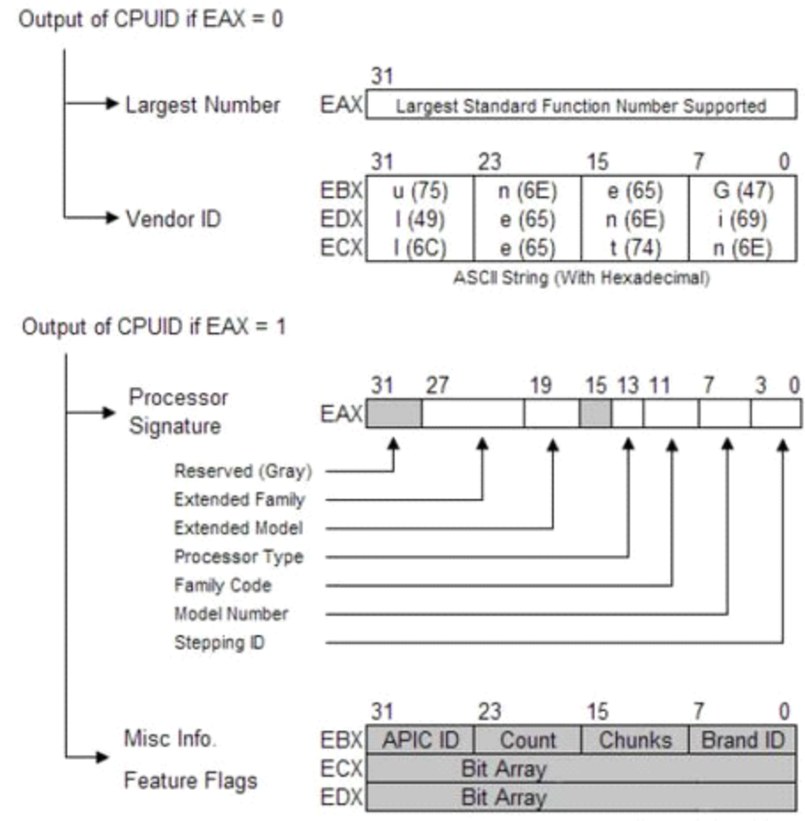
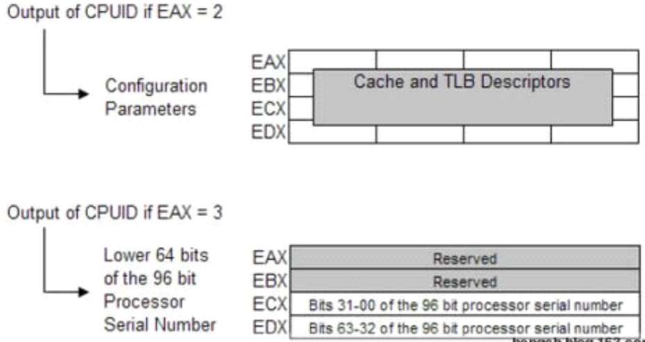
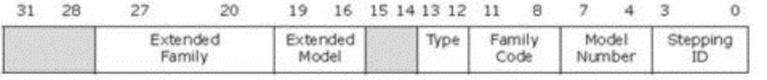
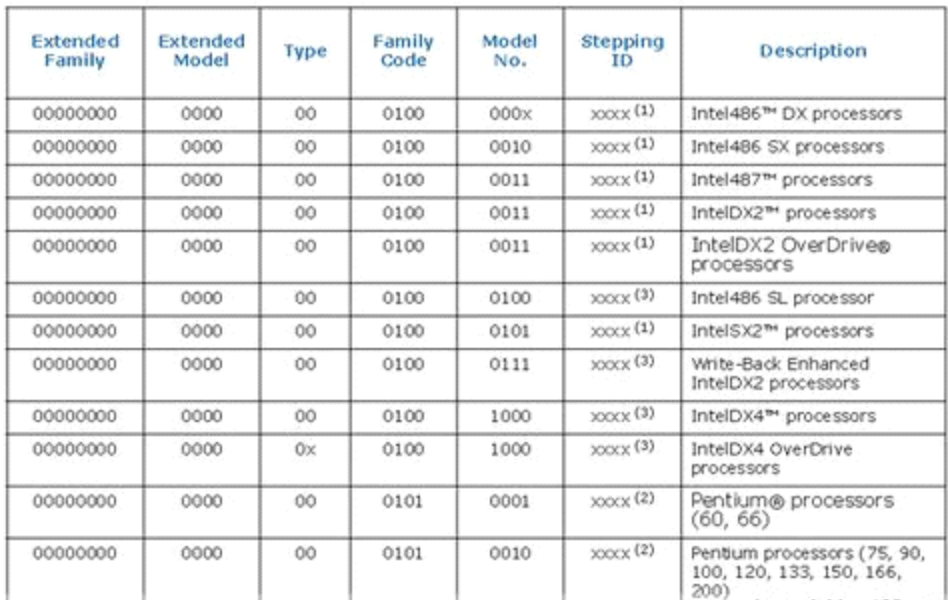

# 检测处理器是否支持cpuid指令
在eflags.ID标志位是Processor Feature Identification位，通过修改这个标志位的值，以此来检测是否支持cpuid指令

若能成功地修改eflags.ID标志位，说明cpu是支持cpuid指令的

CPUID这条指令，除了用于识别CPU(CPU型号、家族、类型等)，还可以读出CPU支持的功能(比如是否支持MMX，是否支持4MB的页等等)

CPUID 指令有两组功能，一组返回的是基本信息，另一组返回的是扩展信息

# 例子
```
  uint32_t  eax, ebx, ecx, edx;

    __asm__ (

        "cpuid"

    : "=a" (eax), "=b" (ebx), "=c" (ecx), "=d" (edx) : "a" (i) );
```
通过汇编指令cpuid，输入参数只有一个，就是cpuid指令支持的功能号，放在eax寄存器中

输出参数有四个，分别放在eax、ebx、ecx、edx中

# CPUID指令的执行方法
把功能代码放在EAX寄存器中，执行CPUID指令即可。例如
```
mov eax, 1
cpuid
```
当执行返回基本信息的CPUID指令时，EAX中功能代码的bit31为0，当执行返回扩展信息的CPUID指令时，EAX中的功能代码的bit31为1

那么不管是那组功能，如何知道EAX中的功能代码最大可以是多少？根据Intel的说明，可以用如下方法:
```
mov eax, 0
cpuid
```
执行完CPUID指令后，EAX中返回的值就是返回基本信息时，功能代码的最大值，在执行CPUID指令要求返回基本信息时，EAX中的值必须小于或等于该值

```
mov eax, 80000000h
cpuid
```
执行完CPUID指令后，EAX中返回的值就是基本信息时，功能代码的最大值，在执行CPUID指令要求返回基本信息，EAX中的值必须小于或等于该值

# 返回基本信息的功能全貌



# 输入的EAX的类型
## EAX=0：获取CPU的Vendor ID
```
mov eax, 0
cpuid
```
执行CPUID指令后，AX中返回的内容前面说过了，返回的Vendor ID固定为12个ASCII字符依次放在EBX、EDX、ECX中

对于Intel的CPU，返回的字符串永远是: GenuineIntel

## EAX=1: 处理器签名(Processor Signiture)和功能(Feature)位
```
mov eax, 1
cpuid
```
执行完成后，处理器签名放在EAX中，功能位及其它内容分别放在EBX、ECX和EDX中

处理器签名(Processor Signiture): 返回在EAX中，定义如下:
- 

图中的灰色区域表示没有定义。通过处理器签名，可以确定CPU的具体型号，以下是部分Intel CPU的处理器签名数据
- 

当处理器签名一样时的处理

有时候，从处理器签名上仍然不能识别CPU，要区别他们只能通过检查他们的高速缓存(Cache)的大小

有些情况下，从处理器签名上不能区分CPU，也可以使用Brand ID(在EBX的bit7:0返回)来区分CPU，比如Pentium III, Model 8、Pentium III Xeon, Model 8和Celeron®、Model 8三种处理器的处理器签名也是一样的，但他们的Brand ID是不同的

## EAX=2: 高速缓存描述符(Cache Descriptor)
```
mov eax, 2
cpuid
```
执行完CPUID指令后，高速缓存描述符和TLB(Translation Lookable Buffer)特性将EAX、EBX、ECX和EDX中返回，每个寄存器中的4个字节分别表示4个描述符

描述符中不同的值表示不同的含义，其中EAX中的最低8位(AL)的值表示要得到完整的

高速缓存的信息，需要执行EAX=2的CPUID指令的次数，同时，寄存器的最高位(bit 31)为0，表示该寄存器中描述符是有效的

## EAX=80000001h: 最大扩展功能号
```
mov eax, 80000001h
cpuid
```
该功能除返回CPU支持的最大扩展功能号外，并没有其他作用，EBX、ECX、EDX都不返回有意义的信息

## EAX=80000002h: 返回CPU支持的扩展功能
```
mov eax, 80000002h
cpuid
```
0 LAHF LAHF / SAHF
Reserved

## EAX=80000002h、80000003h、80000004h: 返回处理器名称/商标字符串
```
mov eax, 80000002h
cpuid

mov eax, 80000003h
cpuid

mov eax, 80000004h
cpuid
```
每次调用CPUID分别在EAX、EBX、ECX、EDX中返回16个ASCII字符，处理器名称/商标字符串最多48个字符，前导字符为空格，结束字符为NULL，在寄存器中排列顺序为little-endia(即低字符在前)

## EAX=80000006h：扩展L2高速缓存功能
```
mov eax, 80000006h
cpuid
```
执行完CPUID指令后，相应信息在ECX中返回

## EAX=80000007h：电源管理
```
mov eax, 80000007h
cpuid
```
执行CPUID指令后，是否支持电源管理功能在EDX的bit8中返回，其余位无意义

## EAX=80000008h：虚拟地址和物理地址大小
```
mov eax, 80000008h
cpuid
```
执行CPUID指令后，物理地址的大小在EAX的bit[7:0]返回，虚拟地址的大小在EAX的bit[15:8]返回，返回的内容为虚拟（物理）地址的位数

# 参考资料
- [CPUID — CPU Identification](https://www.felixcloutier.com/x86/cpuid)