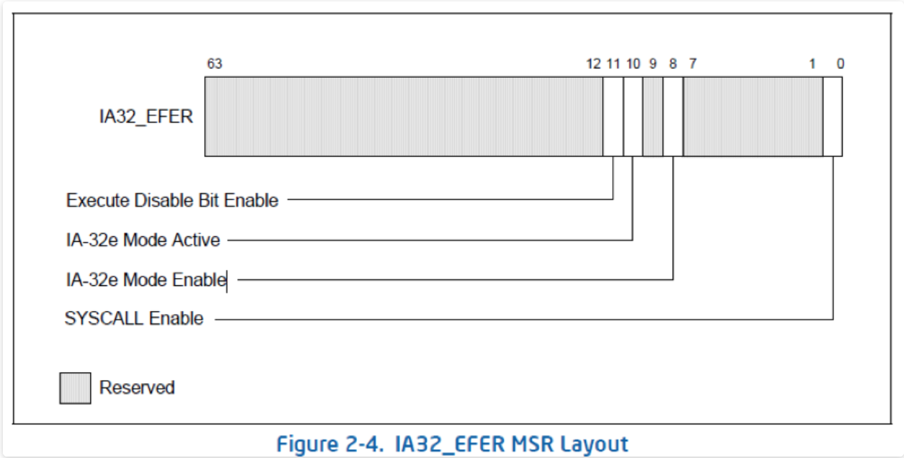
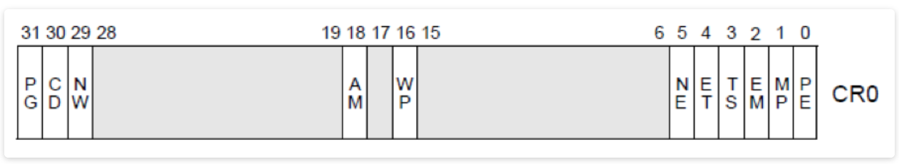
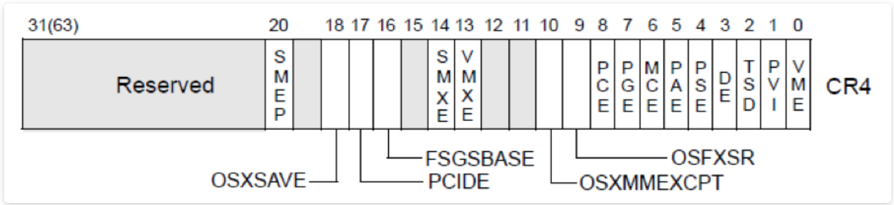

# 概述
扩展功能启用寄存器(EFER)是AMD K6处理器中添加的特定于型号的寄存器，用于启用SYSCALL/SYSRET指令，以及稍后用于进入和退出长模式

该寄存器在AMD64中成为体系结构，并已被Intel采用，其MSR编号为0xC0000080

# IA32_EFER结构

| 标志位 | 标志名 | 描述 |
| --- | --- | --- |
| 0 | SCE | 启用SYSCALL. 在64位模式下，启用SYSCALL/SYSRET指令 |
| 1-7 | 0 | 被预定 |
| 8 | LME | 启用IA-32e模式 |
| 10 | LMA | 当置1时，表示处理器处于IA-32e模式 |
| 11 | NXE | 通过阻止从设置了XD(Execute Disable)标志位PAE[2]页面读取指令，从而启用页面访问限制 |
| 12 | SVME |安全虚拟机启用  |
| 13 | LMSLE | 长模式段限制启用 |
| 15 | TCE | 翻译缓存扩展 |
| 16-63 | 0 | 被预定 |

# 长模式(long-mode IA-32e模式)如何开启
## 过程
支持的CPU: x86-64 的 CPU

启用方式(同时满足以下条件)
- 开启保护模式 CR0.PE = 1
- 开启分页机制 CR0.PG = 1
- 开启PAE CR4.PAE = 1
- IA32_EFER.LME = 1 (Long Mode Enable)
- IA32_EFER.LMA = 1 (Long Mode Active)

地址长度: 48

寻址能力: 256 TB

 ALU 宽度: 64

## CR0 和 CR4结构

基于保护模式的情况下(即CR0.PE置位时)，开启页式映射，仅需要设置CR0.PG标志位即可开启分页模式

而一旦CR0.PG该标志位置位后，将会启用三种分页映射模式中的一种，具体模式还是取决于CR4.PAE和IA32_EFER.LME的设置

根据不同的标志位设置，可以其中分成以下三种
- 32-bit 分页模式: CR0.PG置位，CR4.PAE清零的情况
- PAE分页模式: CR0.PG 和 CR4.PAE置位，而IA32_EFER.LME清零的情况
- IA-32e分页模式: CR0.PG、CR4.PAE、IA32_EFER.LME一同置位

# 参考资料
- [CPU Registers x86-64](https://wiki.osdev.org/CPU_Registers_x86-64#IA32_EFER)
- [IA-32汇编语言笔记（2）—— IA32处理器及其寄存器](https://blog.csdn.net/wxc971231/article/details/101582551)
- [【Linux内存源码分析】X86内存映射小结（2）](https://www.jeanleo.com/2018/09/05/182/)
- [Intel 64/x86_64/x86/IA-32处理器操作模式/运行模式](https://blog.csdn.net/qq_43401808/article/details/86472036)
- [x86 系列 CPU 内存寻址模式总结](http://www.adintr.com/article/blog/298)