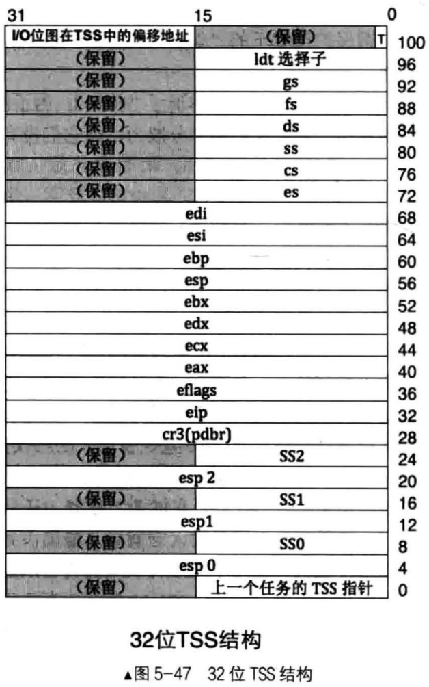
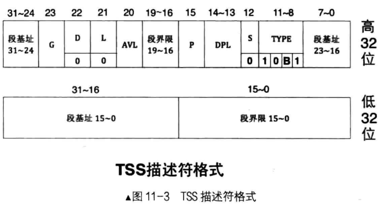
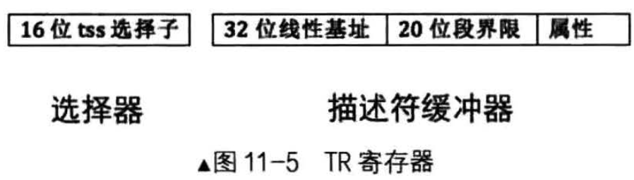
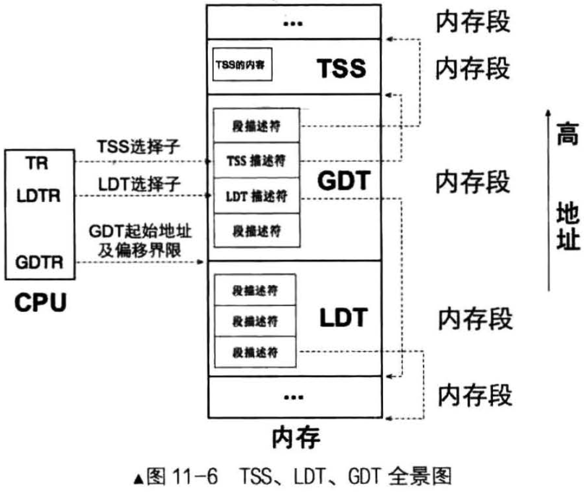

# 概述
`TSS，即Task State Segment, 意为任务状态段`，它是处理器在硬件上原生支持多任务的一种实现方式，也就是说处理器原本是想让操作系统开发厂商利用此结构实现多任务的

TSS 是一种数据结构，它用于存储任务的环境

TSS 是每个任务都有的结构，它用于一个任务的标识，相当于任务的身份证，程序拥有此结构才能运行，这是处理器硬件上用于任务管理的系统结构，处理器能够识别其中每一个字段

该结构看上去也有点复杂，里面众多寄存器都囊括这104字节，其中这104字节只是TSS的最小尺寸，根据需要还可以再接上个IO位图

# 任务与TSS
## 任务的特权级别与栈
任务是由处理器执行的，任务在特权级变换时，本质上是处理器的当前特权级别在变换，由一个特权级变成另外一个特权级

处理器固定，处理器在不同特权级下，应该用不同特权级的栈，原因是如果在同一栈中容纳所有特权级的数据时，这种交叉引用会使栈变得非常混乱，并且，用一个栈容纳多个特权级下的数据，栈容量有限
- 例子，处理器位于0特权级时要用0特权级别的栈，3特权级下也只能用3特权级别下的

每个任务的每个特权级下只能由一个栈，不存在一个任务的某个特权级下存在多个同特权级栈的情况
- 也就是说，一共4个特权级，一个任务"最多"有4个栈

既然一个TSS代表一个任务，每个任务又有4个栈，那么为什么TSS中只有3个栈: ss0和esp0、ss1和esp1、ss2和esp2?
- 它们分别代表0级栈的段选择子和偏移量、1级栈的段选择子和偏移量、2级栈的段选择子和偏移量

## TSS中记录的3个栈是干嘛的？
特权级转移分为两类
- 一类是由中断门、调用门等手段实现低特权级转向高特权级
- 另一类则相反，是由调用返回指令从高特权级别返回到低特权级别，这是唯一一种能让处理器降低特权级的情况

### 特权级由低到高的情况
对于第1种 - 特权级由低到高的情况，由于不知道目标特权级对应的栈地址在哪里，所有要提前把目标栈的地址记录在某个地方

当处理器向高特权级转移再从中取出来加载到SS和ESP中以更新栈，这个保存的地方就是TSS，处理器会自动从TSS中找到对应的高特权级栈地址

也就是说，除了调用返回外，处理器只能由低特权级向高特权级转移，TSS中所记录的栈是转移后的高特权级目标栈，所以它一定比当前使用的栈，所以它一定比当前使用的栈特权级要高，只用于向更高特权级别转移时提供相应特权的栈地址

进一步说，TSS中不需要记录3特权级的栈，因为3特权级是最低的，没有更低的特权级会向它转移

不是每个任务都有4个栈，一个任务可拥有的栈数量取决于当前特权级是否还有进一步提高的的可能，即取决于它最低的特权级别
- 比如3特权级的程序，它是最低的特权级，还能提升3级，所有可额外拥有2、1、0特权级栈，用于将特权级分别转移到2、1、0级时使用
- 2特权级别的程序，它还可以提升2级，所以额外拥有1、0特权级栈，用于将特权级分别转移到1、0级时使用
- 1特权级的程序，它可以额外拥有0特权级栈
- 0特权级已经是至高无上，只有一个0级栈

以上所说的低特权级转向高特权级的过程称为`向内层转移`

### 高特权返回低特权级别的情况
对于第2种 - 由高特权返回到低特权级的情况，处理器是不需要在TSS中去寻找低特权级别目标栈的

因为，TSS中只记录2、1、0特权级的栈，假如是从2特权级返回到3特权级，上哪找3特权级？另一方面的原因是低特权级栈的地址其实已经存在了，这是由处理器的向高特权级转移指令(如int、call等)实现的机制决定的，换句话说，处理器知道去哪里找低特权级的目标栈

由于特权级向低转移后，处理器特权级有了变化，同样也需要将当前栈更新为低特权级别的栈，它如何找到对应的低特权级别的栈？
- 正常情况下，特权级由低向高转移在先，由高向低返回在后，即只有先向更高特权级转移，才能谈得上再从高特权级回到低特权级，否则没有“去”就谈不上“回”
- 当处理器由低向高特权级转移时，它自动地把当时低特权级的战地址(SS 和 ESP)压入了转移后的高特权级所在的栈中。所以，当用返回指令如 retf 或iret 从高特权级向低特权级返回时，处理器可以从当前使用的高特权级的战中获取低特权级的钱段选择子及偏移量
- 由高特权级返回低特权级的过程称为“向外层转移”

当下次处理器再进入高特权级时，它依然会在TSS中寻找对应的高特权级栈，而TSS中栈指针都是固定的，每次进入高特权级都会重复使用它们

也就是说，即使曾经转移到高特权级下用过高特权级栈，处理器也不会自动把该高特权级栈指针更新到TSS中，因为在从高特权级返回时，处理器需要把栈更新为低特权级的栈选择子及esp指针

而原先在段寄存器SS和寄存器esp中高特权级下的战段选择子及指针会被处理器自动丢弃。换句话说，如果想保留上一次高特权级的栈指针，得手动更新 TSS 中相应栈的数据。

### 处理器是怎样找到TSS?
TSS 是硬件支持的系统数据结构，它和 GDT 等一样，由软件填写其内容，由硬件使用

GDT 也要加载到寄存器 GDTR 中才能被处理器找到， TSS 也是一样，它是由 TR ( Task Register ）寄存器加载的，每次处理器执行不同任务时，将 TR 寄存器加载不同任务的 TSS 就成了

# TSS的作用
## 背景
单核CPU要想实现多任务，唯一方案就是多个任务共享同一个CPU，也就是只能让CPU在多个任务间轮转，让任务轮转CPU

CPU执行任务时，需要把任务运行所需要的数据加载到寄存器、栈和内存中，因为内存只能直接处理这些资源的数据，这是CPU在设计的时候工程师决定的

问题来了，任务的数据和指令是CPU的处理对象，任务的执行要占用一套存储资源，如寄存器和内存，这些资源装的是任务的数据和指令，它们属于CPU的大餐，但CPU很不情愿直接用内存这个低速的、不方便的容器就餐，它最喜欢的容器是寄存器，因为它的速度和CPU很般配

因此内存中的数据往往被加载到高速的寄存器后再处理，处理完成后，再将结果写回到低速的内存中。所以，任何时候，寄存器中的内容才是任务的最新状态

采取轮流使用CPU的方式运行多任务，当前任务在被换下CPU时，任务的最新状态，也就是寄存器中的内容应该找个地方保存起来，以便下次重新将此任务调度到CPU上时可以恢复此任务的最新状态

Intel的建议就是给每个任务“关联”，一个任务状态段，这就是`TSS(Task State Segment)`,用它来表示任务

## TSS的关联
之所以称为“关联”，是因为TSS是由程序员`“提供”`的，由CPU来`“维护”`

“提供”就是指TSS是程序员为任务单独定义的一个结构体变量

“维护”是指CPU自动用此结构体变量保存任务的状态(任务的上下文、寄存器组的值)和自动从此结构体变量中载入任务的状态

当加载新任务的时，CPU自动把当前任务（旧任务）的状态存入当前任务的TSS，然后将新任务TSS中的数据载入对应的寄存器中，这就实现了任务的切换

TSS就是任务的代表，CPU用不同的TSS区分不同的任务，`因此任务切换的本质就是TSS的切换`

## CPU如何知道TSS换了？
CPU中有一个专门存储TSS信息的寄存器，就是TR寄存器，它始终指向当前正在运行的任务。因此任务的切换就是TR寄存器指向不同的TS寄存器

总结
- 在CPU视角中，每个任务关联一个TSS，因此每个任务都必须有单独的TSS，所以TSS就是任务的代表
- 在人的视角中，任务切换就是让CPU执行不同任务的代码段中的指令，说白了就是让CPU的CS:[e]ip指向不同的代码，即使是所有任务共享一个TSS也无所谓，这是Linux的做法

## TSS描述符

### TSS 属性说明
TSS和其他段一样，本质上是一片存储数据的内存区域，Intel打算用这片内存区域保存任务的最新状态(也就是任务运行时占用的寄存器组)

TSS描述符也要在GDT中注册，才能找到它

TSS描述符属于系统段描述符，因此S为0，在S为0的情况下，TYPE的值为10B1。B表示busy位，B位为0时，表示任务不繁忙，B位为1时，表示任务繁忙

### 什么是任务繁忙？
任务繁忙有两方面的含义？一方面就是指此任务是否位当前正在CPU上运行的任务。另一方面是指此任务嵌套调用了新的任务，CPU正在执行新任务，此任务暂时被挂起，等新任务执行完成后CPU会回到此任务继续执行，所以此任务马上就会被调度执行

这种有嵌套调用关系的任务数不只两个，可以很多，比如任务A调用了任务A.1，任务A.1又调用了任务呢A.1.1等，此维护这种嵌套调用关联，CPU把新任务TSS中的B位置1

并且在新任务的TSS中保存了上一级旧任务的TSS指针(还要把新任务标志寄存器eflags中NT位的值置为1)，新老任务的调用关系形成了调用关系链

当任务被创建时，此时尚未上CPU执行，因此，此时的B位为0，TYPE的值为1001。当任务开始上CPU执行时，处理器自动地把B位置为1，此时TYPE的值为1011

当任务被换下CPU时，处理器把B位置0.注意，B位是由CPU来维护的，不需要人工干预

### B位的不可重入
B位的存在不是单纯表示任务忙不忙，而是为了给当前任务打个标记，目的是避免当前任务调用自己，也就是说`任务是不可重入的`

`不可重入`的意思是当前任务只能调用其他任务，不能自己调用自己
- 原因是如果任务可以自我调用的话就混乱了，由于旧任务和新任务是同一个，首先CPU进行任务状态保护时，在同一个TSS中保存后再载入，这将导致严重错误
- 其次，旧任务在调用新任务时，新任务执行完成后，为了能够回到旧任务，在调用新任务之初，CPU会自动把老任务的TSS选择子写入到新任务TSS中的"上一个任务的TSS指针"字段中，此指针形成了一个任务嵌套调用链，CPU是靠此指针形成的链表来维护任务调用链的
- 如果任何重入的话，此链则被破坏

为了避免这种情况的发生，CPU利用B位来判断调用的任务是否是当前任务。若被调用任务的B位为1，这就表示当前任务自己调用自己。因此，B位主要是用来给CPU做重入判断用的

并不是只有当前任务的 B 位才为 1 ，那些被当前任务通过 call 指令嵌套调用的新任务，除了其TSS 的 B 位会被置为 1 以外，老任务 TSS 的 B 位不会被清 0，而是继续保持为 1

因为 call 指令是“有去有回”的指令，它执行新任务后还需要再回来，新任务属于当前任务（老任务）的分支。老任务由于未执行完，相当于被自己调用的新任务中断了，因此原任务 TSS 中的 B 位依然保持为 1 ，并不会被置为 0 

嵌套任务调用的情况还会影响 eflags 寄存器中的 NT 位，这表示任务嵌套（ Nest Tast)

## TR 寄存器

TSS 是 CPU 原生支持的数据结构，因此 CPU 能够直接、正确识别其中的所有宇段。当任务被换下CPU 时， CPU 会自动将当前寄存器中的值存储到 TSS 中的对应位置，当有新任务上 CPU 运行时， CPU 会自动从新任务的 TSS 中找到相应的寄存器值加载到对应的寄存器中。

每个任务都有自己的 TSS 结构，而 TSS 是个内存区域， CPU 是怎么知道它在哪里的呢？
- 和 LDT 一样， CPU 对 TSS 的处理也采取了类似的方式，它提供了一个寄存器来存储 TSS 的起始地址及偏移大小
- 这个寄存器叫  TR (Task Register)

TSS是通过选择子来访问的，将tss加载到寄存器TR的指令是ltr，其命令格式为
- ltr "16位通用寄存器" 或 "16位内存单元"

## TSS、LDT 、GDT的关系
### 总结
不管操作数是寄存器，还是内存，其值必须是描述符在 GDT 中的选择子

有了 TSS 后，任务在被换下 CPU 时，由 CPU 自动地把当前任务的资源状态（所有寄存器、必要的内存结构，如栈等）保存到该任务对应的 TSS 中（由寄存器 TR 指定〉。

CPU 通过新任务的 TSS 选择子加载新任务时，会把该 TSS 中的数据载入到 CPU 的寄存器中，同时用此 TSS 描述符更新寄存器 TR

总结一下：`TSS 由用户提供，由CPU自动维护`

### 具体流程

TSS 与其他普通段一样，也有自己的描述符，即TSS 描述符，用它来描述一个 TSS 的信息，此描述符需要定义在 GDT 中

寄存器 TR 始终指向当前任务的 TSS

任务切换就是改变 TR 的指向， CPU 自动将当前寄存器组的值（快照）写入 TR 指向的 TSS ，同时 将新任务 TSS 中的各寄存器的值载入 CPU 中对应的寄存器，从而实现了任务切换

TSS 和 LDT 都只能且必须在 GDT 中注册描述符，TR 寄存器中存储的是 TSS 的选择子， LDTR 寄存器中存储的是 LDT 的选择子

GDTR 寄存器中存储的是 GDT 的起始地址及界限偏移（大小减 I ），下面把 TSS 和 LDT 的全景图给大伙儿呈上，`如图 11-6 所示`