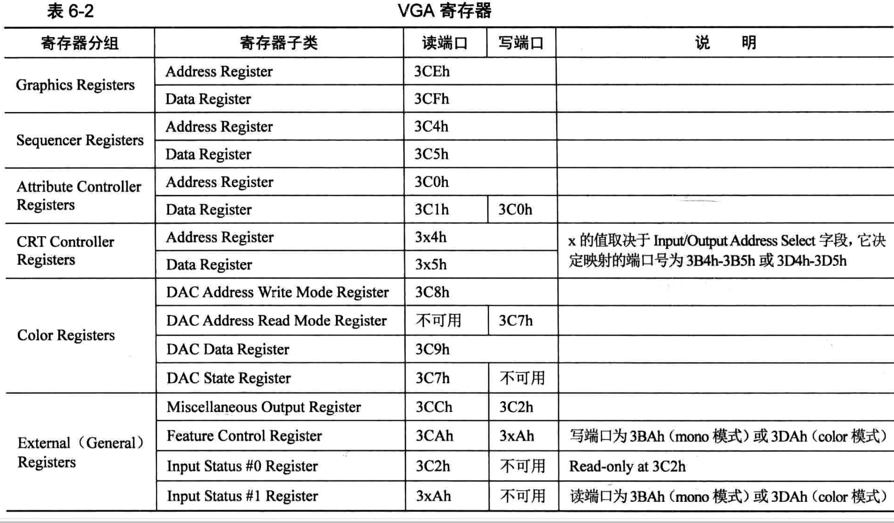

# VGA寄存器图例


## Address Register 和 Data Register这个两个寄存器是干嘛的?
端口实际上就是IO接口电路上的寄存器，为了能访问到这些CPU外部的寄存器，计算机系统为这些寄存器统一编址，一个寄存器被赋予一个地址

这些地址可不是我们所说的内存地址，内存地址是用来访问内存用的，其访问取决于地址总线的宽度，而寄存器的地址范围是0~65535(Intel 系统)

这些地址是我们所说的端口号，用专门的IO指令in和out来读写这些寄存器

如果一个寄存器就要占用一个系统端口的话，那么这63336个地址可就捉襟见肘

所以，每个寄存器分组视为一个寄存器数组，提供一个寄存器用于指定数据下标，再提供一个寄存器用于对索引所指向的数组元素(也就是寄存器)进入输入输出操作

这样用这两个寄存器就能够定位寄存器中的任何寄存器了，这两个寄存器就是各种中的Address Register 和 Data Register

Address Register作为数组的索引(下标)，Data Register作为寄存器数组中该索引对应的寄存器，它相当于所对应的寄存器的窗口，往此窗口读写的数据作用在索引对应的寄存器上

所以，对这类分组的寄存器操作方法是先在Address Register 中指定寄存器的索引值，用来确定所操作的寄存器是哪个，然后在Data Register 寄存器中对所索引的寄存器进行读写操作

# 例子
```
 ;;;   获得当前光标位置 ;;;;
    ; 先获得高8位
    mov dx, 0x03d4              ; 索引寄存器
    mov al, 0x0e                ; 用于提供光标位置的高8位
    out dx, al
    mov dx, 0x03d5              ; 通过读写数据端口0x3d5来获得或设置光标位置
    in al, dx                   ; 得到了光标位置的高8位
    mov ah, al

    ; 再获取低8位
    mov dx, 0x03d4
    mov al, 0x0f
    out dx, al
    mov dx, 0x03d5
    int al, dx

    ; 将光标存入bx
    mov bx, ax
```
CRT Controller Data Registers 中索引为`0Eh`的Cursor Location High Register寄存器的索引为`0Fh`的Cursor Location Low Register寄存器，这两个寄存器都是8位长度，分别用来存储光标坐标的低8位和高8位地址

访问CRT controller 寄存器组的寄存器，需要先往端口地址为0x3D4的Address Register 寄存器中写入寄存器的索引，再从端口地址为0x3D5的Data Register寄存器读、写数据