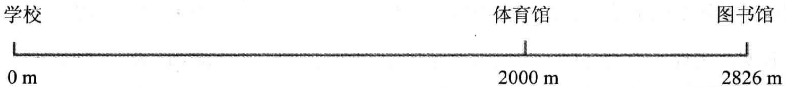
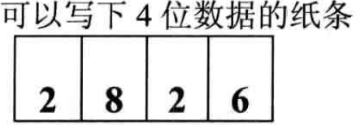
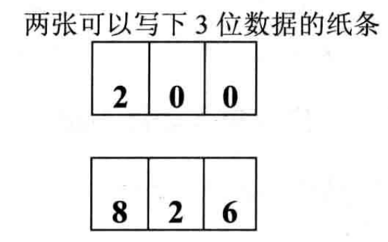
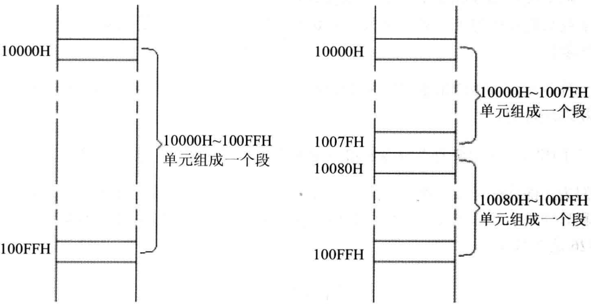

# 概述
- CPU访问内存时，用一个基础地址(段地址 * 16)和一个相对于基础地址的偏移地址的偏移地址相加，给出内存单元的物理地址
- 更一般地说，8086CPU的这种寻址功能是`基础地址 + 偏移地址 = 物理地址`寻址模式的一种具体实现方案
- 8086CPU中，段地址 * 16可看作是基础地址

# 例子
## "基础地址 + 偏移地址 = 物理地址"
- 
- 比如说，学校、体育馆、图书馆同在一条笔直的单行路上,学校位于路的起点(从路的起点到学校距离是0米)
- 你要去图书馆，问我哪里的地址，我可以用两种方式告诉你图书馆的地址
    - (1) 从学校走2826m到图书馆。这2826m可认为是图书馆的物理地址
    - (2) 从学校走2000m到体育馆，从体育馆再走826m到图书馆。第一个距离2000m，是相对于起点的基础地址，第二个距离826m是想关于基础地址的偏移地址(以基础地址为起点的地址)

## "段地址* 16 + 偏移地址 = 物理地址"
- 通过纸条进行通信，询问图书馆的地址
- 显然，必须有一张可以容纳4位数据的纸条，才能写下2826这个数据
    - 
- 可不巧的是，没有容纳4位数据的纸条，仅有两张可以容纳3位数据的纸条
    - 
- 在第一张纸上写上200(段地址)，在第二张纸上写上826(偏移地址)
- 假设事前对这种情况又有过相关的约定：你得到这两张纸后，做这样的运算: 200(段地址) * 10+826(偏移地址)=2826(物理地址)
- 8086CPU就是这样一个只能提供两张3位数据纸条的CPU
    
- 例子1
    - 由于8086CPU用"基础地址(段地址 * 16) + 偏移地址 = 物理地址"的方式给出内存单元的物理地址，使得我们可以用分段的方式来管理内存
    - 
    - 从上图看来，我们可以认为: 地址10000～100FFH的内存单元组成一个段，该段的起始地址(基础地址)为10000H, 段地址为1000H,大小为100H
    - 我们也可以认为地址10000H ~ 1007FH、10080H ~ 100FFH的内存单元组成两个段，它们的起始地址(基础地址)为: 10000H 和 10080H, 段地址为: 1000H 和 1008H，大小都为80H
- 例子2
    - 如果给定一个段地址，仅通过变化偏移地址进行寻址，最多可定位多少个内存单元？
    - 偏移地址16位([2 ^ 16] - 1 ),变化范围为0～FFFFH,仅用偏移地址来寻址最多可寻64KB个内存单元
    - 比如给定段地址1000H，用偏移地址寻址, CPU的寻址范围为: 10000H ~ 1FFFFH

# 小结
## 段地址在8086CPU的段寄存器中存放
- 当8086CPU要访问内存时，由段寄存器提供内存单元的段地址
- 8086CPU有4个段寄存器，其中CS用来存放指令的段地址

## CS存放指令的段地址，IP存放指令的偏移地址
- 8086机中，任意时刻，CPU将CS:IP指向的内容当作指令执行

## 8086CPU工作过程
- 1⃣️从CS:IP指向的内存单元读取指令，读取的指令进入指令缓冲器
- 2⃣️IP指向下一条指令
- 3⃣️执行指令(转向步骤1⃣️，重复这个过程)