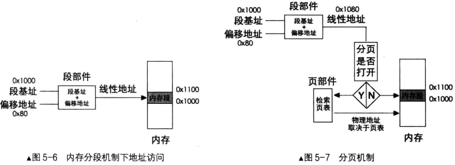
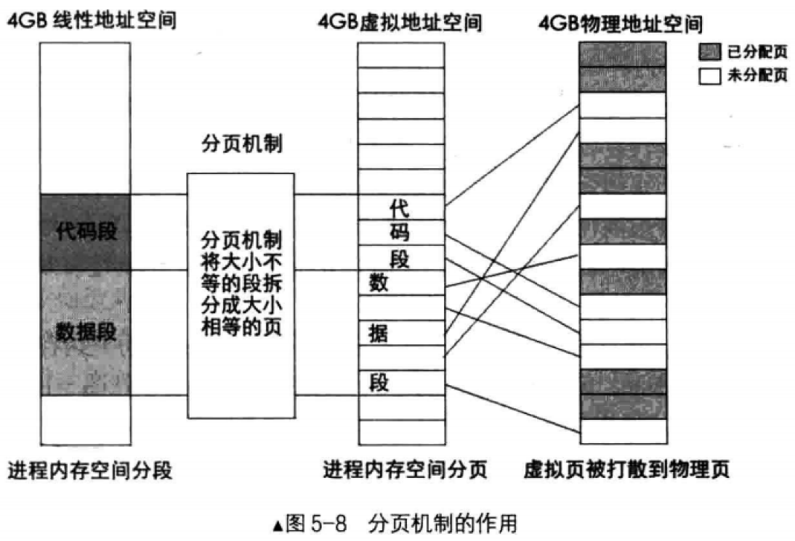
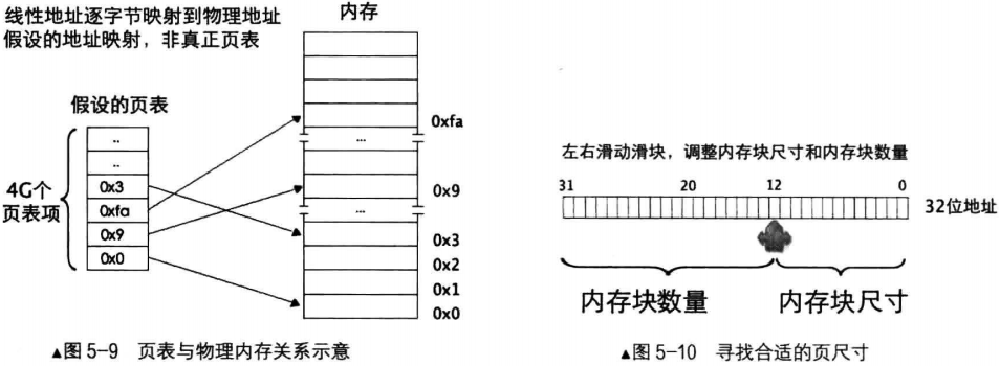
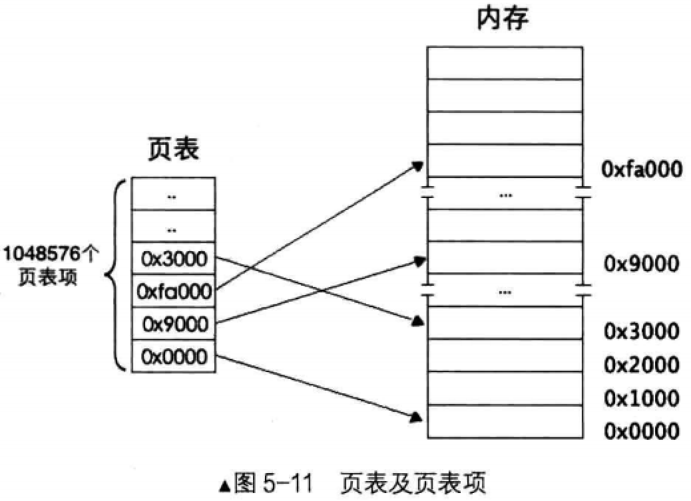
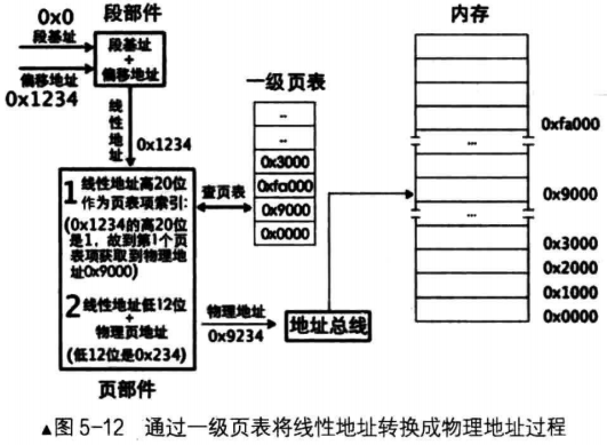

# 线性地址

## 分段模式下的线性地址
在保护模式中段寄存器中的内容已经是选择子，但选择子最终就是为了要找到段基址，其内存访问的核心机制依然是"段基址 + 段内偏移地址"，这两个地址相加之后才是绝对地址，也就是`线性地址`

此线性地址在分段机制下被CPU认为是物理地址，直接能拿来使用，也就是说，此线性地址可以直接送上地址总线

将段基址和段内偏移地址相加求和的工作是由CPU的段部件自动完成的。如`图5-6`所示

## 分页模式下的线性地址
`图5-7`说明，CPU在不打开分页机制的情况下，是按照默认的分段方式进行的，段基址和段内偏移地址经过段部件处理后输出线性地址，CPU就认为是物理地址

如果打开了分页机制，段部件输出的线性地址就不等同物理地址，被称之为`虚拟地址`。它是逻辑上的，是假的

# 分页机制的作用
## 作用简述
将线性地址转换成物理地址

用大小相等的页代替大小不等的段

## 过程

上图表示的一个进程地址转换过程，从线性空间到虚拟地址再到物理地址空间，每个空间大小都是4GB

4GB的物理地址空间属于所有进程包括操作系统在内的共享资源，其中标注为已分配页的内存块被分配给其他进程，当前进程只能使用未分配页

此转换过程对任意一个进程都是一样的，也就是说，每个进程都有自己的4GB虚拟空间

分页机制建立在分段机制之上，与其脱离不了干系，即使在分页机制下的进程也要经过逻辑上的分段才行，每个加载一个进程，操作系统按照进程中各段的起始范围，在进程自己的4GB虚拟地址空间寻找可用空间分配内存段

此虚拟地址空间可以是页表，也可以是操作系统维护的某种数据结构，总之此阶段的分配是逻辑上的，并没有写入物理内存

在分页机制下，代码段和数据段在逻辑上被拆分成以页为单位的小内存块。这时的虚拟地址虚如其名，不能存放任何数据。接着操作系统开始为这些虚拟内存分页真实物理内存，它查找物理内存中可以用的页，然后在页表中登记这些物理地址，这样就完成了虚拟页到物理页的映射，每个进程都以为自己独享4GB地址空间

# 页
## 内存块数 与 内存块大小

32位地址表示4GB空间，可以将32位地址分成高低两部分，低地址部分是内存块大小，高地址部分是内存块数量，它们是这样一种关系
- 内存块数 * 内存块大小 = 4GB

`图5-10`所示的32位地址上滑动滑块找到合适的内存块尺寸。滑块右边是内存块大小，滑块左边是内存块数量

为了节省页表空间，势必要将滑块往左调整，以使内存块尺寸变大，这样内存块数量变小，从而减少了页表项数量
- 如果滑块指向第20块，内存块大小为2的20次方，即1MB，内存块数量为2的12次方，即4K
- 或滑块指向第12位，内存块大小则为2的12次方，即4KB，内存块数量则为2的20次方，1M,即1048576个
- 这里说的内存块，其官方名称是页，CPU中采用的页大小恰恰就是4KB

## 页表模型
### 计量单位
页是地址空间的计量单位，并不是专属物理地址或线性地址，只要是4KB的地址空间都可以称为一页，所以线性地址的一页也要对应物理地址的一页

一页大小为4KB，这样一来，4GB地址空间被划分为4GB/4KM=1M个页，也就是4GB空间中可以容纳1048576个页

### 一级页表

- 由于页大小是4KB，所以页表项中的物理地址都是4k的整数倍，故用十六进制表示的地址，低3位都是0
- 就拿第3个页表项，其值为0x3000,表示该页对应的物理地址是0x3000

用`图5-10`帮助理解，滑块正落在32位地址的第12位。右边第11 ～ 0位用来表示页的大小，也就是这12位可以作为页内寻址
- 左边第 31 ~ 12位用来表示页的数量
- 同样这20位也用来索引一个页(索引范围0 ~ 0xffff)，表示第几个页

其实也可以这样理解
- 任意一个地址最终会落到某一个物理页中
- 32位地址空间共有1M(1048756)个物理页，首先要做的是定位到某个具体物理页，然后给出物理页内的偏移量就可以访问到任意1字节的内存
- 所以，用20位二进制就可以表示全部物理页，标准页都是4KB，12位二进制便可以表达4KB之内的任意地址

其实就是，虚拟地址的高20位可用来定位一个物理页，低12位可用来在物理页内寻址

### 虚拟地址转化为物理地址
#### 前提
分页机制打开前要将页表地址加载到控制寄存器cr3中，这是启用分页机制的先决条件之一

虽然内存分页机制的作用是将虚拟地址转换成物理地址，但其转换过程相当于在关闭分页机制下进行，过程中所涉及的页表及页表项的寻址，它们的地址都被CPU当作最终的物理地址(本来也是物理地址)直接送上地址总线，不会被分页机制再次转换(否则会递归转换下去)

#### 地址转换过程原理(页部件)
一个页表项对应一个页，所以，用线性地址的高20位作为页表项，每个页表项要占用4字节大小，所以这高20位的索引乘以4后才是该页表项相对于页表物理地址的字节偏移量

用cr3寄存器中的页表物理地址加上偏移量便是该页表的物理地址，从该页表项中得到映射的物理页地址，然后用线性地址的低12位与该物理页地址相加，所得的地址之和便是最终要访问的物理地址

#### 例子

- 例子: mov ax, [0x1234]

假设是在平坦模型下工作，不管段选择子值是多少，其所指向的段基址都是0，指令mov ax, [0x1234]中的0x1234称为有效地址，它作为"段基址 + 段内偏移地址"中的段内偏移地址

这样段基址为0，段内偏移地址为0x1234，经过段部件处理后，输出的线性地址是0x1234

图中启用了分页机制，所以线性地址0x1234被送入了页部件

页部件分析0x1234的高20位，用16进制表示高20是0x00001
- 将此项作为页表项索引，再将索引乘以4后加上cr3寄存器中页表的物理地址，这样便得到索引所指代的页表项的物理地址
- 这样便得到索引所指代的页表项的物理地址，从该物理地址处(页表项中)读取所映射的`物理页地址`:0x9000

线性地址的低12位是0x234，它作为物理页的页内偏移地址与物理页地址0x9000相加，和为0x9234，这就是线性地址0x1234最终转换成的物理地址

