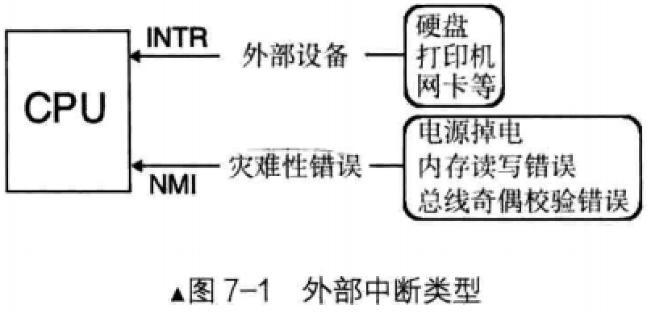
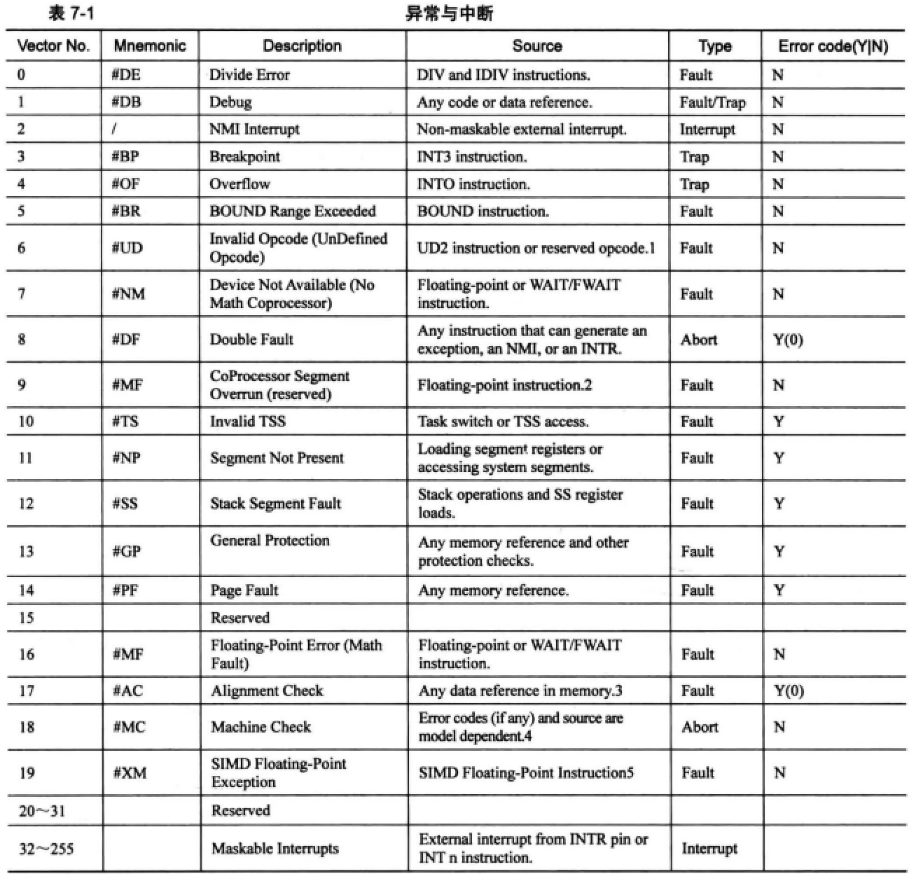

# 外部中断
## 概述
外部中断是指来自CPU外部的中断，而外部的中断源必须是某个硬件，所以外部中断又被称为`硬件中断`
- 比如，网卡收到了来自网络的数据包，这时网卡就会主动通知CPU，CPU得到通知后便将数据拷贝到内核缓冲区

## INTR 和 NMI

为了让CPU获得每个外部设备的中断信号，最好的方式是在CPU中为每个外设准备一个引脚接收中断，但这是不可能的，计算机中挂了很多外部设备，而且理论上外设数量是没有上限的，无论CPU中准备多少引脚都不够用

CPU提供了两条信号线。外部硬件的中断是通过两根信号线通知CPU的，这两根信号线就是`INTR(Interupt)和NMI(Non Maskable Interrupt)`

在CPU上运行的程序都是串行的，所有任务，包括中断处理程序都是一个接一个在CPU上运行的，所有任务都共享同一个CPU，CPU在各个任务间不断切换才实现了并发

既然是串行，也就是每次CPU只能处理一个任务，何必整两根中断信号线？
- 从INTR引脚收到的中断都是不影响系统运行的，可以随机处理，甚至CPU可以不处理
- 从NMI引脚收到的中断都是硬伤，CPU都没有运行下去的必要了

## 可屏蔽中断
可屏蔽中断是通过INTR引脚进入CPU的，外部设备如硬盘、网卡等发出的中断都是可屏蔽中断

可屏蔽的意思是此外部设备发出的的中断，CPU可以不理会，因为它不会导致系统宕机，所有可以通过eflags寄存器的IF位将所有这些外部设备的中断屏蔽

## 不可屏蔽中断
不可屏蔽中断是通过NMI引脚进入CPU的，它表示系统中发生了致命的错误，它等同于宣布：计算机的运行到此结束了

## 中断的上半部和下半部
### 概述
把中断处理程序中需要立即执行的部分(分分钟不能耽误的部分)划分到上半部，这部分是要限时执行的，所以通常情况下只完成中断应答或硬件复位等重要紧迫的工作

而中断处理程序中哪些不紧急的部分则被推迟到下半部中去完成

由于中断处理程序的上半部是刻不容缓要执行的，所以上半部是关在关中断不被打扰的情况下执行的。当上半部执行完成后就把中断打开，下半部也属于处理程序，所以中断处理程序下半部则是在开中断的情况下执行的

如果有新的中断发生，原来这个旧中断的下半部就会被换下CPU，先执行新的中断处理程序的上半部，等待线程调度机制为旧中断处理程序择一日期后，再调度其上CPU完成其下半部的执行

### 例子
网络中的数据通过网线到达网卡后，首先会被存储到网卡自己的缓冲区，这个缓冲区容量不大，所以里面的数据必须立即被CPU拿走，否则由于网卡缓冲区中无空余空间，后续到来的数据只能丢掉

鉴于这个刻不容缓的理由，网卡会立即发中断通知CPU: "数据到了，赶紧取走"，CPU立即放下手里的工作，马上执行网卡的中断处理程序，将网卡缓冲区的中的数据拷贝到内核缓冲区，这就是`上半部`

CPU拿到网络数据后，处理数据的工作就不那么紧急，它将在`下半部`完成，这部分将在适当时机被启动

## CPU 中断流程
CPU 收到中断后，得知道发生了什么事情才能执行相应的处理办法

这是通过中断向量或中断描述符(中断向量表是实模式下的中断处理程序数组)来实现的，首先为每一种中断分配一个中断向量号，中断向量号就是一个整数，它就是中断向量表或中断描述符表中的索引下标，用来索引中断项

中断发起时，相应的中断向量号通过NMI或INTR引脚被传入CPU，中断向量号是中断向量表或中断描述符表里中断项下标，CPU根据此中断向量号在中断向量表或中断描述符中检索对应的中断处理程序并去执行

# 内部中断
## 软中断
### 概述
软中断，就是由由软件主动发起的中断，因为它来自软件，称之为软中断

由于该中断是软件运行中主动发起的，并不是客观上的某种内部错误

### 指令
#### int 8 位立即数
通过它进行系统调用，8 位立即数可表示256种中断

#### int3
这可不是int空格3，它们之间无间隙

int3 是调试断点指令，其所触发的中断向量号是3

#### into
这是中断溢出指令，它所出发的中断向量是4

不过，能够引发4号中断要看eflags标志寄存器中的OF位是否为1，如果是1才会引发中断

#### bound
这是检查数组索引越界指令，它可以触发5号中断，用于检查数组的索引下标是否在上下边界之内

该指令格式是"bound 16/32位寄存器， 16/32位内存"

目的操作数是用寄存器来存储的，其内容是待检测的数组下标值

源操作数是内存，其内容是数组下标的下边界和上边界，当执行bound指令时，若下标处于数组索引的范围之外，则会触发5号中断

#### ud2
未定义指令，这会触发第6号中断。该指令表示指令无效，CPU无法识别

主动使用它发起中断，常用于软件测试中，无实际用途

## 异常
### 概述
异常是另一种内部中断，是指令执行期间CPU内部产生的错误引起的

由于是运行时错误，所以它不受标志寄存器eflags中IF位影响，无法向用户隐瞒

### 为什么中断不受寄存器eflags中的IF位影响
首先，只要是导致运行错误的中断类型都会无视IF位，不受IF的位的管束，如NMI、异常

其次，由于 int n型的软中断用于实现系统调用功能，不能因为IF位为0就不顾用户请求，所以为了用户功能正常，软中断必须也无视IF位

### 异常的程度
#### Fault, 故障
这种错误是可以是被修复的一种类型，属于最轻的一种异常，它给软件一次"改过自新"的机会

当发生此类异常时CPU将机器状态恢复到异常之前的状态，之后调用中断处理程序时，CPU将返回地址依然指向导致fault异常的那条指令

通常中断处理程序中会将此问题修复，待中断处理程序返回便能重试

最典型的例子就是操作系统的缺页异常page falut

#### Trap, 陷阱
这一名称很形象地说明软件掉进了CPU设下的陷阱，导致停了下来

此异常通常用于调试，比如int3指令便引发此类异常，为了让中断处理程序返回后能够继续向下执行

CPU将中断处理程序的返回地址指向导致异常指令的下一个指令地址

#### Abort，终止
从名字上看，这是最严重的异常类型，一旦出现，由于错误无法修复，程序将无法继续运行，操作系统为了自保，只能将此程序从进程表中去掉

导致此异常的错误通常是硬件错误，或者某些系统数据结构出错

# 异常和中断列表

表中 error code 字段中，如果值为Y，表示相应中断会由CPU压入错误码

