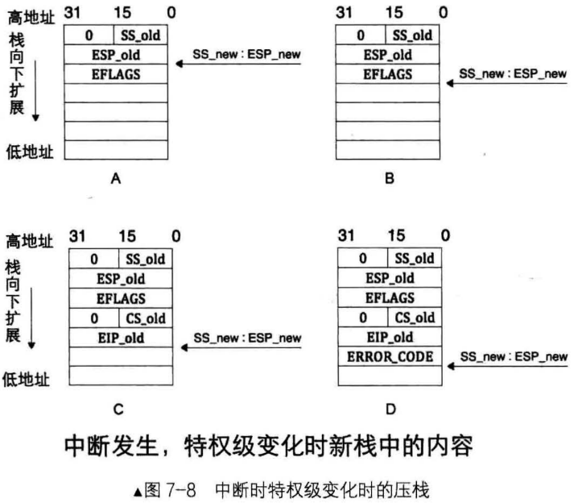
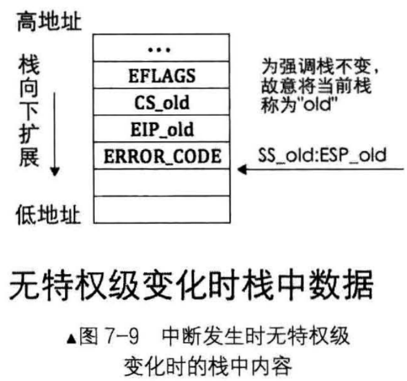

# 32位保护模式的中断情况
中断在发生时，处理器收到一个中断向量号，根据此中断向量号在中断描述符表中找到相应的中断门描述符，门描述符中保存的是中断处理程序所在代码段的选择子及在段内偏移量，处理器从该描述符中加载目标代码段选择子到代码段寄存器CS及偏移量到指令寄存器EIP

注意，由于CS加载了新的目标代码段选择子，处理器不管新的选择子和任何段寄存器(包括CS)中当前的选择子是否相同，也不管这两个选择子是否指向当前相同的段，只要段寄存器被加载，段描述符缓冲寄存器就会被刷新，处理器都认为是换了一个段，属于段间转移，也就是`远转移`

所以，当前进程被中断打断后，为了从中断返回后能继续运行该进程，处理器自动把CS和EIP的当前值保存到中断处理程序使用的栈中

不同特权级别下处理器使用不同的栈，至于中断处理程序使用的是那个栈，要视它当时所在的特权级别，因为中断是可以在任何特权级别下发生的

除了要保存CS、EIP外，还需要保存标志寄存器EFLAGS，如果涉及到特权级变化，还要压入SS和ESP寄存器

# 各寄存器入栈情况及顺序

## 步骤1
处理器根据中断向量号找到对应的中断描述符后，拿CPL和中断门描述符中选择子对应的目标代码的DPL对比

若CPL权限比DPL低，则数值上CPL > DPL，这表示要向高特权级转移，需要切换到高特权级的栈

这也意味着当执行完中断处理程序后，若要正确返回当前被中断的进程，同样需要将栈恢复为此时的旧栈
- 于是处理器先临时保存当前旧栈SS和ESP的值，记作SS_old和ESP_old，然后在TSS中找到同目标代码段DPL级别相同的栈加载到寄存器SS和ESP中，记作SS_new和ESP_new
- 再将之前临时保存的SS_old和ESP_old压入新栈备份，以备份返回重新加载到栈段寄存器SS和栈指针ESP
- 由于SS_old是16位数据，32位模式下的栈操作数是32位，所以将SS_old用0扩展其高16位，成为32位数据后入栈
- 此时新栈内容如图7-8A中所示

## 步骤2
在新栈中压入EFLAGS寄存器，新栈内容如图7-8中B所示

## 步骤3
由于要切换到目标代码段，对于间这种段间转移，要将CS和EIP保存到当前栈中备份，记作CS_old和EIP_old，以便中断程序执行结束后能恢复到被中断的进程

同样CS_old是16位数据，需要用0填充其高16位，扩展为32位数据后入栈

此时新栈内容如图7-8中C所示

当前栈是新栈，还是旧栈，取决于`步骤1`中是否涉及到特权级转移

如果在`步骤1`中判断未涉及到特权级转移，便不会到TSS中寻找新栈，而是继续使用当前旧栈，因此也谈不上恢复旧栈，此时中断发生时栈中数据不包括SS_old和ESP_old

比如中断发生时候当前正在运行的是内核程序，这是0特权级到0特权级，无特权级变化，如图7-9所示

## 步骤4
某些异常会有错误码，此错误码用于报告异常是在哪个段上发生的，也就是异常发生的位置，所以错误码中包含选择子等信息

错误码会紧跟在EIP之后入栈，记作ERROR_CODE

此时新栈内容如图7-8中D所示

# 中断逆转过程
## 返回的寄存器的顺序
处理器进入中断执行完中断处理程序后，还要返回到被中断的进程，这是进入中断的逆过程

中断返回是用iret指令实现的。Iret，即interrupt ret，此指令专用于从中断处理程序返回，假设在32位模式下，它从当前栈顶处依次弹出32位数据分别是寄存器EIP、CS、EFLAGS

iret指令并不清楚栈中数据的正确性，它只负责把栈顶往上的数据，每次4字节，对号入座弹出到相关寄存器，所以使用iret之前，一定要保证栈顶往上的数据是正确的，且从栈顶往上的顺序是EIP、CS、EFLAGS，根据特权级是否有变化还有ESP、SS

由于段寄存器CS是16位，故从栈中返回的32位数据，其高16位被丢弃，只将低16位载入到CS

若处理器发现返回后特权级会变化还是继续将双字数据返回ESP、SS，其中SS也是16位寄存器，所以同样也是弹出32位数据后，只将其中的低16位加载到SS

iret 指令意味着从中断返回，所以，它是中断处理程序中最后一个指令

## iret指令
同类指令还有iretw和iretd，16位模式下用iretw，32位模式下用iretd
- iret是iretw和iretd的简写，无论是在16位模式下，还是在32位模式下编码，都可以只用iret指令
- 它是被编译成iretw，还是iretd，取决于伪指令BITS所指明的字长

iretw隐含操作数是16位，所以只用在16位模式下。它依次从栈中分别弹出2字节到寄存器IP、CS和eflags中，它不涉及到特权级改变的情况下，栈指针sp自减6

iretd隐含操作数是32位，所以只用在32位模式下。它先从栈中弹出32位数据到寄存器EIP，再弹出32位数据，先丢弃高16位，只将16位加载CS，再弹出32位数据到eflags中。在不干涉到特权级改变的情况下，栈指针esp自减12

## 错误码与iret指令
如果中断有错误码，处理器并不会主动跳过它的位置，必须手动将其跳过，也就是说，在准备用iret指令返回时，当前栈指针esp必须指向栈中备份的EIP_old所在的位置，这样处理器才能将栈中的数据对号入座，弹出到各自对应的寄存器中

同时处理器并不会记录自己来过这里(此处是指进入中断)，已经做过了特权级检查，为了安全起见，处理器在返回被中断过程中也要再进行一次特权级检查

## 逆转流程
背景: 这个从中断处理返回的过程，假设此时已经手动将ERROR_CODE从栈中弹出，栈顶已位于正确的位置，即指向EIP_old

### 步骤1
当处理器执行到iret指令时，它知道要执行远返回，首先需要从栈中返回被中断进程的代码段选择子CS_old及指令指针EIP_old

这时候它要进行特权级检查

先检查栈中CS选择子CS_old，根据其RPL位，即未来的CPL，判断返回过程中是否要改变特权级

### 步骤2
栈中CS选择子是CS_old，根据CS_old对应的代码段的DPL及CS_old中的PRL做特权级检查

如果检查通过，随即需要更新寄存器CS和EIP

由于CS_old在入栈时已经将高16位扩充为0，现在是32位数据，段寄存器CS是16位，故处理器丢弃CS_old高16位，将低16位加载到CS，将EIP_old加载到EIP寄存器，之后栈指针指向ELAGS

如果进入中断时未涉及特权级转移，此时栈指针是ESP_old(说明在之前进入中断后，是继续使用旧栈)。否则栈指针是ESP_new(说明在之前进入中断后用的是TSS中记录的新栈)

### 步骤3
将栈中保存的EFLAGS弹出的到标志寄存器EFLAGS

如果在`步骤1`中判断返回要改变特权级，此时栈指针是ESP_new,它指向栈中的ESP_old

否则进入中断属于平级转移，用的是旧栈，此时栈指针是ESP_old，栈中已无因此次中断发生而入栈的数据，栈指针指向中断发生前的栈顶

### 步骤4
如果在`步骤1`中判断出返回时需要改变特权级，也就是说需要恢复旧栈，此时便需要将ESP_old和SS_old分别加载到寄存器ESP及SS，丢弃寄存器SS和ESP中原有的SS_new和ESP_new，同时特权级检查

补充，由于SS_old在入栈时已经由处理器将高16位填充为0，现在是32位数据，所以在重新加载到栈段寄存器SS之前，需要将SS_old高16位剥离丢弃，只用其低16位加载SS

### 注意事项
如果在返回时需要改变特权级，将会检查数据段寄存器DS、ES、FS和GS的内容，如果在它们之中，某个寄存器中选择子所指向的数据段描述符的DPL权限比返回后的CPL(CS.RPL)高，即数值上返回后的CPL > 数据段描述符的DPL，处理器将把数值0填充到相应的段寄存器

原理是选择子为0便指向GDT中的第0个段描述符，该段描述符不可用，从而故意处理器抛异常

