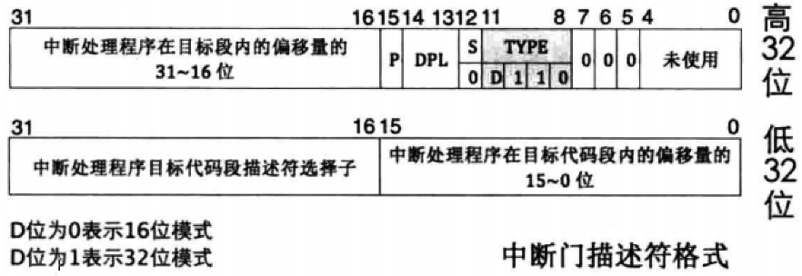

# 中断描述符表概述
中断描述符表(Interrupt Descriptor Table, IDT)是保护模式下用于存储中断处理程序入口的表

当CPU接收一个中断时，需要用中断向量在此表中检索对应的描述符，在该描述符中找到中断处理程序的起始地址，然后执行中断处理程序

由于表中所有描述符都是记录一段程序的起始地址，相当于通向某段程序的"大门"，所以，中断描述符表中的描述符有自己名称-`门`

# 门
## 概述
门，顾名思义，是通往某处的入口。在计算机中，用门来表示一段程序入口。段描述符中描述的是一片内存区域，而门描述符中描述的是一段代码

## 任务门

任务门和任务状态段(Task Status Segment, TSS)是Intel处理器在硬件一级提供的任务切换机制，所以任务门需要和TSS配合在一起使用，在任务门中记录的是TSS选择子，偏移量未使用

任务门可以存在于全局描述符表GDT、局部描述符LDT、中断描述符IDT中。

描述符中任务门的type值为二进制0101

## 中断门

中断门包含了中断处理程序所在段的段选择子和段内偏移地址

当通过此方式进入中断后，标志寄存器eflags中的IF位自动置0，也就是在进入中断后，自动把中断关闭，避免中断嵌套

Linux就是利用中断门实现的系统调用，就是那个著名的int 0x80。中断门只允许存在于IDT中，描述符中中断门的type值为二进制1110

## 陷阱门

陷阱门和中断门非常相似，区别是由陷阱门进入中断后，标志寄存器eflags中的IF位不会自动置0

陷阱门只允许存在于IDT中。描述符中陷阱门的type值为二进制1111

## 调用门

调用门是提供给用户进程进入特权0级的方式，其DPL为3

调用门中记录例程的地址，它不能用int指令调用，只能用call和jmp指令

调用门可以安装在GDT和LDT中。描述符中调用门的type值为二进制1100

# 中断描述符寄存器IDTR

在CPU内部有个中断描述符表寄存器(Interrupt Descriptor Table Register, IDTR)，该寄存器分为两部分
- 第0~15位是表界限，即IDT大小减1
- 第16～47位是IDT的基地址

中断描述符表地址肯定要加载到这个寄存器中，只有寄存器IDTR指向了IDT，当CPU接收到中断向量号时才能找到中断向量处理程序，这样中断系统才能正常运行

16位的表界限，表示最大范围是0xfff,即64KB
- 可容纳的描述符个数是 64KB / 8 = 8KB = 8192个
- 特别注意的是GDT中的第0是可用的，中断向量号为0的中断是除法错
- 但处理器只支持256个中断，即0～254,中断描述符中其余的描述符不可用
- 在门描述符中有个P位，所以，构建IDT时，记得把P位置0，表示门描述符中的中断处理器程序不在内存中

同加载GDTR一样，加载IDTR也有个专门的指令-lidt，其用法是
- lidt48位内存数据
- 在这48位内存数据中，前16位是IDT表界限，后32位是IDT线性基地址

# 中断处理过程及保护
## CPU 与 完整的中断处理过程
CPU外：外部设备的中断有中断代理芯片接收，处理后将该中断的中断向量号发送到CPU

CPU内：CPU执行该中断向量号对应的中断处理程序

## 中断处理过程

- 由于IDT中全都是门描述符，所以图7-7的IDT中的“某门描述符”表示中断门、陷阱门或任务门

### 处理器根据中断向量号定位中断门
中断向量号是中断描述符的索引，当处理器收到一个外部中断向量后，它用此向量号在中断描述符表中查询对应的中断描述符，然后再去执行该中断中的中断处理程序

由于中断描述符是8个字节(64位)，所以处理器用中断向量号乘以8后，再与IDTR中的中断描述符表地址相加，所求的地址之和便是该中断向量号对应的中断描述符

### 处理器进行特权级检查
由于中断是通过中断向量号通知处理器的，中断向量号只是个整数，其中并没有RPL，所以在对由中断引起的特权转移做特权检查中，并不涉及RPL

中断门的特权检查同调用门类似，对于软件主动发起的软中断，当前特权级CPL必须在门描述符DPL和门中目标代码段DPL之间

这是为了防止位于3特权级下的用户程序主动调用某些只为内核服务的例程
- 检查当前特权级CPL和门描述符DPL
    - 如果是由软中断int n、int3和into引发的中断，这些是用户进程中主动发起的中断，由用户代码控制，处理器要检查当前特权级CPL和`门描述符DPL`，这是检查进门的特权下限
    - 如果CPL权限大于等于DPL，即数值上CPL <= `门描述符DPL`，特权级“门槛”检查通过，进入下一步的“门框”检查
    - 否则，处理器将抛异常
- 检查CPL和目标代码DPL
    - 这一步检查特权级的上限(门框)：处理器要检查当前特权级CPL和门描述符中所记录的选择子对应的目标代码段DPL
    - 如果CPL权限小于`目标代码DPL`,即数值上CPL > `目标代码段DPL`，检查通过
    - 否则CPL若大于等于`目标代码段DPL`，处理器将引发异常，也就是说，除了用返回指令从高特权级返回，特权转移只能发生在由低向高
    
### 执行中断处理程序
特权级检查通过后，将门描述符目标代码段选择子加载到代码段寄存器CS中

把门描述符中中断处理程序的偏移地址加载到EIP，开始执行中断处理器

### 中断的eflags寄存器
#### IF 位的作用
##### 概述
IF 位只能限制外部设备的中断，对那些影响系统正常运行的中断都无效，如异常exception，软中断，如int n等，不可屏蔽中断NMI都不会受IF限制

在中断程序打开，就可以根据需要优先处理更高级别的中断

##### IF 位为0的情况
如果中断对应的门描述符是中断门，标志寄存器eflags中的IF位被自动置0，避免中断嵌套，即中断处理过程中又来了个新的中断，这是为防止在处理某个中断的过程中又来了个相同的中断

即同一种中断未处理完时又来了一个，这会导致一般保护性(GP)异常。这表示默认情况下，处理器会在无人打扰的方式下执行中断门描述符中的中断处理例程

##### IF位不为0的情况
若中断发生时对应的描述符是任务门或陷阱门的话，CPU是不会将IF位清0的。因为陷阱门主要用于调试，它允许CPU响应更高级别中断，所以允许中断嵌套

而对任务门来说，这是执行一个新任务，任务都应该在开中断的情况下进行，否则就独占CPU资源，操作系统也会由多任务退化程单任务

从中断返回的指令是iret，它从栈中弹出数据到寄存器cs、eip、eflags等，根据特权级是否改变，判断是否恢复旧栈，也就说是否将栈中位于SS_old和ESP_old位置的值弹出到寄存器ss和esp。当中断处理器程序执行完成返回后，通过iret指令从栈中恢复eflags的内容

#### 中断发生后，eflags中的NT位和TF位会被置0
##### TF
TF表示 Trap Flag，也就是陷阱标志位，这用在调试环境中，当TF为0时表示禁止单步执行，也就是说，进入中断后TF置为0，表示不允许中断程序处理单步执行

##### NT
NT 位表示Nest Task Flag，即`任务嵌套标志位`，也就是用来标记任务嵌套调用的情况

任务嵌套调用是指CPU将当前正执行的旧任务挂起，转去执行另外的新任务，待新任务执行完后，CPU再回到旧任务继续执行

为什么CPU执行完旧任务后还能回到新任务呢？原因是在执行新任务之前，CPU做了两件准备工作
- (1) 将旧任务TSS选择子写到了新任务TSS中的"上一个任务TSS的指针"字段中
- (2) 将新任务标志寄存器eflags中NT位置1，表示新任务之所以能够执行，是因为有别的任务调用了它。这个别的任务是指CPU在第1步写入新任务自己TSS的"上一个任务TSS指针"字段中的值

CPU把新任务执行完后还是要回去继续执行旧任务，怎样回到旧任务？
- 通过iret指令
- iret指令因此有了两个功能，一是从中断返回，另外一个就是返回到调用自己执行的哪个旧任务，这也相当于执行一个任务

对于同一条iret指令，CPU是如何知道该从中断返回呢，还是返回到旧任务继续执行？
- 这就用到了NT位了， 当CPU执行iret时，它会去检查NT位的值，如果NT位为1，这说明当前任务是被嵌套执行的
- 因此会从自己TSS中"上一个任务TSS的指针"字段中获取旧任务，然后去执行该任务
- 如果NT位的值为0，这表示当前是在中断处理环境下，于是就执行正常的中断退出流程