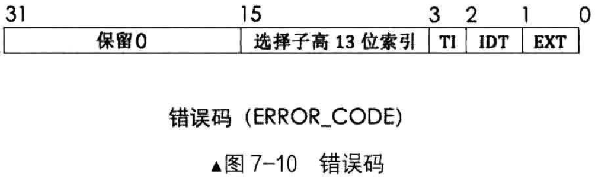

# 中断错误码图例

# 结构参数解析
## EXT
EXT 表示EXTernal event，即外部事件，用来指明中断源是否来自处理器外部，如果中断源是不可屏蔽中断NMI或外部设备，EXT为1，否则为0

## IDT
IDT表示选择子是否指向中断描述符IDT，IDT位为1，则表示此选择子指向中断描述符表，否则指向全局描述符GDT或局部描述符LDT

## TI
TI和选择子中TI是一个意思，为0时用来指明选择子是从GDT中检索描述符，为1时是从LDT中检索描述符

当然，只有在IDT位为0时，TI位才有意义

## 选择子高13位索引
选择子高13位索引就是选择子中用来在表中索引描述用的下标

## 高16位
高16位是保留位，为0

# 注意事项
有时候不仅错误的高16位全为0，低16位也为0，那一个全0的错误码能指明什么信息？
- 当全0错误码出现时，表示中断的发生和特定的段无关，或引用了一个空描述符
- 引用描述符就是往段寄存器中加载选择子的时候，处理器发现选择子指向的描述符是空的

中断返回时，iret指令并不会把错误码从栈中弹出，所以在中断处理器程序中需要手动用栈指针跨过错误码或将其弹出。否则栈顶处若不是EIP(EIP_old)的话，iret返回时将会载入错误的值到后续寄存器

通常能够压入错误码的中断属于中断向量号在0～32之内的异常，而外部中断(中断向量号在32 ～ 255之间)和int软中断并不会产生错误码。通常我们并不用处理完错误码