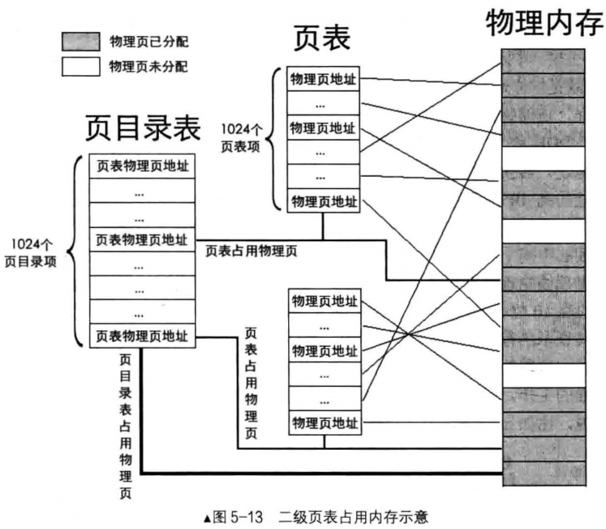
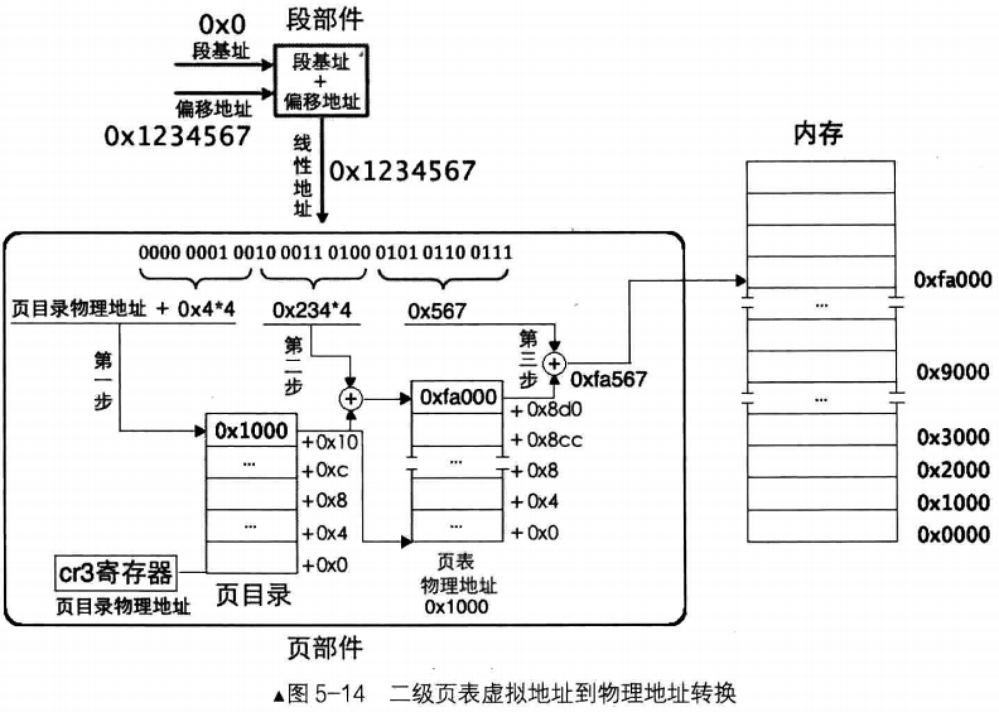
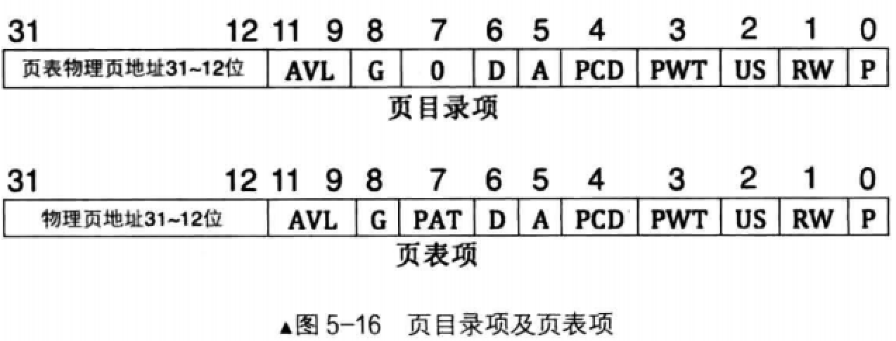
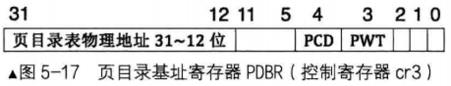

# 为什么要搞二级页表
一级页比表中最多可容纳1M(1048576)个页表项，每个页表项是4字节，如果页表项全满的还话，便是4MB大小

一级页表中所有页表项必须要提前建好，原因是操作系统要占用4GB虚拟地址空间的高1GB，用户进程要占用低3GB

# 什么是二级页表
无论是几级页表，标准页的尺寸都是4KB，所以4GB线性地址空间最多有1M个标准页

一级别页表是将这1M个标准页放置到一张页表中，二级页表是将这1M个标准页平均放置1K个页表中

每个页表中包含有1K个页表项。页表项是4字节大小，页表包含1K个页表项，故页表大小为4KB，这恰恰是一个标准页的大小

# 怎么动态创建页表项
## 页目录项(Page Directory Entry, PDE)
每个页表的物理地址在页目录表中都以页目录项(Page Directory Entry, PDE)的形式存储

页目录项大小同页表项一样，都用来描述一个物理页的物理地址，其大小都是4字节，而且最多有1024个页表，所以页目录也是4KB大小，同样也是标准页的大小

## 二级页表占用的内存

页表是用于管理内存的数据结构，其也要占用内存，所以页目录表和页表所占用的物理页，同样混迹于物理内存之中

页目录表中共1024个页表，也就是有1024个页目录项
- 一个页目录项中记录一个页表物理页地址，物理页地址是指`页的物理地址`
- 在页目录项及页表项中记录的都是页的物理地址，页大小都是0x100，即4096，因此页地址以000为结尾的16进制数字

每个页表中有1024个页表项，每个页表项中一个物理页地址，最终数据写在这页表项中指定的物理页中

页表项中分配的物理页地址在真正物理内存中离散分布，毫无规律可言，操作系统负责这些物理页的分配与释放

由于页目录表和页表本身都要占用内存，且为4KB大小，故它们也会由操作系统在物理内存中分配一物理页存放。

图中最粗的线存放页目录表物理页，稍细一点的线指向的是用来存放页表的物理页，其他最细的线是页表项中分配的物理页，页表结构本身与其他数据混布渗透在物理内存中，页表所占用的物理页在外在形式上与其他数据占用的物理页没有什么不同

页表在建立之初，物理内存各部分的布局

## 虚拟地址转化为物理地址
### 原理
每个页表中容纳1024个物理页，故每个页表可表示的内存容量是 1024 * 4KB = 4MB

页目录中共有1024个页表，故所有页表可表示的内存容量是 1024 * 4MB = 4GB

任意一个32位物理地址，它必然在某个页表之内的某个物理页中
- 定位某一物理页，必然要找到其所属页表。页目录中1024页表，只需要10位二进制就能够表示了，所以虚拟地址的高10位(第31 ～ 22位)用来在页目录中定位一个页表，也就是这高10位用于定位页目录中的页目录项目PDE,PDE中有页表物理地址
- 由于页表中可容纳1024个物理页，故只需要10位二进制就能够表示了。所以虚拟地址的中间10位(第21 ～ 12位)用来在页表中定位具体的物理页，也就是在页表中定位一个页表项PTE，PTE中有分配的物理页地址
- 由于标准页都是4KB，12位二进制便可以表达4KB之内的任意地址，故线性地址中余下的12位(第11 ～ 0位)用于页内偏移

经过上面分析，二级页表地址转换原理是将32位虚拟地址拆分成高10位，中间10位，低12位三部分，它的作用
- 高10位作为页表的索引，用于在页目录表中定位一个页目录PDE，页目录项中有页表物理地址，也就是定位到了某页表
- 中建10位作为物理页的索引，用于在页表内定位到某个页表项PTE，页表项中有分配的物理页地址，也就是定位到了某个物理页
- 低12位作为页内偏移量用于在已经定位到物理页内寻址

同一级页表一样，访问任何页表内的数据都要通过物理地址。由于页目录项PDE和页表项PTE都是4字节大小，给出了PDE和PTE索引后，还需要在背后悄悄乘以4，再加上页表物理地址，这才是最终要访问的绝对物理地址

转换过程背后的具体步骤如下:
- 用虚拟地址的高10位乘以4，作为页目录表内的偏移地址，加上页目录表的物理地址，所得之和，便是页目录的物理地址。读取该页目录项，从中获取页表物理地址
- 用虚拟地址的中间10位乘以4，作为页表内的偏移地址，加上在上一步得到的页表物理地址，所得的和，便是页表项的物理地址。读取该页表项，从中获取到分配的物理页地址
- 虚拟地址的高10位和中间10位分别是PDE和PTE的索引值，所以它们需要乘以4。但低12位就不是索引值，其表示范围是0 ~ 0xfff，作为页内偏移最合适。所以虚拟地址的低12位加上上一步中得到的物理页地址，所得的和便是最终转换的物理地址

### 例子

- mov ax, [0x1234567]

平坦模式下段基址为0，指令mov ax, [0x1234567]，经过段部件处理，输出的线性地址为0x1234567,由于是在分页机制下，此地址被认为是虚拟地址，需要被页部件转换

页部件首先要把地址拆分成高10位、中间10位、低12位三部分

其实低12位最容易得出，十六进制的每1位代表4位二进制，所以低12位直接就是0x567

高10位和中间10位，不容易一眼看出，所以还是将它们换算成二进制看比较容易
- 0x1234567的二进制形式: 0000 0001 0010 0011 0100 0101 0110 0111
- 高10位是 0000 0001 00，16进制为0x4
- 中间10位是 10 0011 0100, 16进制为0x234
- 低12位是 0101 0110 0111, 16进制为0x567

第一步：
- 为了得到页表物理地址，页部件用虚拟地址高10位乘以4的积与页目录表物理地址相加，所得和便是页目录地址，读取该页目录项，获取页表物理地址
- 这里是0x4 * 4 = 0x10，页表物理地址存储在cr3寄存器中，由于是过程演示，无需给出具体数值，只需要用0x10作为页表中的偏移地址便能够找到对应的页目录项
- 如图页目录表中，对于内存地址我们给出的都是偏移量，所以地址前都有个加号"+"。然后找到最上面的页目录项，其值为0x1000,这意味着要找到的页表位于物理地址0x1000

第二步:
- 为了得到具体的物理页，需要找到页表对应的页表项
- 页部件用虚拟地址中间10位的值乘以4的积与第一步中得到的页表地址相加，所得的和便是页表物理地址
- 这里是0x234 * 4 = 0x8d0，页表项物理地址0x8d0 + 0x1000 = 0x18d0
- 在该页表项中的值是0xfa000，这意味着分配的物理页地址是0xfa000

第三步:
- 为了得到最终的物理地址，用虚拟地址低12位作为页内偏移地址与第二步得到的物理页地址相加，所得之和便是最终的物理地址
- 这里是 0xfa000 + 0x567 = 0xfa567

经过上面三步，页部件将虚拟地址0x1234567转换成物理地址0xfa567

# 页目录项目和页表项结构

## 概述
4字节大小，但其实内容并不全是物理地址，只有第12 ~ 31位才是物理地址，这才20位

按理说32位地址应用32位来表示？
- 因为页目录项和页表项中的都是物理页地址，标准页大小是4KB，故地址都是4K的倍数，也就是地址的低12位是0
- 所以只需要记录物理地址高20位就可以了
- 这样省出来的12位(第0~11位)可以用来添加其他属性

## 属性
### P, Present，意为存在位
若为1表示该页存在物理内存中

若为0表示该表不在物理内存中。操作系统的页式虚拟内存管理便是通过P位和相应的pagefault异常来实现的

### RW, Read/Write，意为读写位
若为1表示可读可写，若为0表示可读不可写

### US, User/Supervisor，意为普通用户/超级用户位
若为1时，表示处于User级，任意级别(0、1、2、3)特权的程序都可以访问该页

若为0时，表示处于Supervisor级，特权级别为3的程序不允许访问该页，该页只允许特权级别为0、1、2的程序可以访问

### PWT, Page-level Write-Through,意为页级通写位，也称页级写透位
若为1表示此项采用通用方式，表达该页不仅是普通内存，还是高速缓存

此项和高速缓存有关，“通写”是高速缓存的一种工作方式，本位用来间接决定是否用此方式改善该页的访问效率

这里直接置0就可以了

### PCD，Page-level Cache Disable，为页级高速缓存禁止位
若为1表示该页启用高速缓存

为0表示禁止该页缓存。这里将其置0

### A, Accessed,意为访问位
若为1表示该页被CPU访问过了，所以该位是由CPU设置的

这里的A位也可以用来记录某一内存页的使用频率(操作系统定期将该位清0，统计一段时间内变成1的次数)，从而内存不足时，可以将使用频率较低的页面换出到外存(如硬盘)

同时将页目录项或页表项的P位置0，下次访问该页引起pagefault异常时，中断处理程序将硬盘上的页再此换入，同时将P位置1

### D, Dirty，意为脏页位
当CPU对一个页面执行写操作时，就会设置对应页表项的D位为1

此项仅对页表项有效，并不会修改页目录项中的D位

### PAT, Page Attribute Table，意为页属性表位
能够在页面一级的粒度上设置内存属性

比较复杂，将此位置0即可

### G, Global，意为全局位
由于内存地址转换也是颇费周张，先得拆分虚拟地址，然后又要查目录项，又要查页表

所以为了提高获取物理地址的速度，将虚拟地址与物理地址转换结果存储在TLB(Translation Lookaside Buffer)中

在此先知道TLB是用来缓存地址转换结果的高速缓存的ok啦

此G位用来指定该页是否位全局页，为1表示全局页，为0表示不是全局页

若为全局页，该页将在高速缓存TLB中一直保存，给出虚拟地址直接就出物理地址，无需再经过三步骤转换

由于TLB容量较小,所以这里面就存放使用频率较高的页面

### AVL，意为Available位,表示可用
谁可用？当然是软件可用，操作系统可用该位

# cr3 寄存器
控制寄存器cr3用于存储页表物理地址，所以cr3寄存器又称为页目录基址寄存器(Page Directory Base Register, PDBR)

由于页目录表所在的地址要求在一个自然页内，即页目录的起始地址是4KB的整数倍，低12位地址全是0

所以，只要在cr3寄存器的第31 ~ 12位中写入物理地址的高20位就行了。另外，cr3寄存器的低12位中，除第3位的PWT位和第4位的PCD位外，其余位都没用

PWT位和PCD位之前介绍过了，它们用于设置高速缓存相关特性，在此将其置为0即可。这样一来低12位全部为0，故只需要把页目录表物理地址的高20位写入cr3寄存器即可

因为控制寄存器是可以于通用寄存器相互传递数据的，所以cr3寄存器复制则没有那么复杂，可以用mov命令

mov指令中控制寄存器于通用寄存器互传数据的格式为: mov cr[0 ~ 7], r32或 mov r32, cr[0 ~ 7]
