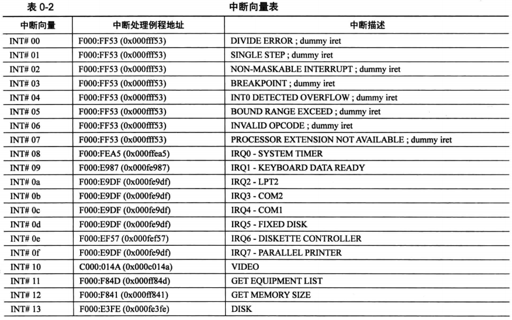
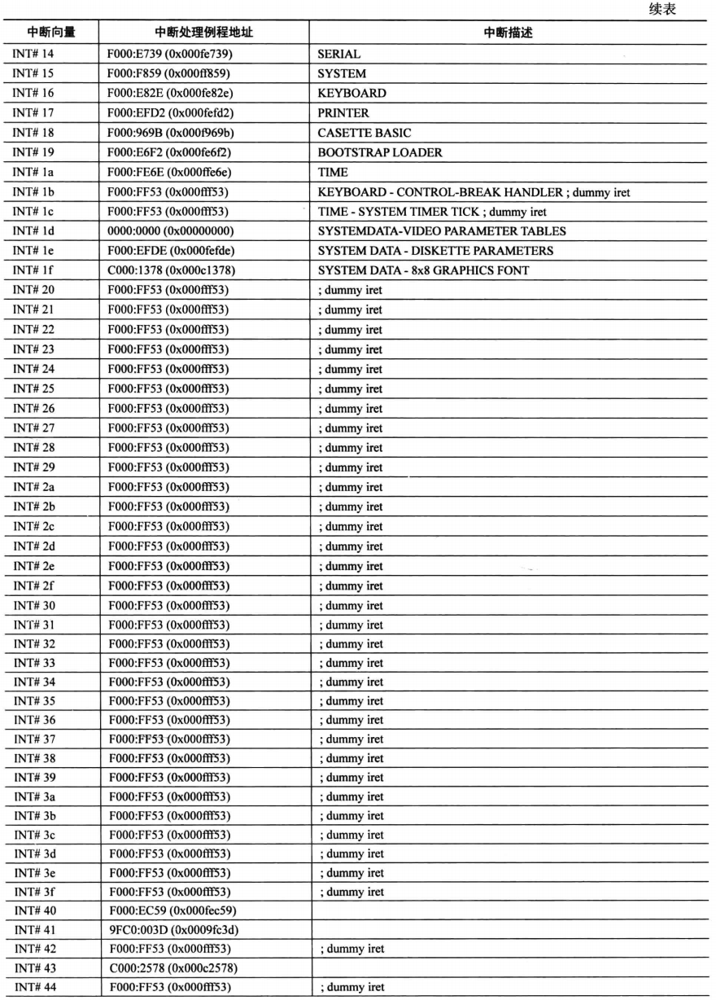
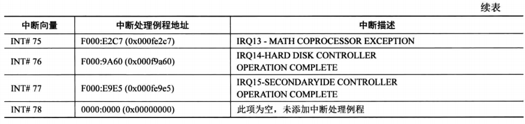

# 什么是BIOS中断
最有名的软中断是BIOS中断，之所以称为BIOS中断，是因为这些中断功能是在计算机加电之后，BIOS 程序执行期间建立起来的。换句话说，这些中断功能在加载和执行主引导扇区之前，就已经可以使用了

BIOS中断，又称BIOS功能调用，主要是为了方便地使用最基本的硬件访问功能

# 例子
比如，使用键盘服务时，中断号是0x16，即
```
int 0x16
```

为了区分针对同一硬件的不同功能，使用寄存器AH来指定具体的功能编号。举例来说，以下指令用于键盘读取一个按键:
```
mov ah, 0x00    ; 从键盘读字符
int 0x16        ; 键盘服务。返回时，字符代码在寄存器AL中
```
在这里，当寄存器AH的内容是0x00，执行int 0x16后，中断服务例程会监视键盘动作。当它返回时，会在寄存器AL中存放按键的ASCII码

# BIOS怎么知道如何访问硬件
BIOS 可能会为一些简单的外围设备提供初始代码和功能调用代码，并填写中断向量表，但也有一些BIOS中断是由外部设备接口自己建立的

每个外部设备接口，包括各种板卡，如网卡、显卡、键盘接口电路、硬件控制器等都有自己的只读存储器(Read Only Memory, ROM)，类似于BIOS芯片

这些ROM中提供了它自己的功能调用例程，以及本设备的初始化代码

我们知道，从内存物理地址A0000开始，到FFFFF结束，有相当一部分空间是留给外围设备的。如果设备存在，那么，它自带的ROM会映射到分配给它的地址范围内

在计算机启动期间，BIOS程序会以2KB为单位搜索内存地址C0000 ~ E0000之间的区域。当它发现某个区域的头两个字节是0x55和0xAA时，那意味该区域有ROM代码存在，再对该区域做累加和检查，如果结果与第3个字节的值相符，说明代码无误，就从第4个字节进入

这时开始执行了硬件自带的例程以初始化硬件自身，最后，BIOS填写中断向量表中相关项，使它们指向硬件自带的例程

# 中断向量表





# 参考资料
- [BIOS中断调用](https://baike.baidu.com/item/BIOS%E4%B8%AD%E6%96%AD%E8%B0%83%E7%94%A8/22788153)
- [BIOS中断大全](https://blog.csdn.net/liguodong86/article/details/3973337)