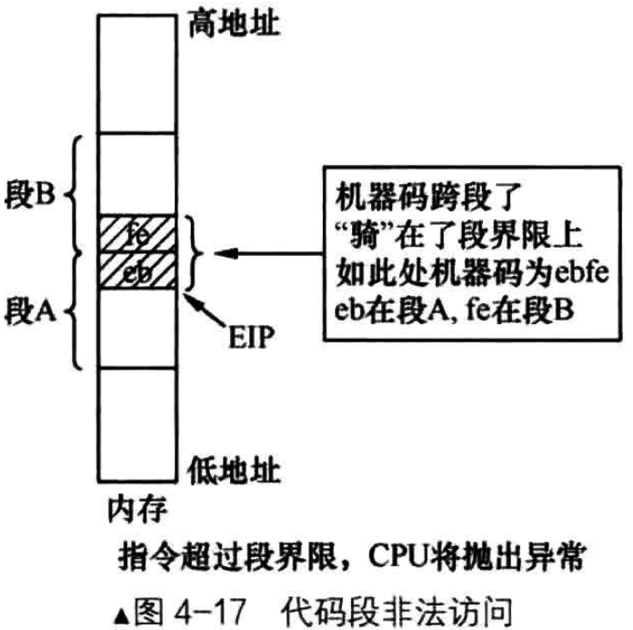

# 概述
对于代码段和数据段来说，CPU每访问一个地址，都要确认该地址不能超过其所在内存段的范围

实际段界限的值为:
- (描述符中段界限 + 1) * (段界限的粒度大小: 4k或者1) - 1

对于G位为1的4k粒度大小的段来说，其实用下面这个公式更为直接
- 实际段界限大小 = 描述符中段界限 * 0x1000 + 0xFFF

其中, 0xFFF是4k(0x1000)中以0为起始的最后一个字节。所以此公式的意义是以0为起始的段偏移量，即段界限。推导过程也很简单，就是将原公式展开
- (描述符中段界限 + 1) * 4k - 1 = 描述符中段界限 * 4k + 4k - 1 = 描述符中段界限 * 0x1000 + 0xFFF

实际的段界限大小，是段内最后一个可访问的有效地址。由于有了段界限的限制，我们给CPU提交的每个内存地址，无论是指令地址还是数据地址，CPU都要帮我们检查地址的有效性

首先地址指向的数据是由宽度的，CPU要保证该数据一定要落在段内，不能"骑"在段边界上

# 代码段的"段基本：段内偏移地址"形式
对于代码段来说，段中的"数据"是各种机器指令。在IA32体系结构中，访问内存就要用分段策略，这是它的宿命，逃不掉的

代码段既然也是内存中的区域，所以对于代码段的访问也要用"段基址:段内偏移地址"的形式，在32位保护模式下，段基址存放在CS寄存器中，段内偏移地址，即有效地址，存放在EIP寄存器中

CS:EIP只是指令的起始地址，指令本身也是由长度的，之前见过各种各样的机器码，它们的长度有2字节的、3字节等。如果jmp .-2,其机器码位ebfe，大小是2字节

CPU得确保指令"完全、完整"地任意一部分都在当前的代码段内，也就是满足以下条件
- EIP中的偏移地址 + 指令长度 - 1 <= 实际段内界限大小

如果不满足条件，指令未完整地落在本段内，CPU则会抛出异常

# 数据段的边界检查
这种边界检查对于数据段也是一样的，数据也是有长度的(不同类型数据的长度不一致，这就是数据类型作用)，CPU也要保证操作数要"完全、完整"地任意部分都要在当前数据段内，所以，数据地址也要遵循此原则
- 偏移地址 + 数据长度 - 1 <= 实际段界限大小

与上图类似，数据段的段界限也是段内可访问的最后一个地址，所以不允许出现数据“骑”在段边界的情况

# 例子
举个例子，假设数据段描述符的段界限是0x12345，段基址位0x0000000

如果G位为0，那么实际段界限便是0x12345. 如果G位为1，那么实际段界限便是0x12345 * 0x1000 + 0xFFF = 0x12345FFF

如果访问的数据地址是0x12345FFF，还要看访问的数据宽度

若数据大小是1字节，如mov ax, byte[0x12345fff]，这种内存操作一点问题都没有，数据完全在实际段界限之内

若该数据大小是2字节，如mov ax, word[0x12345fff]，这种内存操作超过了实际的段界限，数据所在地址分别是0x12345fff和0x12346000这两个字节，CPU会抛异常
