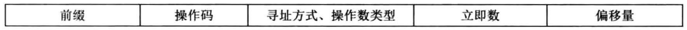

# 运行模式的寄存器


在这个格式中第3个字段用于指定寻址方式和操作数类型，在指令格式不变的情况下，为了兼容保护模式，一种方案是重新定义各寻址方式、寄存器编码
- 由于保护模式中的寻址方式和操作数类型同实模式下完全不同，故相应的编码也不同
- 比如在实模式下，用二进制010表示dx寄存器，在保护模式下的010就表示edx寄存器(根据编码确定指令、寻址方式、寄存器、这是译码器的工作)
- 操作dx寄存器和edx寄存器，对于硬件来说是完全不同的，所以编译器必须明确操作对象是哪个

在指令格式中，有个"前缀"字段，里面存放的是指令选项之类的东东，比如`指令重复前缀rep`、`段跨越前缀"段寄存器:"`，还有反转前缀(0x66, 0x67)

# 兼容性两面性
兼容性带来了好处，也带来了坏处，好处是CPU很强大，可以同时支持16位指令和32位指令，运行新来程序畅通无阻。但坏处就是CPU也不知道您想生成16位，还是32位机器码，这就是前面说过的，需要明确告诉编译器一些信息

编译器提供了伪指令bits，用它来向编译器传达:
- 下面的指令都要编译成xx位的，因为不知道下面的代码的运行环境是xx模式
    - 比如在实模式下，运行指令都是16位的，所以编译器要将代码编译成16位的指令
    - 在实模式下准备好了保护模式所需要的环境后，进入保护模式后的代码就应该是32位指令
    - 也就是，同一段程序要经历两种模式，所以同一段程序中有两种模式的机器码
- bits的指令格式[bits 16]或[bits 32]
    - [bits 16]是告诉编译器，下面的代码帮我编译成16位的机器码
    - [bits 32]是告诉编译器，下面的代码帮我编译成32位的机器码
- "下面的代码"是那里的？
    - bits指令的范围是从当前bits标签直到下一个bits标签的范围，这个范围中的代码将被编译成相应字长的机器码
    - bit外面的中括号是可以省略的，另外，在未使用bits指令的指令，模式是[bits 16]
    
进入保护模式需要三个步骤
- 打开A20
- 加载gdt
- 将cr0的pe位置1

# 反转前缀
操作数反转前缀这个是干吗的？
- 模式之间可以互相使用对方环境下的资源
- 比如，16位是实模式下可以用32位保护模式下的寄存器
- 但这种福利的得到却稍费功夫的，如果要用另一模式下的操作数大小，需要在指令前添加指令前缀0x66，将当前模式临时改变变成另一个模式
- 这就是反转的意义，不管当前模式是什么，总是转变成相反的运行模式

比如，在指令中添加了0x66反转前缀之后
- 假设当前运行模式是16位实模式，操作数大小将变为32位
- 假设当前运行模式是32位保护模式，操作数大小将变为16位

在0x86指令集，0x66前缀的全称是Operand Size Override Prefix，用于翻转指令操作的长度(32位变16位，16位32位)
```
[bits 16]           ; 伪指令，无机器码
mov ax, 0x1234      ; B83412
mov dx, 0x1234      ; BA3412

[bits 32]           ; 伪指令，无机器码
mov eax, 0x1234     ; B34120000
mov edx, 0x1234     ; BA34120000
```

寻址方式反转前缀0x67
```
[bits 16]               ; 伪指令, 无机器码
mov word [bx], 0x1234    ; C7073412
mov word [eax], 0x1234   ; 67C7003412
mov dword [eax], 0x1234  ; 6667C70034120000

[bits 32]               ; 伪指令，无机器码
mov dword [eax], 0x1234  ; C70034120000
mov word [eax], 0x1234   ; 66C7003412
mov dword [bx], 0x1234   ; 67C70734120000
```
不同模式之间不仅可以使用对方模式下的操作数，还可以使用对方模式下的寻址方式

# 总结
bits伪指令用于指定运行模式，操作数大小反转前缀0x66和寻址方式前缀0x67，用于临时将当前运行模式下的操作数大小和寻址方式转变成另一种模式下的操作数方式及寻址方式

# 参考资料
- [指令前缀0x66到底是干什么用的?](https://www.zhihu.com/question/55116551)
- [怎样通俗的理解操作系统中内存管理分页和分段？](https://www.zhihu.com/question/50796850)