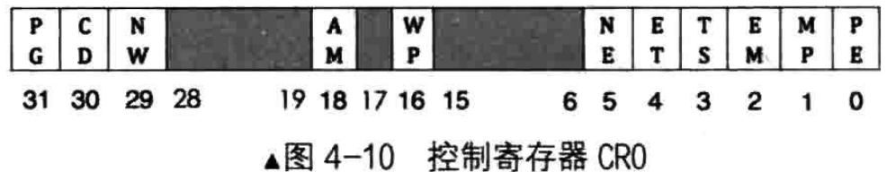

# 控制寄存器
控制寄存器是CPU的窗口，既可以用来展示CPU的内部状态，也可用于控制CPU的运行机制

CR0的寄存器的第0位，即PE位，Protection Enable，此位用于启用保护模式，是保护模式的开关


打开PE位后，CPU才真正进入保护模式

PE 为0表示在实模式下运行，PE为1表示在保护模式下运行

# 控制寄存器CR0字段

| 标志位 | 描述 |
| --- | --- |
| PE | Protection Enable |
| MP | Monitor coProcessor/Math Present |
| EM | Emulation |
| TS | Task Swtiched |
| ET | Extention Type |
| NE | Numeric Error |
| WP | Write Protect |
| AM | Alignment Mask |
| NW | Not Writethrough |
| CD | Cache Disable |
| PG | Paging |

# 例子
```
mov eax, cr0
or eax, 0x00000001
mov cr0, eax
```
- 第1行代码是将cr0写入eax
- 第2行代码，通过或运算or指令将eax的第0位置1
- 第3行代码是将eax写回cr0，这样cr0的PE位便是1