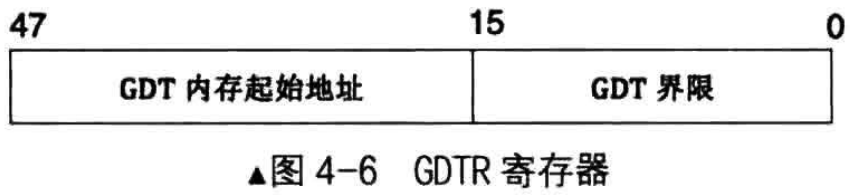
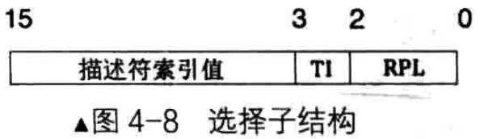

# 全局描述符表
全局描述符表GDT相当于是描述符的数组，数组中的每个元素都是8字节的描述符

可以用选择子中提供的下标在GDT中索引描述符

全局描述符表位于内存中，需要用专门的寄存器指向它后，CPU才知道它在那里。这个专门的寄存器便是GDTR，即GDT Register，专门用来存储GDT的内地地址及大小

GDTR是个48位的寄存器， lgdt的指令格式: lgdt48位内存数据

- 这48位内存数据划分为两部分，其中前16位是GDT以字节位单位的界限值，所以这16位相当于GDT的字节大小减1,后32位是GDT的起始地址
- 由于GDT的大小是16位二进制，其表示的范围是2的16次方等于65535字节
- 每个描述符大小是8字节，故，GDT中最多可容纳的描述符数量是65535/8=8192个，即GDT中可容纳8192个段或门

# 段选择子

段寄存器CS、DS、ES、FS、GS、SS，在实模式下时，段中存储的是段基地址，即内存段的起始地址

而在保护模式下时，由于段基址已经存入了段描述符中，所以段寄存器中再存放段基址是没有意义的，在段寄存器存入的是一个叫做选择子的东西 - selector

选择子"基本上"是个索引值，用此索引值在段描述符表中索引相应的段描述符，这样，便在段描述符中得到了内存段的起始地址和段界限值等相关信息

由于段寄存器是16位，所以选择子也是16位，在其低2位即0~1位，用来存储RPL，即请求特权级，可以表示0、1、2、3四种特权级

在选择子的第2位是TI位，即Table Indicator，用来指示选择子是在GDT中，还是LDT中索引描述符
- TI为0表示在GDT中索引描述符，TI为1表示在LDT中索引描述符

选择子的高13位，即3～15位是描述符的索引值，用此值在GDT中索引描述符。GDT相当一个描述符数组，所以此选择子中索引值就是GDT中的下标

由于选择子的索引值部分是13位，即2的13次方是8192，故最多可以索引8192个段，这和GDT中最多定义8192个描述符是符合的

选择子的作用主要是确定段描述符，确定描述符的目的，一是为了特权级、界限等安全考虑，最主要的还是要确定段的基地址

保护模式下，由于已经是32位地址线和32位寄存器，任意一寄存器都能够提供32位地址，故不需要再将段基址乘以16后再与段内偏移地址想买，直接用选择子对应的"段描述符中的段基址" 加上 "段内偏移地址"就是要访问的内存地址
- 例如选择子是0x8，将其加载到ds寄存器后，访问ds:0x9这样的内存，其过程是: 0x8的低2位是RPL，其值为00
- 第2是TI，其值0，表示是在GDT中索引段描述符
- 用0x8的高13位0x1在GDT中索引，也就是GDT中的第1个段描述符(GDT中第0个段描述符不可用)
- 假设第1个段描述符中的3个段基址部分，其值为0x1234。 CPU将0x1234作为段基址，与段内偏移地址0x9相加，0x1234 + 0x9 = 0x123d。用所得的和0x123d作为访存地址

值得注意的是上面括号中提到了GDT中的第0个段描述符是不可用的，原因是定义在GDT中段描述符是要用选择子来访问的
- 如果使用的选择子忘记初始化，选择子的值便会是0，这便会访问到第0个段描述符
- 为了避免出现这种因忘记初始化选择子而选择到第0个段描述符的情况，GDT中的第0个段描述符不可用
- 也就是说，若选择到了GDT中的第0个描述符，处理器将发出异常

# 局部描述符(LDT)
局部描述符表示，叫LDT， Local Descriptor Table，它是CPU厂商为在硬件一级原生支持多任务而创造的表，按照CPU的设想，一个任务对应一个LDT

CPU厂商建议每个任务的私有内存段都应该放到自己的段描述符表中，该表就是LDT，即每个任务都有自己的LDT，随着任务切换，也要切换相应任务的LDT

LDT也位于内存中，其地址需要先被加载到某个寄存器后，CPU才能使用LDT，该寄存器是LDTR，即LDT Register

同样也有专门的指令用于加载LDT，即lldt.以后每切换时，都要用lldt指令重新加载任务的私有内存段

lldt的指令格式
- lldt 16位寄存器 / 16位内存

无论是寄存器，还是内存，其内容一定是个选择子，该选择子用来在GDT中索引LDT的段描述符

在LDT被加载到ldtr,之后再访问某个段时，选择子中的TI位若为1，就会用该选择子中的高13位在ldtr寄存器所指向的LDT中去索引相应段描述符

LDT中的段描述符和GDT中的一样，与GDT不同的是LDT中的第0个段描述符是可用的，因为提交的选择子中的TI位，TI位用于指定是GDT，还是LDT。TI为1则表示在LDT中索引段描述符，即TI为1必然是经过显式初始化的结果，完全排除了忘记初始化的可能
