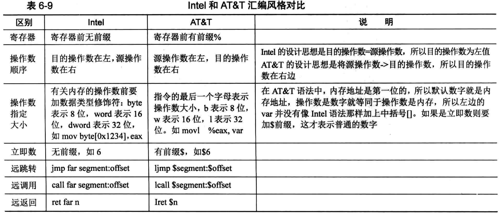

# 什么是内联汇编
内联汇编称为inline assembly, GCC 支持在C代码中直接嵌入汇编代码，所以称为GCC inline assembly

内联汇编按格式分为两大类，一类是最简单的基本内联汇编，另一类是复杂一些的扩展内联汇编

# 什么是AT&T语法
## 概述
AT&T语法是汇编语言的一种语法风格、格式。在某一个处理器平台上，无论汇编代码是什么语法，其编译出来的机器码是一样的，所以不要误以为AT&T是一种新的机器语言

AT&T首先在UNIX中使用，可当初UNIX并不是在x86处理器上开发的，最初是在PDP-11机器上开发的，后来有移植到VAX和68000的处理器上，所以AT&T的语法自然更近于这些处理器的特性

无论语法再怎么变，汇编语言中指令关键字肯定不能有太大出入，名字非常接近，只是在指令名字的最后加上了操作数后缀,b表示1字节，w表示2字节，l表示4字节

比如压栈指令，Intel中是push，AT&T中是pushl,最后这个'l'表示压入4字节(long型大小)

## Intel 和 AT&T汇编风格对比


在Intel语法中，立即数就是普通数字，如果让立即数成为内存地址，需要将它用中括号括起来, "[立即数]"这样才表示以"立即数"为地址的内存

而AT&T认为，内存地址既然是数字，那数字也应该被当作内存地址
- 所以，数字被优先认为是内存地址，也就是说，操作数若为数字，则统统按以该数字为地址的内存来访问
- 这样，立即数的地址比较次要了，如果想表示成单纯的立即数，需要额外在前面加个前缀$

# 基本内联汇编
## 内联形式
```
asm [volatile] ("assembly code")
```
各关键字之间可以用空格或制表符分隔，也可以紧凑挨在一起不分隔，各部分意义如下:
- 关键字asm用于声明内联汇编表达式，这是内联汇编的固定部分，不可少
- asm 和 *\__asm__* 是一样的
- volatile 和 *\__volatile__* 是一样的

assembly code的规则
- 指令必须用双引号引起来，无论双引号中是一条指令或多条指令
- 一对双引号不能跨行，如果跨行需要在结尾用反斜杆'\'转义
- 指令之间用分号';'、换行符'\n'或换行符加制表符'\n' '\t'分隔

## 例子
```
#include <stdio.h>
#include <stdlib.h>

char *str = "hello, world\n";

int count = 0;

int main() {

    asm("pusha;             \
        movl $4, %eax;      \
        movl $1, %ebx;      \
        movl str, %ecx;     \
        movl $12, %edx;     \
        int $0x80;          \
        mov %eax, count;    \
        popa;               \
    ");

    printf("count:%d\n", count);

    return 0;
}
```
代码中的变量count和str定义为全局变量。在基本内联汇编中，若要引用C变量，只能将它定义为全局变量

如果定义为局部变量，链接时会找不到这两个符号，这就是基本内联汇编的局限性


# 扩展内联汇编
## 扩展内联形式
```
asm [volatile]("assembly code":output : input : clobber/modify)
```

和前面的基本内联汇编相比，扩展内联汇编在圆括号中变成了4部分，多了output、input和clobber/modify三项

其中的每一部分都可以省略，甚至包括assembly code,省略的部分要保留冒号分隔符来占位。如果省略的是后面的一个或多个连续的部分，分隔符也不用保留，比如省略了 clobber/modify，不需要保留input后面的冒号

assembly code: 还是用户写入的汇编指令，和基本内联汇编一样

output: output 用来指定汇编代码的数据如何输出给C代码使用。内嵌的汇编指令运行结束后，如果想将运行结果存储到c变量中，就用此项指定输出的位置

outoupt中每个操作数的格式为: 
- "操作数修饰符约束名"(C变量名)
- 其中的引号和圆括号不能少，操作数修饰符通常为等号'='
- 多个操作数之间用逗号','分隔

input: input用来指定C中数据如何输入给汇编使用。要想让汇编使用C中的变量作为参数，就要在此指定

input 中每个操作数的格式为:
- "[操作数修饰符] 约束名" (C变量名)
- 其中的引号和圆括号不能少，操作数修饰为可选项
- 多个操作数之间用逗号"," 分隔

clobber/modify: 汇编代码执行后会破坏一些内存或寄存器资源，通过此项通知编译器，可能造成寄存器或内存数据的破坏，这样gcc就知道哪些寄存器或内存需要提前保护起来


## 约束
### 约束的作用
约束的作用是让C代码的操作数变成汇编代码能使用的操作数，所有的约束形式其实都是给汇编用的

故，越是是C语言中的操作数(变量或立即数)与汇编代码中操作数之间的映射，它告诉gcc，同一个操作数在两种环境下如何变换身份，如何对接沟通

编译过程中C代码是先要变成汇编代码的，内联汇编中的约束相当于gcc让咱们指定C中数据的编译形式

在内联汇编中assembly code中用到的操作数，都是位于output和input中C操作数的副本，多数通过赋值的方式传给汇编代码，或顶多是通过指针的形式，当操作数的副本在汇编中处理完成后，又重新赋值给C操作数

也可以说，C操作数通过约束后，在汇编中的操作是约束所指定的那个操作数载体，即内存或寄存器。如果是寄存器约束，汇编中操作的并不是C变量本身，而是C变量通过值传递到汇编的副本

### 寄存器约束
寄存器约束就是要求gcc使用哪个寄存器，将input 或 output中变量约束在某个寄存器中

常见的寄存器约束:
- a: 表示寄存器 eax/ax/al
- b: 表示寄存器 ebx/bx/bl
- c: 表示寄存器 ecx/cx/bl
- d: 表示寄存器 edx/dx/dl
- D: 表示寄存器 edi/di
- S: 表示寄存器 esi/si
- q: 表示任意这4个通用寄存器之一: eax/ebx/ecx/edx
- r: 表示任意这6个通用寄存器之一: eax/ebx/ecx/edx/esi/edi
- g: 表示可以存放到任意地点(寄存器和内存)。相当于除了同q一样外，还可以让gcc安排在内存中
- A: 把eax和edx组合成64位整数
- f: 表示浮点寄存器
- t: 表示第1个浮点寄存器
- u: 表示第2个浮点寄存器

寄存器约束例子

基本内联汇编
```
#include <stdio.h>

int in_a = 1, in_b = 2, out_sum;

int main() {

    asm("puasha;                \
        movl in_a, %eax;        \
        movl in_b, %ebx;        \
        addl %ebx, %eax;        \
        movl %eabx, out_sum;    \
        popa;                   \
    ");

    printf("sum is %d\n", out_sum);

    return 0;
}
```

扩展内联汇编
```
#include <stdio.h>

int main() {

    int in_a = 1, in_b = 2, out_sum;
    asm("addl %%ebx, %%eax": "=a"(out_sum):"a"(in_a), "b"(in_b));

    printf("sum is %d\n", out_sum);

    return 0;
}
```
output中的"="号是操作数类型修饰符，表示只写，其实就是out_sum=eax的意思

### 内存约束
内存约束是要求gcc直接将位于input和output中的C变量的内存地址作为内联汇编代码的操作数，不需要寄存器做中转，直接进行内存读写，也就是汇编代码的操作数是C变量的指针

m: 表示操作数量可以使用任意一种内存形式

o: 操作数为内存变量，但访问它是通过偏移量的形式访问，即包含offset_address的格式

内存约束例子
```
#include <stdio.h>

int main() {

    int in_a = 1, in_b = 2;
    printf("in_b is %d\n", in_b);
    asm("movb %b0, %1;"::"a"(in_a), "m"(in_b));

    printf("in_b now is %d\n", in_b);

    return 0;
}
```
%b0，这是用的 32 位数据的低 8 位，在这里就是指 al 寄存器,如果不显式加字符’b’，编译器也会按照低 8 位来处理，但它会发出警告。

“%1”,它是序号占位符，代表的是in_b的内地地址(指针)

### 立即数约束
立即数即常数，此约束要求gcc在传值的时候不通过内存和寄存器，直接作为立即数传给汇编代码

由于立即数不是变量，只能作为右值，所以只能放在input中
- i: 表示操作数为整数立即数
- F: 表示操作数为浮点立即数
- I: 表示操作数为0~31之间的立即数
- J: 表示操作数为0~63之间的立即数
- N: 表示操作数为0~255之间的立即数
- O: 表示操作数为0~32之间的立即数
- X: 表示操作数为任何类型立即数

### 通用约束
0~9: 此约束只用在input部分，但表示可与output和input中的第n个操作数用相同的寄存器或内存


## 占位符
### 序号占位符
序号占位符是对在output和input中的操作数，按照它们从左到右出现的次序从0开始编号，一直到9，也就说最多支持10个序号占位符

操作数用在 assembly code中，引用它的格式是%0~9

在操作数自身的序号前面加1个百分号'%'便是对相应操作数的引用。一定要切记，占位符指代约束所对应的操作数，也就是说在汇编中的操作，并不是圆括号中的C变量

```
asm("addl %%ebx, %%eax": "=a"(out_sum): "a"(in_a), "b"(in_b));
等价于
asm("addl %2, %1":"=a"(out_sum): "a"(in_a), "b"(in_b));
```
- "=a"(out_sum)序号为0，%0对应的是eax
- "a"(in_a)序号为1，%1对应的是eax
- "b"(in_b)序号为2，%2对应的是ebx


占位符所表示的操作数默认情况下为 32 位数据。指令的操作数大小并不一致，有的指令操作数大小是 32 位，有的是 16 位，有的是 8 位。

当为这些指令提供操作数时，编译器会自动取 32 位数据的低 16 位给需要 16 位操作数的指令，取 32 位的低 8 位给需要 8 位操作数的指令


### 名称占位符
名称占位符与序号占位符不同，序号占位符靠本身出现在output和input中的位置就能被编译器辨识出来

而名称占位序需要在output和input中把操作数显示地起个名字，它用这样的格式来表示操作数:
- [名称]"约束名"(C变量)

名称占位符例子
```
#include <stdio.h>

void main() {

    int in_a = 18, in_b = 3, out = 0;

    asm("divb %[divisor];movb %%al, %[result]"  \
        : [result]"=m"(out)                     \
        : "a"(in_a), [divisor]"m"(in_b)         \
    );

    printf("result is %d\n", out);
}
```

## 操作数类型修饰符
### 在output中有以下3种
- =: 表示操作数是只写，相当于为output括号中的C变量赋值，如=a(c_var)，此修饰符相当于c_var=eax
- +: 表示操作数是可读写的，告诉gcc所约束的寄存器或内存先被读入，再被写入
- &: 表示此output中的操作数要独占所约束(分配)的寄存器，只供output使用，任何input中所分配的寄存器不能与此相同。注意，当表达式中有多个修饰符时，&要与约束名挨着，不能分隔

### 在input中
- %: 该操作数可以和下一个输入操作数互换