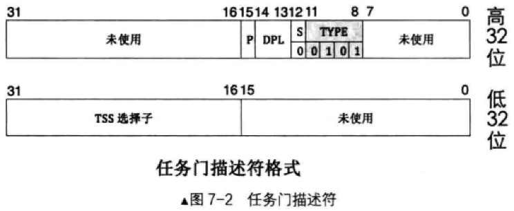
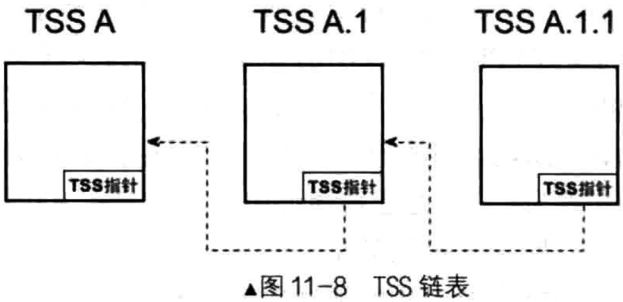

# 通过“中断+任务门”进行任务切换
## 好处
实现简单

抢占式任务调度，所有任务都有运行的机会

## 例子
在8258A中，把时钟的中断向量号设置为0x20，因此在中断描述符表IDT的第0x20个中断描述符中注册了时钟的中断处理程序

随着时钟中断的定期发生，满足一定条件后，该中断处理程序又调用schedule()进行线程调度

与任务相关的是TSS选择子，这个时钟中断的描述符是中断描述符，中断描述符存储的不是TSS选择子，而是目标中断处理例程的代码段选择子及偏移地址，因此处理器并没有把此中断门描述符中的中断处理程序当成新的任务

## 任务门的作用
中断发生时，处理器一定会通过中断向量号检索IDT中的描述符，所以，若想通过中断的方式进行任务切换，该中断对应的描述符中必须包含TSS选择子，唯一包含TSS选择子的描述符便是任务门描述符

任务门描述符中的内容是TSS选择子，任务门描述符也是系统段，因此S的值为0，在S为0的情况下，TYPE的值为0101,就表示此描述符为`任务门描述符`

中断是任何时候都会发生的，任务在执行时都会被中断信号打断，在中断描述符表中的描述符可以是中断门、陷阱门、任务门。所以，当前任务被中断后，`要么是去执行中断处理程序，要么是进行任务切换`

当中断发生时，处理器通过中断向量号在IDT中找到描述符后，通过分析描述符中字段S和字段TYPE的组合，判断描述符的类型

若发现中断对应的描述符是中断门描述符，则转去执行此中断门描述符中指定的中断处理例程。在中断处理程序的最后，通过iretd指令返回到被中断任务的中断前的代码处

若发现中断对应的是门描述符，此时便进行任务切换

## 任务调用的前提
一个完整的任务包括用户空间和内核空间代码，这两种代码加起来才是任务的全局空间

另外，在CPU眼里，一个TSS就代表一个任务，TSS才是任务的标志，CPU区分任务就是靠TSS。因此，只要TR寄存器中的TSS信息不换，无论执行的是哪里的指令，也无论指令是否跨越特权级(从用户态到内核态)，CPU都任务还是在同一个任务中

平时所写的程序代码都只是用户态代码，对于完整的任务来说它属于半成品。用户代码和内核代码只是同一个任务的不同部分

中断处理例程属于内核代码，因此它也属于当前的任务，当在中断处理例程中执行iretd指令从中断返回后，是返回到当前任务在中断前的代码处，依然属于当前任务，只是返回到了当前任务的不同部分

## iretd可以调用一个任务
之前了解了iretd指令用于从中断处理例程中返回，其实这只是它的一个功能，它一共有两个功能
- 从中断返回到当前任务的中断前代码处
- 当前任务是被嵌套调用时，它会调用自己TSS中“上一个任务的TSS指针”的任务，也就是返回到上一个任务

现在关注的重点：iretd可以调用一个任务

一个指令在不同环境下具备不同的功能，有时候这很容易引起混淆，现在模拟一下这个情况，当中断发生时，假设当前任务A被中断，CPU进入中断后，它有可能的动作是:
- 假设是中断门或陷阱门，执行完中断处理例程后是用iretd指令返回到任务A中断前的指令部分
- 假设是任务门，进行任务切换，此时是嵌套调用任务B，任务B在执行期间又发生了中断，进入了对应的中断门，当执行完对应的中断处理程序后，用iretd指令返回
- 同样假设是任务门，任务A调用任务B执行，任务B执行完成后要通过iretd指令返回任务A，使任务A继续完成后续的指令

以上几种情况的最后都是执行iretd指令，那么，CPU在执行iretd时，是回到任务A中断前的代码部分，还是回到任务B中断前的代码部分？还是调用任务A？必须要分清楚这几种情况，因为涉及的底层不同

## 怎么区分这几种情况？
看来必须在调用新任务之初就给自己留好“后路”，这时候标志寄存器eflags中的NT位和TSS中的“上一个任务的TSS指针”字段便起作用了

NT位是eflags中的第14位，1bit的宽度，它表示Nest Task Flag，任务嵌套。
- 任务嵌套是指当前任务是被前一个任务调用后才执行的，也就是当前任务嵌套于另一个任务中，相当于另一个任务的子任务
- 在此任务执行完成后还要回到前一个任务，使其继续执行
- 这一点类似于在函数A中调用一个子函数Ac，子函数Ac执行完成后还是要回到函数A中

TSS的字段"上一个任务的TSS指针"，用于记录是哪个任务调用了当前任务，有点类似于“父任务”，此字段中的值是TSS的地址，因此它就形成了任务嵌套关系的单向链表，每个TSS属于链表中的节点，CPU用此链表来记录任务嵌套调用关系，如图11-8所示

## 任务调用
当调用一个新任务时，处理器做了两件准备工作
- 自动将新任务eflags中的NT位置为1，这就表示新任务能够执行的原因被别的任务调用，也就是嵌套调用
- 随后处理器将旧任务的TSS选择子写入新任务TSS的“上一个任务的TSS”字段中

之前，中断发生时，处理器要把NT位和TF位置为0，如果对应的描述符是中断门描述符，还要再将标志寄存器eflags中的IF位清0，这是为了避免嵌套。防止正在处理的中断尚未完成时相同的中断源又发出中断信号，避免引发GP异常

有了上面的准备工作，当CPU执行iretd指令时，始终要判断NT位的值。如果NT等于1，这表示是从新任务返回到旧任务，于是CPU到当前任务(新任务)TSS的“上一个任务的TSS指针”字段中获取旧任务的TSS，转而去执行旧任务

如果NT等于0，这表示要回到当前任务中断前的指令部分

## 中断发生时，通过任务门进行任务切换过程
1) 从该任务门描述符中取出任务的TSS选择子

2) 用新任务的TSS选择子在GDT中索引TSS描述符

3) 判断该TSS描述符的P位是否为1，为1表示该TSS描述符对应的TSS已经位于内存中TSS描述符指定位置可以访问
    1. 否则P不为1表示该TSS描述符对应的TSS不在内存中，这会导致异常

4) 从寄存器TR中获取旧任务的TSS位置，保存旧任务(当前任务)的状态到旧TSS中
    1) 其中，任务状态是指CPU中寄存器的值，这仅包括TSS结构中列出的寄存器：
    2) 8个通用寄存器，6个段寄存器、指令指针eip、栈指针寄存器esp、页表寄存器cr3和标志寄存器eflags等

5) 把新任务的TSS中的值加载到相应的寄存器中

6) 使寄存器TR指向新任务的TSS

7) 将新任务(当前任务)的TSS描述符中的B位置1

8) 将新任务标志寄存器中eflags的NT位置1

9) 将旧任务的TSS选择子写入新任务TSS中"上一个任务的TSS指针"字段中

10) 开始执行新任务

## 调用iretd返回旧任务，处理器检查NT位，为1则返回
1) 将当前任务(新任务)标志寄存器中eflags的NT位置0

2) 将当前任务TSS描述符中的B位置为0

3) 将当前任务的状态信息写入TR指向的TSS

4) 获取当前任务TSS中“上一个任务的TSS指针”字段的值，将其加载到TR中，恢复上一个任务的状态

5) 执行上一个任务(当前任务)，从而恢复到旧任务

# call、jmp切换任务
## 概述
- 首先，任务描述符除了可以在IDT中注册，还可以在GDT和LDT中注册
- 其次，任务以TSS为代表，只要包括TSS选择子的对象都可以作为任务切换的操作数

## call和jmp指令 + TSS选择子或任务门选择子
TSS中已经包含了任务的详细信息，任务门描述符中又包含了TSS选择子，所以它和所有的门描述符一样，使用TSS和任务门作为call和jmp指令操作数时，操作数中包含了偏移量，CPU只用选择子部分就够了，会忽略其中的偏移量部分

假设任务门选择子定义在GDT中第2个描述符位置
- call 0x0010:0x1234

假设TSS选择子定义在GDT中第3个描述符位置
- call 0x0018:0x1234

call 是有去有回的指令，jmp是一去不回的指令

## call 0x0018:0x1234 任务切换步骤
1) CPU忽略偏移量0x1234，拿选择子0x0018在GDT中索引到第3个描述符

2) 检查描述符中的P位，若P为0，表示该描述符对应的段不存在，这将异常
    1) 同时检查该描述符的S与TYPE的值，判断其类型
    2) 如果是TSS描述符，检查该描述符符的B位，B位若为1将抛出GP异常，即表示调用不可重入

3) 进行特权级检查，数值上"CPL和TSS选择子中的RPL"都要小于等于TSS描述符的DPL，否则抛出GP异常

4) 特权检查完成后，将当前任务的状态保存到寄存器TR指向的TSS中

5) 加载新任务TSS选择子到TR寄存器的选择器部分，同时把TSS描述符中的起始地址和偏移量等属性加载到TR寄存器中的描述符缓冲器中

6) 将新任务TSS中的寄存器数组载入到相应的寄存器中，同时进行特权级检查，如果检查未通过，则抛出GP异常

7) CPU会把新任务的标志寄存器eflags中的NT位置为1

8) 将旧任务TSS选择子写入新任务TSS的字段"上一个任务的TSS指针"中，这表示新任务是被旧任务调用才执行的

9) 然后将新任务TSS描述符中的B位置1以表示任务忙
    1) 旧任务TSS描述符中的B位不变，依然保持为1
    2) 旧任务的标志寄存器eflags中的NT位的值保持不变

10） 开始执行新任务，完成任务切换

## jmp 任务切换步骤
jmp 指令以非嵌套的方式调用新任务，新任务和旧任务之间不会形成链式关系

当以jmp指令调用新任务时，新任务TSS描述符中的B位会被CPU置为1以表示任务忙，旧任务TSS描述符中的B位会被CPU清0

## 任务返回
当通过iretd指令任务返回时，新任务eflags寄存器的NT位必须为1，所以iretd仅适用于call

当调用iretd返回旧任务时，CPU会将当前任务(新任务)TSS描述符中B位清0，同时将其eflags寄存器的NT位清0