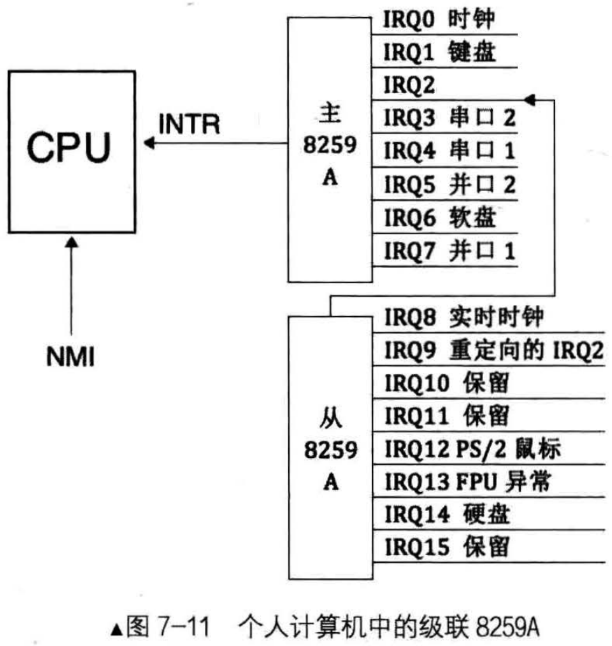
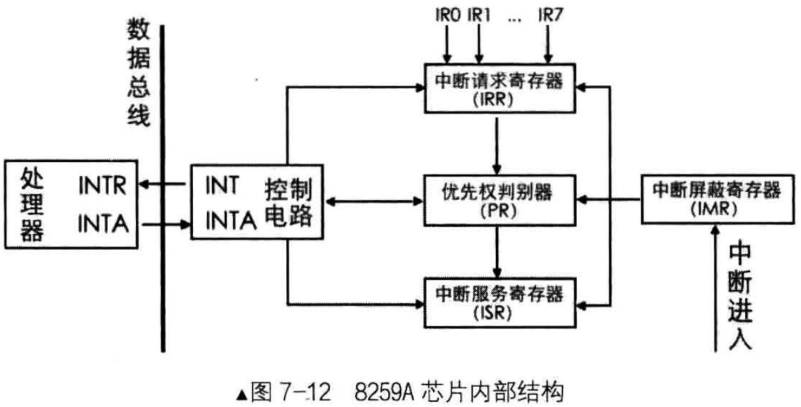

# 介绍
8258A的作用是负责所有来自外设的中断，其中就包括来自时钟的中断

8259A用于管理和控制可屏蔽中断，它表现在屏蔽外设中断，对它们实行优先级判决，向CPU提供中断向量号等功能

Intel 处理器共支持256个中断，但8259A只可以管理8个中断，所以提供了另一个解决方案，将多个8259A组合，官方术语`级联`。有了级联后，每个8259A就被称为1片

若采用级联方式，即多片8259A芯片串连在一起，最多可级联9个，也就是最多支持64个中断

n片8259A通过级联可支持7n + 1个中断源，级联时只能有一片8259A为主片master，其余的均为从片slave。来自从片的中断只能传递给主片，再有主片向上传递给CPU，也就是说`只有主片才能向CPU发送INT中断信号`

每个独立运行的外部设备都是一个中断源，它们所发出的中断，只有接在中断请求(IRQ:Interrupt ReQuest)信号线上才能被CPU知晓

# 什么是级联
## 8259A的级联
由于单个8258A芯片只有8个中断请求信号线：IRQ0~IRQ7，这显然是不够的，所以提供了一种组合方式，可以将多个自己像串联电路一样组曲一起，提供更多的中断请求信号线，这种组合方式称为`级联(cascade)`

## 个人计算机中的8259A级联

个人电脑中只有两片8259A芯片，一共16个IRQ接口，最多也只是支持 7 * 2 + 1 = 15个中断，为什么不是 2 * 8 = 16个？
- 因为级联一个从片，要占用主片一个IRQ接口，而从片上的IRQ接口不被占用，从片上专门的接口用于级联(相当于从片上向CPU发送INT信号的接口插在了主片上的某个IRQ)
- 这和级联交换机的原理是一样的，交换机上通向网关的接口是单独的，下级交换机必须用该接口通过网线接在核心交换机的某个普通网卡接口上

外部设备和8259A芯片是独立，它们也得通过信号线连接到8259A，主板电路上已经实现了这些，只要把外设往主板上一插，这些设备自动就和8259A连接上了

这些设备在发中断的时候都以为是直接发给了CPU，它们并不知道中间隔着个中断代理，8259A在收到中断后，对中断判优，将优先级最高的中断转发给CPU处理

# 8259A芯片内部结构

## 结构寄存器
### INT
8259A选出优先级最高的中断请求后，发信号通知CPU

### INTA
INT Acknowledge, 中断响应信号

位于8259A中的INTA接收来自CPU的INTA接收来自CPU的INTA接口的中断响应信号

### IMR
Interrupt Mask Register，中断屏蔽寄存器，宽度是8位，用来屏蔽某个外设的中断

### IRR
Interrupt Request Register，中断请求寄存器，宽度是8位

它的作用是接受经过IMR寄存器过滤后的中断信号并锁存，此寄存器中全是等待处理的中断，“相当于”5259A维护的未处理中断信号队列

### PR
Priority Resolver, 优先级仲裁器

当有多个中断同时发生，或当有新的中断请求进来时，将它与当前正在处理的中断进行比较，找出优先级更高的中断

### ISR
In-Service Register，中断服务寄存器，宽度是8位

当某个中断正在被处理时，保存在此寄存器中

## 注意事项
以上介绍的寄存器都是8位，这是有意如此的，其原因是8259A共8个IRQ接口，可以用8位寄存器中的每一位代表8259A的每个IRQ接口

# 8259A工作流程
## 上半场
当某个外设发出一个中断信号时，由于主板上已经将信号通路指向了8259A芯片的某个IRQ接口，所以该中断信号最终被送入了8259A

8259首先检查IMR寄存器中是否已经屏蔽了来自该IRQ接口的中断信号

IMR寄存器中的位，为1，则表示中断屏蔽，为0，则表示中断放行，如果该IRQ对应的相应位已经被置1，即表示来自该IRQ接口上的中断已经被屏蔽了，则`将该中断信号丢弃`。否则，将其送入IRR寄存器，`将该IRQ接口所在的IRR寄存器中对应的BIT置1`

IRR寄存器的作用"相当于"待处理器中断队列。在某个恰当时机，优先级仲裁器PR会从IRR寄存器中挑选一个优先级最大的中断，此处的优先级判断很简单，就是`IRQ接口号越低，优先级越大，所有IRQ0优先级最大`

之后，8259A会在控制电路中，通过INT接口向CPU发送INTR信号。信号被送入CPU的INTR接口后，这样CPU便知道有新的中断到了，于是CPU将手里的指令执行完成后，马上通过自己的INTA接口向8259A的INTA接口回复一个中断响应信号，表示CPU已经准备好了，8259A继续后面的工作

8259A在收到这个信号后，立即将刚才选出来的优先级最大的中断在ISR寄存器中对应的BIT置1，此寄存器表示当前正在处理的中断，同时要将该中断从"待处理中断队列"寄存器IRR中去掉，也就是在IRR中将该中断对应的BIT置0

之后，CPU将再次发送INTA信号给8259A，这一次是想获取中断对应的中断向量号，就是前面所说的0~255的"整数"

由于大部分情况下8259A的起始中断向量号并不是0(起始中断向量被修改)，所以用起始中断向量号 + IRQ接口号便是该设备的中断向量号，由此可见，外部设备虽然会发中断信号，但它并不知道还有中断向量好这么回事，不知道自己会被中断代理(如8259A)分配一个这样的整数

随后，8259A将此中断向量号通过系统数据总线发送给CPU。CPU从数据总线上拿到该中断向量号后，用它做中断向量表或中断描述符表的索引，找到相应的中断处理程序并去执行

## 下半场
如果8259A的"EOI通知(End Of Interrupt)"若被设置为非自动模式(手动模式)，中断处理程序结束必须有向8259A发送EOI的代码，8259A在收到EOI后，将当前正处理的中断在ISR寄存器中对应的BIT置0

如果"EOI通知"被设置为自动模式，在刚才8259A接收到第二个INTA信号后，也就是CPU向8259A要中断向量号的那个INTA，8259A会自动将此中断在ISR中对应的BIT置0

在8259A发送中断向量号给CPU之前，这时候又来了新的中断，如果它的来源IRQ接口号比ISR中的低，也就是`优先级更高`，原来ISR中准备上CPU处理的旧中断，其对应的BIT就得清0，同时将它所在的IRR中相应BIT恢复为1，随后在ISR中将此优先级更高的新中断对应的BIT置1，然后再将新中断的中断向量号发给CPU