# 8259A的编程
## 背景
在实模式下，8259A的IRQ0～7已经被BIOS分配了0x8~0xf的中断向量号。而在保护模式下，中断向量号为0x8~0xf的范围已经被CPU占了，分配给各种异常

## 8259A内的两组寄存器
### 初始化命令寄存器组
一组是初始化命令寄存器组，用来保存初始化命令字(Initialization Command Words,ICW), ICW共4个，ICW~iCW4

一部分使用ICW做初始化，用来确定是否需要级联，设置起始中断向量号，设置中断结束模式

其编程就是往8259A的端口发送一系列ICW。由于从一开始就要决定8259A的工作状态，所以要一次性写入很多设置

某些设置之间是具有关联、依赖性的，也许后面的某个设置会依赖前面某个ICW写入的设置，所有这部分要求严格的顺序，必须依次写入ICW1、CW2、ICW3、ICW4

### 操作命令寄存器组
另一组寄存器是操作命令寄存器组，用来保存操作命令字(Operation Command Word, OCW),OCW共3个，OCW1～OCW2

用OCW来操作控制8259A，前面所说的中断屏蔽和中断结束，就是通过往8259A端口发送OCW实现的

OCW的发送顺序不固定，3个中先发送那个都可以

## ICW 解析
### ICW1
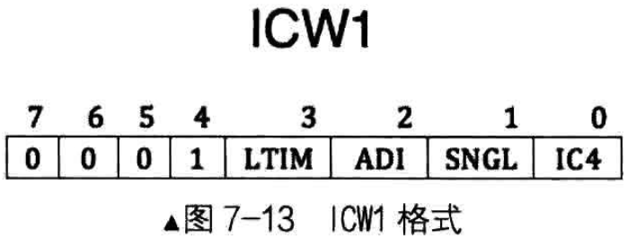

ICW1是用来初始化8259A的连接方式和中断信号的触发方式
- 连接方式是指用单片工作，还是用多片级联工作
- 触发方式是指中断请求是电平触发，还是边沿触发

注意，ICW1需要写入到主片的0x20端口和从片的0xA0端口，如图7-13所示

IC4表示是否要写入ICW4，这表示，并不是所有的ICW初始化控制字都需要用的
- IC4为1时表示需要在后面写入ICW4，为0则不需要
- 注意，x86系统IC4必须为1

SNGL 表示single，若SNGL为1，表示单片，若SNGL为0，表示级联(cascade)
- 若在级联下，这要涉及到主片(1个)和从片(多个)用哪个IRQ接口互相连接的问题
- 所以当SNGL为0时，主片和从片也是需要ICW3

ADI 表示 call address interval，用来设置8085的调用时间间隔，x86不需要设置

LTIM 表示level/edge triggered mode，用来设置中断检测方式，LTIM为0表示边沿触发，LTIM为1表示电平触发

第4位的1是固定的，这是ICW1的标记

第5～7位专门用于8085处理器，x86不需要，直接置0即可

### ICW2
ICW2用来设置起始中断向量号，就是前面所说的硬件IRQ接口到逻辑中断向量号的映射。由于每个8259A芯片上的IRQ接口是顺序排列的，所以这里设置就是指定IRQ0映射到的中断向量号，其他IRQ接口对应的中断向量号会顺着自动排下去

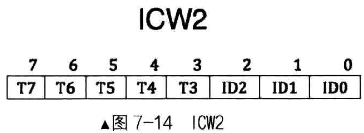

注意，ICW2需要写入到主片的0x21端口和从片的0xA1端口，如图7-14所示

由于只需要设置IRQ0的中断向量号，IRQ1～IRQ7的中断向量号是IRQ的顺延，所以，只负责填写高5位T3～T7，ID0～ID2这低3位不用负责

由于只填写高5位，所以任意数字都是8的倍数，这个数字表示的便是设定的起始中断向量号。这是有意这样设计的，低3位能表示8个中断向量号，这由8259A根据8个IRQ接口的排列位次自定导入

IR0的值是000，IRQ1的值是001，IRQ2的值是010。。。。 依次类推，这样高5位加低3位，便表示了任意一个IRQ接口实际分配的中断向量号

### ICW3
ICW3仅在级联的方式下才需要(如果ICW1中的SNGL为0)，用来设置主片和从片用哪个IRQ接口互连

注意，ICW3需要写入到主片的0x21端口和从片的0xA1端口，如图7-15所示

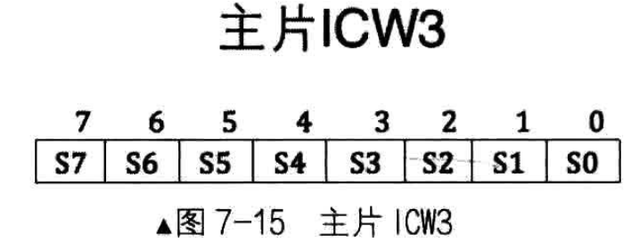

由于主片和从片的级联方式不一样，对于这个ICW3，主片和从片都有自己不同的结构，如图7-15所示

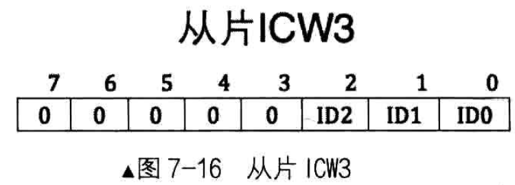

对于主片，ICW3中置1的那一位对应的IRQ接口用于连接从片，若为0则表示接外部设备。比如，若主片IRQ2和IRQ5接有从片，则主片的ICW3为00100100，如图7-16所示

对于从片，要设置与主片8259A的连接方式, 不需要指定用自己的那个IRQ接口与主片连接，从片上专门用于级联主片的接口并不是IRQ

如果从片用IRQ接口连接主片，若主片只级联一个从片，在从片上指令的IRQ接口便默认与主片上做级联的那个IRQ接口匹配

但如果主片级联多个从片时，在从片上还要设置自己用于连接主片的IRQ接口与主片上连接从片的哪个IRQ接口(有多个)对接，这样反而更麻烦

所以，设置从片连接主片的方法是只需要在从片上指定主片用于连接的自己的那个IRQ接口就行了

在中断响应时，主片会发送与从片做级联的IRQ接口号，所有从片用自己的ICW3的低3位和它对比，若一致则认为是发给自己的
- 比如主片用IRQ2接口连接从片A，用IRQ5接口连接从片B，从片A的ICW3的值应该设为00000010
- 从片B的ICW3的值应该设为00000101
- 所以，从片ICW3中的低3位ID0～ID2就够了，高5位不需要，为0即可

### ICW4
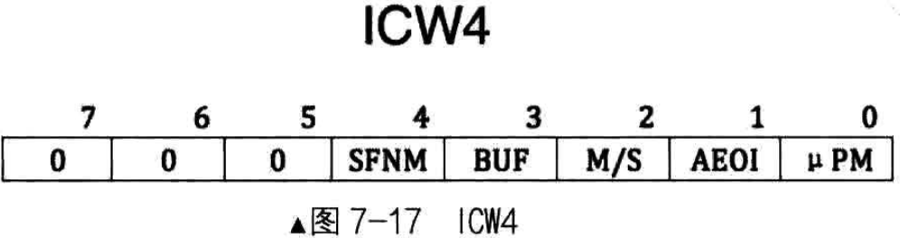

ICW4用于设置8259A的工作模式，当ICW1中的IC4为1时才需要ICW4

注意，ICW需要写入主片的0x21及从片的0xA1端口，如图7-17所示

ICW4有些低位的选项基于高位
- 第7～5位未定义，直接置为0即可

SFNM表示特殊全嵌套模式(Special Fully Nested Mode)
- 若SFNM为0，则表示全嵌套模式
- 若SFNM为1，则表示特殊全嵌套模式

BUF表示本8259A芯片是否工作在缓冲模式
- BUF为0，则工作非缓冲模式
- BUF为1，则工作在缓冲模式

当多个8259A级联时，如果工作在缓冲模式下, M/S用来规定本8259A是主片，还是从片
- 若M/S为1，则表示是主片
- 若M/S为0，则表示是从片
- 若工作在非缓冲模式(BUF为0)下，M/S无效

AEOI 表示自动结束中断(Auto End Of Interrupt)，8259A在收到中断信号时才能继续处理下一个中断，此项用来设置是否要让8259A自动把中断结束
- 若AEOI为0，则表示非自动，即手动结束中断，可以在中断处理器程序中手动向8259A的主、从片发送EOI信号。这种操作类命令，通过OCW进行
- 若AEOI为1，则表示自动结束中断

µPM 表示微处理器类型(microprocessor)，此项是为了兼容老处理器。
- 若µPM为0，则表示8080或8085处理器
- 若µPM为1，则表示x86处理器

## OCW解析
### OCW1
OCW1用来屏蔽连接8259A上的外部设置的中断信号，实际上就是把OCW1写入了IMR寄存器

这里屏蔽是说是否把来自外部设备的中断信号转发给CPU。由于外部设备的中断都是可屏蔽中断，所以最终还是要受标志寄存器eflags中的IF位的管束
- 若IF为0，可屏蔽中断全部屏蔽，也就是说，在IF为0的情况下，即使8259A把外部设备的中断向量发过来，CPU也置之不理

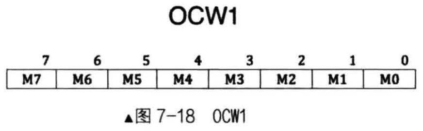

注意，OCWl要写入主片的0x21或从片的 0xAl 端口，如图 7-18 所示

M0 ～ M7对应8259A的IRQ0～IRQ7
- 某位1，对应的IRQ上的中断信号被屏蔽
- 某位0，对应的IRQ上的中断信号被放行

### OWC2
#### 概述
OCW2 用来设置中断结束方式和优先级模式

注意，OCW2要写入到主片的0x20及从片的0xA0端口

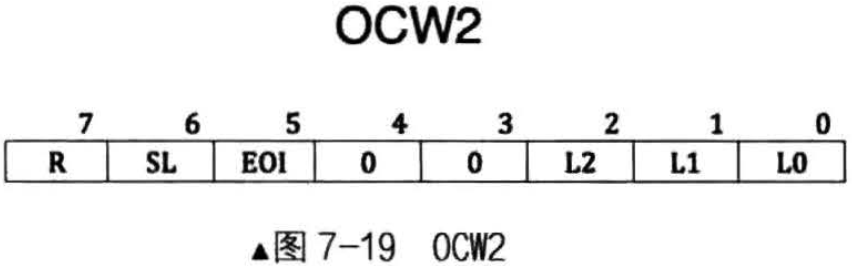

OCW2的配置比较复杂，各种属性位要配合在一起，组合出8259A的各种工作模式。如图7-19所示，由高3位R、SL、EOI可以定义多种中断结束方式和优先级循环模式

#### 属性分析
在OCW2中比较灵活的是有个开关位: SL
- 可以针对某个特定优先级的中断进行操作
- 以下优先级模式设置和中断结束都可以基于此开关做更细粒度的控制

OCW2其中的一个作用就是发EOI信号结束中断
- 如果使SL为1，可以用OCW2的低3位(L2 ~ L0)来指定位于ISR寄存器中哪个中断被终止，也就是结束来自哪个IRQ接口的中断信号
- 如果SL位为0，L2 ～ L0便不起作用了。8259A会自动将正在处理的中断结束，也就是把ISR寄存器中优先级最高的位清0

OCW2另一个作用就是设置优先级控制方式，这就是用R位(第7位)来设置
- 为表述方便，IRQ各个接口在此被表述位"IR数字"的形式，这也是微机接口中的命名规则
- 如果R为0，表示固定优先级方式，即IRQ接口号越低，优先级越高
- 如果R为1，表明循环优先级方式，这样优先级会在0～7内循环。如果SL为0，初始化的优先级次序为 IR0 > IR1 > IR2 > IR3 > IR4 > IR5 > IR6 > IR7
- 当某级别的中断处理完成后，它的优先级将变成最低，将最高优先级传给之前较之低一级别的中断请求，其他依次类推
- 所以，可循环方式多用于各中断源优先级相同的情况，优先级通过这种循环可以实现轮询处理
- 该循环可总结为如果IR(i)优先级最低，IR(i + 1)则优先级最高，优先级关系如图 7 - 20所示
- 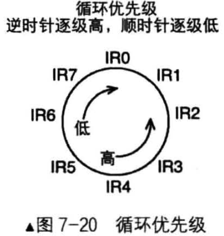
- 在图7-20中，顺时针方向的优先级是逐级减小，反之逆时针的优先级是逐渐增大
- 比如，当前IR3为最高级别中断请求，处理完成后，IR3将变成最低级别，IR4变成最高级别，这一组循环之后的优先级变成
    - IR4 > IR5 > IR6 > IR7 > IR0 > IR1 > IR2 > IR3
- 另外，还可以打开SL开关，使SL为1，再通过L2 ~ L1指定最低优先级是哪个IRQ接口
- 举个例子，在R和SL都等于1的情况下，若想指定IR5为最低的优先级，需要将L2 ~ L0置为101
    - 这样，参看图7-20，新的初始优先级循环：
    - IR6 > IR7 > IR0 > IR1 > IR2 > IR3 > IR4 > IR5
    
R,Rotation, 表示是否按照循环方式设置中断优先级
- R为1表示优先级自动循环
- R为0表示自动循环，采用固定优先级方式

SL, Specific Level，表示是否指定优先等级
- 等级用低3位来指定
- 此处的SL只是开启低3位的开关，所以SL也表示低3位的L2 ~ L0是否有效
- SL为1表示有效，SL为0表示无效

EOI, End Of Interrupt, 为中断结束命令位
- 令EOI为1，则会令ISR寄存器中的相应位清0，也就是将当前处理的中断清掉，表示处理结束
- 向8259A主动发送EOI是手工结束中断的走法，所以，使用此命令有个前提，就是ICW4中的AEOI位为0，非自动结束中断时才用
- 值得注意的是在手动结束中断(AEOI位为0)的情况下，如果中断来自主片，只需要向主片发送EOI就行了
- 如果中断来自从片，除了向从片发送EOI以外，还要向主片发送EOI

第4~3位的00是OCW2的标识

L2 ~ L0用来确定优先级的编码，这里分两种，一种用于EOI时，表示被中断的优先级别，另一种用于优先级循环时，指定起始最低的优先级别

#### COW2高位属性组合
其实整个 OCW2 就是各种关键宇属性的配合使用，主要就是 L2～Lo 需要配合 R位、 SL 位、 EOI 位的设置

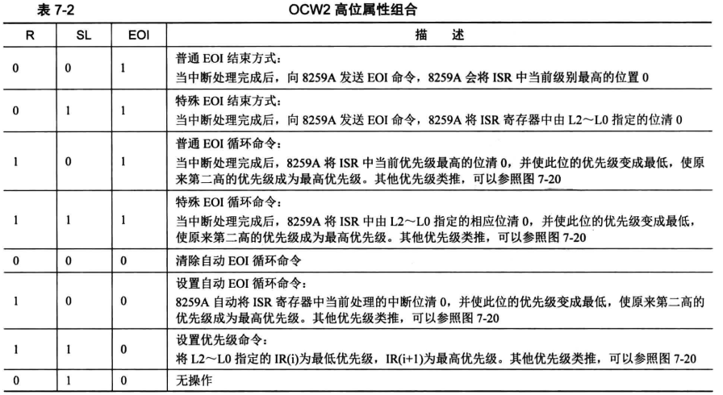

### OCW3
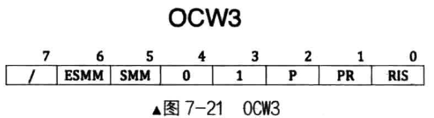

OCW3 用来设定特殊屏蔽方式及查询方式，如图 7-21所示。OCW3 要写入主片的 0x20 端口或从片的 0xAO 端口

第7位未用到

第6位的ESMM(Enable Special Mask Mode) 和 第5位的SMM(Special Maks Mode)是组合在一起用的，用来启用和禁用特殊屏蔽模式
- ESMM是特殊屏蔽模式允许位，是个开关
- SMM是特殊屏蔽模式位
- 只启用特殊屏蔽模式时，特殊屏蔽模式才有效。也就是若ESMM为0，则SMM无效。若ESMM为1，SMM为0，表示未工作在特殊屏蔽模式。
- 若ESMM和SMM都为1，这才正式工作在特殊屏蔽模式下

第 4～3 位的 01 是 OCW3 的标识, 8259A 通过这两位判断是哪个控制字。

P,Poll command，查询命令，当 P 为 1 时，设置 8259A 为中断查询方式，这样就可以通过读取寄存器，如 IRS ，来查看当前的中断处理情况。

RR,Read Register，读取寄存器命令。它和RIS位是配合在一起使用的
- 当 RR为 l 时才可以读取寄存器

RIS,Read Interrupt register Select，读取中断寄存器选择位，顾名思义，就是用此位选择待读取的寄存器
- 有点类似显卡寄存器中的索引的意思
- RIS 为 1 ，表示选择 ISR 寄存器，RIS 为 0，表示选择 IRR寄存器
- 这两个寄存器能否读取，前提是RR的值为 1

## 8259A就2个端口地址，它是如何识别4个ICW和3个OCW的？
ICW1和OCW2、OCW3是用偶地址端口0x20(主片)或0xA0(从片)写入

ICW2～ICW4和OCW1是用奇地址端口0x21(主片)或0xA1(从片)写入

以上4个ICW要保证一定的次序写入，所有8259A就知道写入端口的数据是什么

OCW的写入与顺序无关，并且ICW1和OCW2、OCW3的写入端口是一致的，那8259A怎样来辨识它们呢？
- 其实就是各控制字中的第4～3标识位，通过这两位的组合来唯一确定某个控制字
- 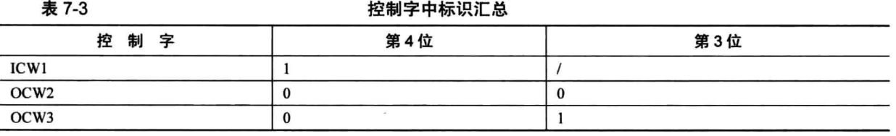

OCW1是怎样确定的？OCW是在初始化之后才有效的，所有初始化之后写入奇地址端口的数据便被认为OCW1

##  总结
8259A的编程就是写入ICW和OCW，下面总结步骤(对于8259A的初始化必须最先完成)
- 无论8259A是否级联，ICW1和ICW2是必须要有的，并且要顺序写入
- 只有当ICW1中的SNGL位为0时，这表示级联，级联就需要设置主片和从片，这才需要在主片和从片中各写入ICW3
- 只能当ICW1中的IC4为1时，才需要写入ICW4。不过，x86系统IC4必须为1

总结再总结，在x86系统中，对于初始化级联8259A，4个ICW都需要，初始化单片8259A，ICW3不要，其余全要

在以上初始化8259A之后才可以用OCW对它操作