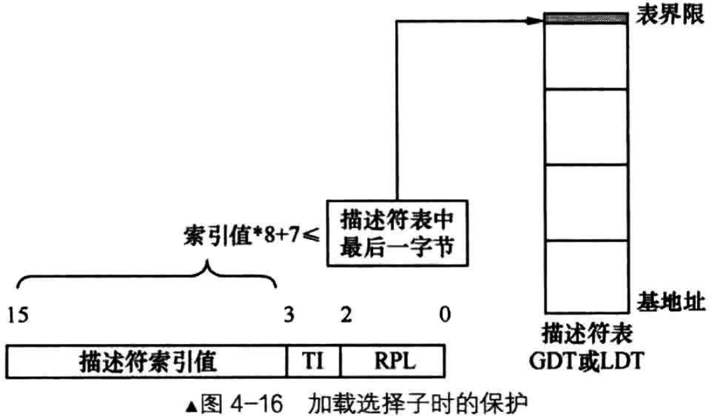
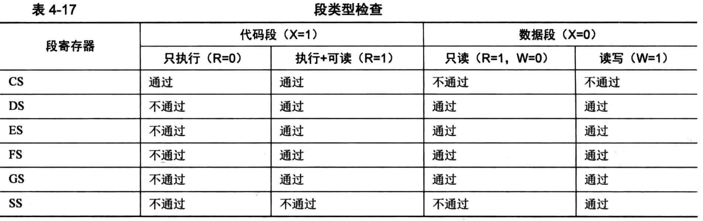

# 概述
当引用一个内存段时，实际上就是往段寄存器中加载个选择子，为了避免出现非法引用内存段的情况，这时候，处理器会在以下几个方面做出检查

# 首先根据选择子的值验证段描述符是否超越界限
选择子的高13位是段描述符的索引值，第0～1位是RPL，第2位是TI位

首先处理器保证选择子是正确的，判断的标准是选择子的索引值一定要小于等于描述符表(GDT或LDT)中描述符的个数

这就像数组下标一样，绝对不能越界，也就是说，段描述符的最后1字节一定要在描述符表(GDT或LDT)的界限地址之内

每个段描述符的大小是8字节，所以在往段寄存器中加载选择子时，处理器要求选择子的索引值要满足下面表达式
- 描述符表基地址 + 选择子中索引值 * 8 + 7 <= 描述符表基地址 + 描述符表界限值

检查过程如下：
- 处理器先检查TI的值，如果TI是0，则从全局描述符表寄存器gdtr中拿到GDT基地址和GDT界限值
- 如果TI是1，则从局部描述符表寄存器ldtr中拿到LDT基地址和LDT界限值
- 有了描述符表基地址和描述符表界限值后，把选择子的高13位代入上面的表达式，若不成立，处理器则抛出异常

GDT中的第0个描述符是空描述符，如果选择子的索引值为0则会引用到它

所以，不允许往CS和SS段寄存器中加载索引值为0的选择子

虽然可以往DS、ES、FS、GS寄存器中加载值为0的选择子，但真正在使用时CPU将会抛出异常，毕竟第0个段描述符是哑的，不可用

# 检查段类型
主要是检查段寄存器的用途和段类型是否匹配
- 只有具备可执行属性的段(代码段)才能加载到CS段寄存器中
- 只具备执行属性的段(代码段)不允许加载到除CS外的段寄存器中
- 只有具备可写属性的段(数据段)才能加载到SS栈段寄存器中
- 至少具备可读属性的段才能加载到DS、ES、FS、GS段寄存器中

# 检查段是否存在
CPU通过段描述符中的P位来确认内存段是否存在，如果P位为1，则表示存在，这时候就可以将选择子载入段寄存器了

同时段描述符缓冲寄存器也会更新为选择子对应的段描述符的内容，随后处理器将段描述符中的A位置为1，表示已经访问过了

如果P位为0，则表示该内存不存在，不存在的原因可能是由于内存不足，操作系统将该段移出内存转储到硬盘上了

这时候处理器会抛出异常，自动转去执行相应的异常处理程序，异常处理程序将段从硬盘加载到内存后并将P位置为1，随后返回

CPU继续执行刚才的操作，判断P位

以上涉及到的P位，其值由软件(通常是操作系统)来设置，由CPU来检查。A位由CPU来设置