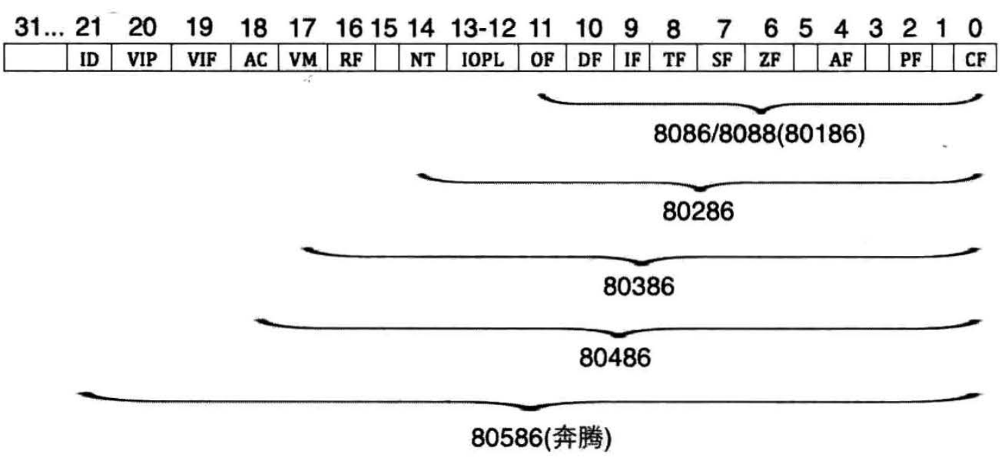

# flag寄存器
## flag寄存器示意图


flag 的1、3、5、12、13、14、15位在8086CPU中没有使用，不具有任何含义

而0、2、4、6、7、8、9、10、11位都具有特殊的含义


## ZF 标志
flag 的第6位是ZF，零标志位

它记录相关指令执行后，其结果是否位0。如果结果为0，那么zf=1;如果结果不为0，那么zf=0

比如，指令:
```
mov ax, 1
sub ax, 1
```
执行后，结果为0，则zf=1

```
mov ax, 2
sub ax, 1
```
执行后，结果不为0，则zf=0

注意，在8086CPU的指令集中，有的指令的执行的影响标志寄存器的,比如, add、sub、mul、div、inc、or、and等，它们大都是运算指令(进行逻辑或算术运算)

有的指令的执行对标志寄存器没有影响，比如, mov、push、pop等，它们大都是传送指令


## PF标志
flag 的第2位是PF，奇偶标志位

它记录相关指令执行后，其结果的所有bit位中1的个数是否为偶数。如果1的个数为偶数,pf=1，如果为奇数，那么pf=0

比如，指令:
```
mov al, 1
add al, 10
```
执行后，结果为00001011B，其中有3(奇数)个1，则pf=0

```
mov al, 1
or al, 2
```
执行后，结果为00000011B,其中有2(偶数)个1, 则pf=1

```
sub al, al
```
执行后，结果为00000000B，其中有0(偶数)个1，则pf=1


## SF标志
flag 的第7位是SF，符号标志位

它记录相关指令执行后，其结果是否位负。如果结果为负，sf=1。如果非负，sf=0

计算机中通常用补码来表示有符号数据。计算机中的一个数据可以看作是有符号数，也可以看成是无符号数,比如
- 00000001B,可以看作为无符号数1，或有符号数+1
- 10000001B,可以看作为无符号数129, 也可以看作有符号数-127

SF标志，就是CPU对有符号数运算结果的一种记录，它记录数据的正负。在我们将数据当作有符号数来运算的时候，可以通过它来得知结果的正负

在我们将数据当作有符号来运算的时候，可以通过它来得知结果的正负。如果我们将数据当作无符号数来运算，SF的值则没有意义，虽然相关的指令影响了它的值

某些指令将影响标志寄存器中的多个标记位，这些被影响的标记位比较全面记录了指令的执行结果，为相关的处理提供了所需的依据

比如指令sub al, al 执行后，ZF、PF、SF等标志位都要受影响，它们分别是1、1、0


## CF标志
flag的第0位是CF，进位标志位. `CF=1表示进位, CF=0表示不进位`

一般情况下，在进行`无符号`运算的时候，它记录了运算结果的最高有效位向更高位的进位值，或从更高位的借位值

对于位数为N的无符号数来说，其对应的二进制信息的最高位，即第N-1,就是它的最高有效位，而假想存在的第N位，就是相对于最高有效位的更高位
    
    
当两个数据相加的时候，有可能产生从最高有效位向更高位的进位。比如，两个8位数据: 98H + 98H，将产生进位

由于这个进位值在8位数中无法保存，在前面的文章中，就只是简单说这个进位值丢失。起始CPU在运算的时候，并不丢弃这个进位值，而是记录在一个特殊的寄存器的某一位上。8086CPU就用flag的CF位来记录这个进位值

比如,下面的指令
```
mov al, 98h
add al, al  ; 执行后: (al) = 30h, CF=1, CF记录了从最高有效位向更高位的进位值
add al, al  ; 执行后: (al) = 600H, CF=0,CF记录了从最高有效位向更高位的进位值
```

而当两个数据作减法的时候，有可能向更高位借位。比如，两个8位数据:
    97h - 98h，将产生借位，借位后，相当于计算197h - 98h

而flag的CF位也可以用来记录这个借位值。比如，下面的指令
```
mov al, 97h
sub al, 98h ; 执行后: (al) = FFH, CF=1,CF记录了向更高位的借位值
sub al, al  ; 执行后: (al) = 0, CF = 0, CF记录了向更高位的借位值
```

## OF标志
那么，什么是机器所能表示的范围？
- 比如说，指令运算的结果用8位寄存器或内存单元来存放，比如, add al, 3， 那么对于8位的有符号数据，机器所能表示的范围就是-128 ~ 127
- 同理，对于16位有符号数据，机器所能表示的范围是-32769 - 32767

如果运算结果超出了机器所能表达的范围，将产生溢出

注意，这里所讲的溢出，只是对有符号运算而言。下面看两个溢出的例子
```
mov al, 98
add al, 99
```
执行后将产生溢出。因为add al, 99进行的有符号数运算是
- (al) = (al) + 99 = 98 + 99 = 197
- 而结果197超出了机器所能表示的8位有符号数的范围: -128 ~ 127

```
mov al, 0F0H    ; F0h，为有符号数 - 16的补码
add al, 088H    ; 88H, 为有符号数 - 120的补码
```
执行后，将产生溢出。因为add al, 088h进行的有符号数运算是
- (al) = (al) + (-120) = (-16) + (-120) = -136
- 而结果-136超出了机器所能表示的8位有符号数的范围: -128 ~ 127


flag的第11位是OF，溢出标志位。一般情况下，OF记录了有符号数运算的结果是否发生了溢出。如果发生溢出，OF=1；如果没有，OF=0

# eflags寄存器
## eflags寄存器示意图


## IOPL
第12～13位为IOPL，即Input Output Privilege Level，这用在有特权级概念的CPU中

有4个任务特权级，即特权级0、特权级1、特权级2和特权级3。故IOPL要占用2位来表示这4种特权级

## NT
第14位为NT，即Nest Task，意为任务嵌套标志位

8088支持多任务，一个任务就是一个进程。当一个任务中有嵌套调用了另一个任务(进程)时，此NT位为1，否则为0

## RF位
第16位为RF位，即Resume Flag,意即恢复标志位

该标志位用于程序调试，指示是否接受调试故障，它需要与调试寄存器一起使用

当RF为1时忽略调试故障，为0时接受

## VM位
第17位为VM位，即Virtual 8086 Model,意为虚拟8086模式

这是实模式向保护模式过渡时的产物，现在已经没有了。CPU有了保护模式后，功能更加强大，但为了兼容实模式下的用户程序，允许将此位置为1，这样便可以在保护模式下运行实模式下的程序了

实模式下的程序不支持多任务，而且程序中的地址就是真实的物理地址

所以在保护模式下每运行一个实模式下的程序，就要为其虚拟一个实模式环境，故称为虚拟模式

## AC位
第18位为AC位，即Alignment Check,意为对齐检查

什么是对齐？
- 是指程序中的数据或指令其内存地址是否是偶数，是否是16、32的整数倍，没有余数
- 这样硬件每次对地址以自增地方式(每次自加2、16、32等)访问内存时，自增后的地址正好对齐数据所在的起始地址上，这就是对齐的原理

## VIF位
第19位为VIF位，即Virtual Interrupt Flag,意为虚拟中断标志位，虚拟模式下的中断标志

## VIP位
第20位为VIP位，即Virtual Interrupt Pending，意为虚拟中断挂起标志位

多任务情况下，为操纵系统提供的虚拟中断挂起信息，需要与VIF位配合

## ID位
第21位为ID位，即Identification，意思为识别标志位

系统经常要判断CPU型号，若ID为1，表示当前CPU支持CPU id指令，这样便能获取CPU的型号、厂商信息

若ID为0，则表示当前CPU不支持CPU id指令