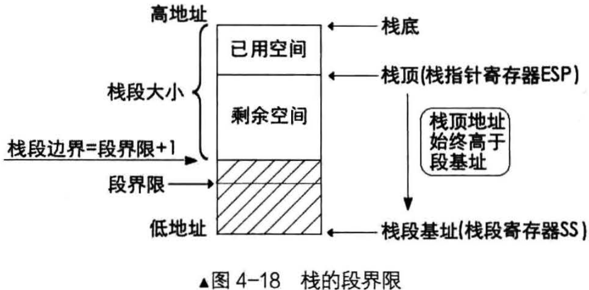

# 扩展方向
虽然段描述符type中的e位用来表示段的扩展方向，但它和别的描述符属性一样，仅仅是用来描述段的性质
- 即使e等于1向下扩展，依然可以引用不断向上递增的内存地址
- 即使e等于0向上扩展，也依然可以引用不断向下递减的内存地址

栈顶指针[e]sp的逐渐降低，这是push指令的作用，与描述符是否向下扩展无关，也就是说，是数据段就可以用作栈

本来以为向下扩展的段是专门给栈用的，现在又说数据段就可以作栈，那它与向上扩展的段的有什么区别？

CPU对数据段的检查，其中一项就是看地址是否超越段界限。如果将向上扩展的数据段用作栈，那CPU将按照`《代码段和数据段的保护》`提到的数据段的方式检查该段，如果用向下扩展的段做栈的话，情况有点复杂，这体现在段界限的意义上
- 对于向上扩展的段，实际的段界限是段内可以访问的最后一个字节
- 对于向上扩展的段，实际的段界限的段内不可以访问的第一个字节

由于栈段是向下扩展的，也许觉得段界限似乎用负数更为"贴切"

# 段界限的范围

但段界限本质上就是段的大小范围，范围可没有负数之说，所以段界限肯定是个正数

`栈的段界限是以栈段的基址为基准，并不是以栈底，因此栈的段界限肯定是位于栈顶之下`

地址本身由低向高，段界限也是个地址，而栈的扩展方向是由高地址向低地址，与段界限有个碰撞的趋势

为了避免碰撞，将段界限地址+1 视为栈可以访问的下限。段界限+1，才是栈指针可达的下边界

# 以32位保护模式下的栈为例子
32位保护模式下栈顶指针是esp寄存器，栈的操作数大小是由B位决定的，这里假设B为1，即操作数是32位。栈段也是位于内存中，所以它也要受控于段描述符的G位
- 如果G为0，实际的段界限大小=描述符中的段界限
- 如果G为1，实际的段界限大小=描述符中段界限 * 0x1000 + 0xFFF

同代码段的操作数一样，用于压栈的操作数也有其长度，push指令每向栈中压入操作数时，实际上就将esp指针减去操作数的大小(2字节或4字节)后，再将操作数复制到esp减4后的新地址

栈指针可访问的最低地址是由实际段界限决定的，但栈段最大可访问的地址是由B位决定的，这里B位为1，表示32位操作数，所以栈指针最大访问地址是0xFFFFFFFF

综上所述，每次向栈中压入数据时就是CPU检查栈段的时机，它要求必须满足以下条件
- 实际段界限+1 <= esp - 操作数大小 <= 0xffffffff

假设现在esp指针为0xffffe002，段描述符的G位为1，描述符中的段界限为0xffffd

故实际段界限为0x1000 * ffffd + 0xfff = 0xffffdfff。 当执行push ax，压入2字节的操作数，即esp - 2 = 0xffffe000, 新的esp值 >= 实际段界限 0xffffdfff + 1

如果执行push eax,压入4字节的数据， esp - 4 = 0xffffdffe，小于实际段界限0xffffdfff，故CPU会抛异常

由于esp只是栈段内的偏移地址，其真正物理地址还要加上段基址。假设段基址为0，故该栈段：
- 最大可访问地址为 0 + 0xffffffff = 0xffffffff
- 最小可访问地址为 0 + 0xffffdfff + 1 = 0xffffe000
- 栈段空间大小为 0xffffffff - 0xffffe000 = 8KB
