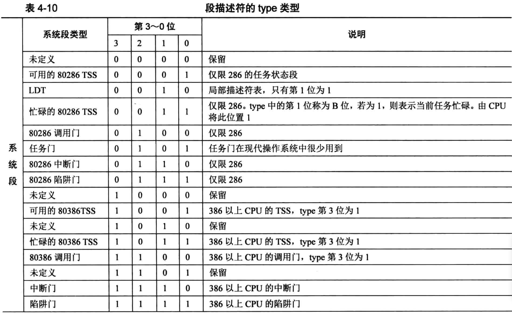
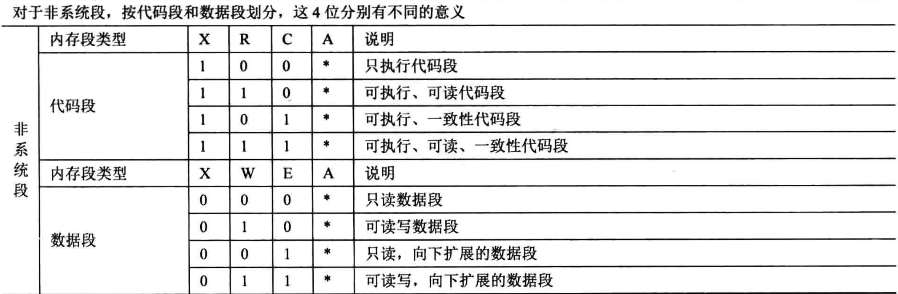

# 段描述符图例

段描述符是8字节大小，上图为了方便展示，才将其"人为地"分成了低32位和高32位，即两个4字节部分

从图片显示，会发现20位的段界限属性，居然被拆分成两部分
- 段界限的低16位(0~15位)存放在段描述符的低32位
- 段界限的高4位(16~19位)存放在段描述符的高32位

段基址更过分，32位的段基址被拆分三份存放
- 主要是为了兼容，CPU不得不兼容过去的产品

段描述符的低32位分为两部分，前16部分用来存储的段界限的前 0 ~ 15位，后16位用来存储段基址的 0 ~ 15位

主要的属性都在段描述符的高32位
- 0 ～ 7位是段基址的16 ～ 23，24 ～ 32位是段基址的24 ~ 31，加上在段描述符低32位中的段基址0~15位，这下32位基地址才齐全
- 8 ～ 11 是type字段，共4位，用来指定本描述符的类型
- 12位是S属性，决定段是系统段还是代码段和数据段
- 段描述符的第 13 ~ 14位是DPL字段，Descriptor Privilege Level
- 段描述符的第15位是P字段，Present,即段是否存在
- 段描述符的16～19位是段界限的第16～19位，共20位的段界限就齐全
- 段描述符的第20位为AVL字段，从名字上看它是Available，可用的
- 段描述符的第21位为L字段，用来设置是否是64位代码段
- 段描述符的第22位是D/B字段，用来指示有效地址(段内偏移)及操作数大小
- 段描述符的第23位是G字段，Granularity，粒度，用来指定段界限的单位大小
- 段描述符的第24 ～ 31位是段基址的第24 ～ 31位，这是段基址的最后8位

# 段基地址
规定段的起始地址，长度32位

保护模式下地址总线宽度是32位，段基址需要用32位地址来表示

# 段界限(段长度)
规定段的大小，长度20位。段界限可以是以`4KB`或者`1B`为单元大小

段界限表示段边界的扩展最值，即最大扩展到多少或最小扩展多少
- 扩展方向只有上下两种
- 对于数据段和代码段，段的扩展方向是向上，即地址越来越低，此时的段界限用来表示`段内偏移的最小值`
- 无论是向上扩展，还是向下扩展，段界限的作用如同其名，表示段的边界、大小、范围
- 段界限用20个二进制位来表示，只不过此段界限只是个单位量，它的单位要么是字节，要么是4KB，这是由描述符中的G位来指定的
- 最终段的边界是此段界限值 * 单位，故段的大小要么是2的20次方等于1MB，要么是2的32次方(4KB等于2的次方，12+20=32)等于4GB

上面所说的1MB和4GB只是个范围，并不是具体的边界值。由于段界限只是个偏移量，是从0算起的，所以实际的段界限边界值 = (描述符中段界限 + 1) * (段界限的粒度大小: 4KB或者1) - 1

这个公式很简单，就是表示有多少个4KB或1.由于描述符的段界限是从0起的，所以左边第1个括号中要加1，表示4KB或1的实际数量

它与第二个括号中的段粒度大小相乘后得到的乘积是以1为起始的段实际大小，由于地址是以0为起始的，所以公式的最后又减1

内存访问需要用到"段基值：段内偏移地址"，段界限其实是用来限制段内偏移地址的，段内偏移地址必须位于段的范围之内，否则CPU会抛异常

根据段的扩展方向，此"段界限 * 单位" 便是段内偏移地址的最大值(向上扩展)或最小值(向下扩展)，任何超过此值的偏移地址都被认为是非法访问，CPU会将此错误捕获

# 段属性
确定段的各种性质.长度(12位)

## S字段
一个段描述符，在CPU眼里分为两大类，要么描述的是系统段，要么描述的是数据段，这是有段描述符中的S位决定的，用它指示是否是系统段

在CPU眼中，凡是硬件运行需要用到的东西都可以称为系统，凡是软件(操作系统也属于软件，CPU眼中，它与用户程序无区别)需要的东西都称为数据

无论是代码，还是数据，甚至包括栈，它们都作为硬件输入，都是给硬件的数据而已，所以代码段在段描述符中也属于数据段(非系统段)

S为0时表示系统段，S为1时表示数据段

什么是系统段？
- 各种称为"门"的结构便是系统段，也就是硬件系统需要的结构，非软件使用的，如果调用门，任务门
- 简而言之，门的意思就是入口，它通往一段程序

## TYPE字段
type字段是要和S字段配合在一起才能确定确定段描述符的确切类型，只有S字段的址确定后，type字段才有意义

### 系统段

### 非系统段

表中的A位表示Accessed位
- 这是由CPU来设置，每当该段被CPU访问过后，CPU就将此位置1
- 所以，创建一个新段描述符时，应该将此位置0

C表示一致性代码，也称为依从代码段,Conforming
- 一致性代码段是指如果自己是转移的目标段，并且自己是一致性代码段，自己的特权级一定要高于当前特权级
- 转移后后的特权级不与自己的DPL为主，而是与转移前的低特权级一致，也就是听从、依从转移前的低特权级
- C为1时则表示该段是一致性代码段，C为0时则表示该段为非一致性代码段

R表示可读，R为1表示可读，R为0表示不可读
- 这个属性一般用来限制代码段的访问
- 如果指令执行过程中，CPU发现某些指令对R为0的段进行访问，如使用段超越前缀CS来访问代码段，CPU将抛异常
- CPU可以访问任何地方，不可读的代码段只是来限制代码指令的，并不是连CPU也不能看

X表示该段是否可执行，EXecutable
- 所说的指令和数据，在CPU眼中是没有任何区别的，都是010101这样类似的二进制
- 所以type中的X位来标识出是否是可执行的代码
- 代码段是可执行的，即X为1。数据段不可执行的，即X为0

E是用来标识段的扩展方向,Extend
- E为0表示向上扩展，即地址越来越高，通常用于代码段和数据段
- E为1表示向下扩展，地址越来越低，通常用于栈段

W是指段是否可写，Writable
- W为1表示可写，通常用于数据段
- W为0表示不可写入，通常用于代码段
- 对于W为0的段有写入行为，同样会引发CPU抛出异常

## DPL(Descriptor Privilege Level)
DPL即描述符特权级，这是保护模式提供的安全解决方案，将计算机世界按权利划分成不同等级，每一种等级称为一种特权级

由于段描述符用来描述符一个内存段或一段代码的情况(若描述符类型为"门")，所以描述符中的DPL是指所代表的内存段的特权段

这两位能表示4中特权级，分别是0、1、2、3级特权，数字越小，特权越大

特权级是保护模式下才有的东西，CPU由实模式进入保护模式后，特权级自动为0

因为保护模式下代码已经是操作系统的一部分啦，所以操作系统应该处于最高的0特权级

用户程序通常处于3特权级，权限最小。某些指令只能在0特权级下执行，从而保证安全

## P 字段
P 字段，Present，即段是否存在

如果段存在于内存中，P为1，否则P为0。P字段是由CPU来检查的，如果为0，CPU将抛出异常，转到相应的异常处理程序，此异常处理程序是我们来写，在异常处理程序处理完成后要将P置1，也就说，对于P字段，CPU只负责检查，我们赋值

不过通常情况下，段都是在内存中的
- 当初CPU的设计是当内存不足时，可以将段描述符中对应的内存段换出，也就是可以把不常用的段直接直接换出到硬盘，待使用时再加载进来
- 但现在即使内存不足时，也没有将整个段都换出去，现在基本都是平坦模式，一般情况下，段都要4GB大小，换到硬盘也很占空间
- 而且，这些平坦的段都是公用的，换出去就麻烦，所以这些是未开启分页时的解决方法
- 保护模式下有分页功能，可以按页(4KB)的单位来将内存换入换出

## L字段
L 用来设置段是否是64位的代码段

L为1表示64位代码段，否则表示32位代码段

这目前属于保留位，在32位CPU下编程，将其置为0

## D/B字段
段描述符的第22位是D/B字段，用来指示有效地址(段内偏移)及操作数大小

有没有觉得奇怪，实模式己经是 32 位的地址线和操作数了，难道操作数不是 32 位大小吗？
- 其实这是为了兼容286的保护模式，286的保护模式下的操作数是16位

对于代码段来说，此位是D位，若D为0，表示指令中的有效地址和操作数是16位，指令有效地址用IP寄存器
- 若D为1，表示指令中的有效地址及操作数是32位，指令有效地址用EIP寄存器

对于栈段来说，此位是B位，用来指定操作数大小，此操作数涉及到栈指针寄存器的选择及栈的地址上限
- 若B为0，使用的是sp寄存器，也就是栈的起始地址是16位寄存器的最大寻址范围, 0xFFFF
- 若B为1，使用的是esp寄存器，也就是栈的起始地址是32位寄存器的最大寻址范围, x0FFFFFFFF

## G字段
G字段，Granularity，粒度，用来指定段界限的单位大小

所以此位是用来配合段界限的，它与段界限一起决定段大小

如果G位为0，表示段界限粒度大小为1字节，根据上面的公式，实际段界限=(描述符中段界限+1) * 1 - 1= 描述符中段界限，段界限实际大小就等于描述符中的段界限值

如果G位为1，表示段界限粒度为4KB字节，故实际段界限=(描述符中段界限+1) * 4K - 1。 举个例子，如果是平坦模式，段界限为0xFFFFF，G位为1，套用上面公式，段界限边界值=0x100000 * 0x1000 - 1 = 0xFFFFFFFF