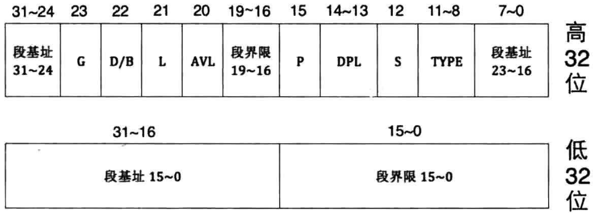

# 段描述符图例

段描述符是8字节大小，上图为了方便展示，才将其"人为地"分成了低32位和高32位，即两个4字节部分

# 段基地址
规定段的起始地址，长度32位

保护模式下地址总线宽度是32位，段基址需要用32位地址来表示

# 段界限(段长度)
规定段的大小，长度20位。段界限可以是以`4KB`或者`1B`为单元大小

段界限表示段边界的扩展最值，即最大扩展到多少或最小扩展多少
- 扩展方向只有上下两种
- 对于数据段和代码段，段的扩展方向是向上，即地址越来越低，此时的段界限用来表示`段内偏移的最小值`
- 无论是向上扩展，还是向下扩展，段界限的作用如同其名，表示段的边界、大小、范围
- 段界限用20个二进制位来表示，只不过此段界限只是个单位量，它的单位要么是字节，要么是4KB，这是由描述符中的G位来指定的
- 最终段的边界是此段界限值 * 单位，故段的大小要么是2的20次方等于1MB，要么是2的32次方(4KB等于2的次方，12+20=32)等于4GB

上面所说的1MB和4GB只是个范围，并不是具体的边界值。由于段界限只是个偏移量，是从0算起的，所以实际的段界限边界值 = (描述符中段界限 + 1) * (段界限的粒度大小: 4KB或者1) - 1

这个公式很简单，就是表示有多少个4KB或1.由于描述符的段界限是从0起的，所以左边第1个括号中要加1，表示4KB或1的实际数量

它与第二个括号中的段粒度大小相乘后得到的乘积是以1为起始的段实际大小，由于地址是以0为起始的，所以公式的最后又减1

内存访问嗯需要用到"段基值：段内偏移地址"，段界限其实是用来限制段内偏移地址的，段内偏移地址必须位于段的范围之内，否则CPU会抛异常

根据段的扩展方向，此"段界限 * 单位" 便是段内偏移地址的最大值(向上扩展)或最小值(向下扩展)，任何超过此值的偏移地址都被认为是非法访问，CPU会将此错误捕获

# 段属性
确定段的各种性质.长度(12位)

## G位
如果G位为0，表示段界限粒度大小为1字节，根据上面的公式，实际段界限=(描述符中段界限+1) * 1 - 1= 描述符中段界限，段界限实际大小就等于描述符中的段界限值

如果G位为1，表示段界限粒度为4KB字节，故实际段界限=(描述符中段界限+1) * 4K - 1。 举个例子，如果是平坦模式，段界限为0xFFFFF，G位为1，套用上面公式，段界限边界值=0x100000 * 0x1000 - 1 = 0xFFFFFFFF

