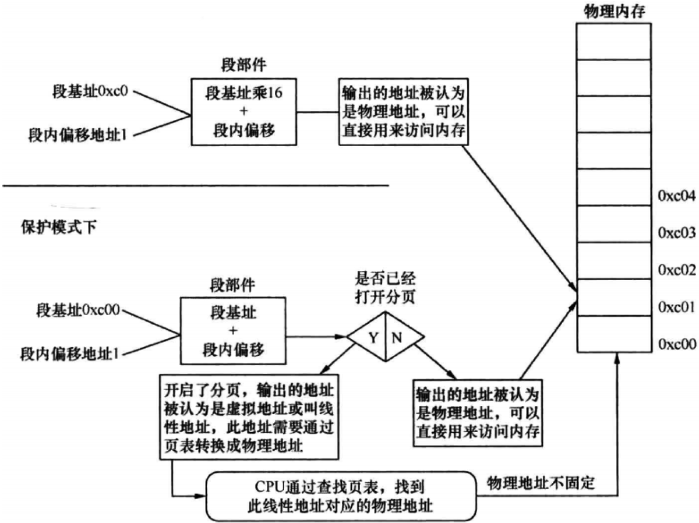

# 物理地址
物理地址就是物理内存真正的地址，相当于内存中每个存储单元的门牌号，具有唯一性

物理地址是内存访问的终点站

在实模式下，"段基址 + 段内偏移地址"经过段部件的处理，直接输出的就是物理地址，CPU可以直接用此地址访问内存

# 线性地址
在保护模式下，"段基址 + 段内偏移地址"称为线性地址

不过，此时的段基址已经不再是真正的地址了，而是一个称为选择子的东西

选择子的本质是一个索引，类似于数组下标，通过这个索引便能在GDT中找到相应的段描述符。在该描述符中记录了该段的起始、大小等消息，这样便得到了段基址

# 虚拟地址
若没有开启地址分页功能，此线性地址就被当作物理地址来用，可直接访问内存

若开启了分页功能，此线性地址又多了一个名字，就是虚拟地址(虚拟地址、线性地址在分页机制下都是一回事)

虚拟地址要经过CPU页部件转换成具体的物理地址，这样CPU才能将其送上地址总线去访问内存

# 逻辑地址、有效地址
无论在实模式或是保护模式下，段内偏移地址又称为有效地址地址，也称为逻辑地址，这是程序员可见的地址

这是因为，最终地址是由段基址和段内偏移地址组合而成的

由于段基址已经有默认的值，要么是在实模式下的默认段寄存器中，要么是在保护模式下的默认段选择子寄存器指向的段描述符中

所以只要给出段内偏移地址就行了，这个地址虽然只是段内偏移，但加上默认的段基址，依然足够有效

# 各地址图例
