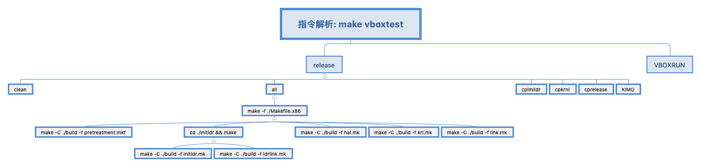

# 待解析指令
make vboxtest

# 指令解析
## make -f ./Makefile.x86 功能
使用make 执行 /build 目录的 pretreatment.mkf、hal.mk、krl.mk、link.mk 文件

使用 make 执行 /initldr/build 目录下 makefile文件

## make -C /build -f ./pretreatment.mkf 功能
主要功能: 生成要执行的文件

类似于通过make 的查找功能