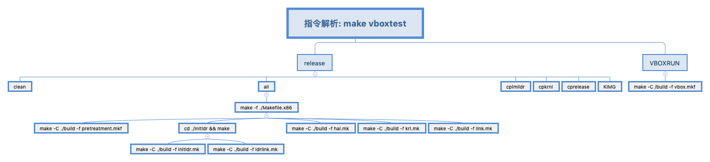

# 待解析指令
make vboxtest


# 指令解析
## make -f ./Makefile.x86 功能
使用make 执行 /build 目录的 pretreatment.mkf、hal.mk、krl.mk、link.mk 文件

使用 make 执行 /initldr/build 目录下 makefile文件

## make -C /build -f ./pretreatment.mkf 功能
主要功能: 生成要执行的文件

通过make 的查找功能,按文件名找到对应的文件
```
%.lds : $(CCBUILDPATH)%.S
	$(CC) $(CPPFLGSLDS) -o $@ $<
	$(PRINTCSTR)

%.mkh : $(CCBUILDPATH)%.S
	$(CC) $(CPPFLGSLDS) -o $@ $<
	$(PRINTCSTR)

%.mki : $(CCBUILDPATH)%.S
	$(CC) $(CPPFLGSLDS) -o $@ $<
	$(PRINTCSTR)

%.mk : %.mki
	$(LMKFBUID) -i $< -o $@
	$(PRINTCSTRLMK)
```

## cd /initldr && make 功能
### make -C /initldr/build -f initldr.mk功能
加载 krnlbuidcmd.mh、ldrobjs.mh 用于扩展功能

加载 krnlbuidrule.mh，增加构建规则
```
%.o : $(CCBUILDPATH)%.asm
	$(ASM) $(ASMBFLAGS) -o $@ $<
	@echo 'AS -[M] 正在构建...' $<

%.o : $(CCBUILDPATH)%.c
	$(CC) $(BTCFLAGS) -o $@ $<
	$(PRINTCSTR) 
```

然后 通过 执行 *.o文件查找对应得到构建规则，把对应 /initldr/include 头文件和 /initldr/idrkrl 中的 *.asm和 *.c 编译成 *.o文件

### make -C /initldr/build -f ldrlink.mk 功能
连接器功能

- ld -s -T initldrimh.lds -n -Map initldrimh.map -o initldrimh.elf imginithead.o inithead.o vgastr.o
  - 通过ld 把 imginithead.o inithead.o vgastr.o 链接成 initldrimh.elf
  - 同时将链接映射输出到指定的文件

- ld -s -T initldrkrl.lds -n  -Map initldrkrl.map -o initldrkrl.elf  ldrkrl32.o ldrkrlentry.o fs.o chkcpmm.o graph.o bstartparm.o vgastr.o
  - 通过ld 把 ldrkrl32.o ldrkrlentry.o fs.o chkcpmm.o graph.o bstartparm.o vgastr.o 链接成 initldrkrl.elf
  - 同时将链接映射输出到指定的文件

- ld -s -T initldrsve.lds -n -Map initldrsve.map -o initldrsve.elf realintsve.o
  - 通过 ld 把 realintsve.o 链接成 initldrsve.elf
  - 同时将链接映射输出到指定的文件

- objcopy -S -O binary initldrimh.elf initldrimh.bin 
  - 把initldrimh.elf 以二进制的方式拷贝成 initldrimh.bin 

- objcopy -S -O binary initldrkrl.elf initldrkrl.bin
  - 把initldrkrl.elf 以二进制的方式拷贝成 initldrkrl.bin

- objcopy -S -O binary initldrsve.elf initldrsve.bin
  - 把initldrsve.elf 以二进制的方式拷贝成 initldrsve.bin

## make -C /build -f hal.mk功能
hal自动化编译

加载 krnlbuidcmd.mh、ldrobjs.mh 用于扩展功能

加载 krnlbuidrule.mh，增加构建规则
```
%.o : $(CCBUILDPATH)%.asm
[$(ASM) $(ASMFLGS) -o $@ $<
[$(PRINTCSTR)

%.o : $(CCBUILDPATH)%.c
[$(CC) $(CFLAGS) -o $@ $<
[$(PRINTCSTR)

%.o : $(CCBUILDPATH)%.S
[$(CC) $(CFLAGS) -o $@ $<
[$(PRINTCSTR)	
```

然后 通过 执行 *.o文件查找对应得到构建规则，把对应 /hal/x86/ *.asm和 *.c 编译成 *.o文件

## make -C /build -f krl.mk功能
krl自动化编译

加载 krnlbuidcmd.mh、ldrobjs.mh 用于扩展功能

加载 krnlbuidrule.mh，增加构建规则

## make -C /build -f link.mk
链接器功能

加载 krnlbuidcmd.mh、ldrobjs.mh 用于扩展功能

- ld -s -static -T cosmoslink.lds -n -Map cosmos.map -o Cosmos.elf init_entry.o hal_start.o
   - 通过ld 把 init_entry.o hal_start.o 链接成 Cosmos.elf
  - 同时将链接映射输出到指定的文件

- objcopy -S -O binary Cosmos.elf Cosmos.bin
  - 把Cosmos.elf 以二进制的方式拷贝成 Cosmos.bin

## cplmildr 功能
移动文件

把 ./initldr/build/ 的文件移动到 ./release/

## cpkrnl 功能
进入./build目录，把 Cosmos.bin 文件移动到  ../exckrnl

## cprelease 功能
进入 ./exckrnl目录, 把 Cosmos.bin 文件 移动到 ../release

## KIMG 功能
进入./release/，通过 lmoskrlimg 把 initldrimh.bin initldrsve.bin initldrkrl.bin Cosmos.bin font.fnt logo.bmp background.bmp 打包成 Cosmos.eki

## make -C /build -f vbox.mkf 功能