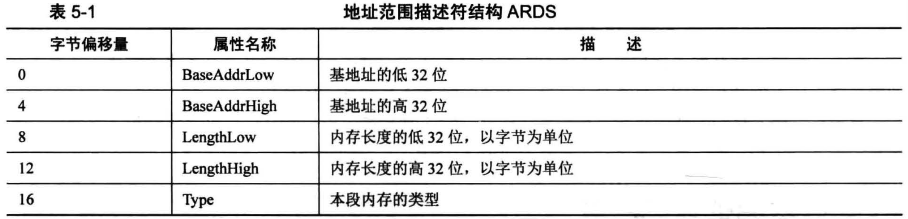
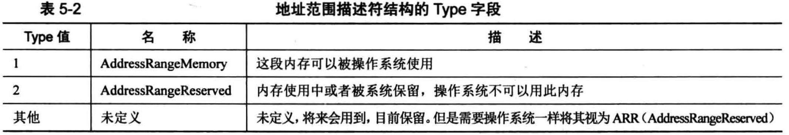
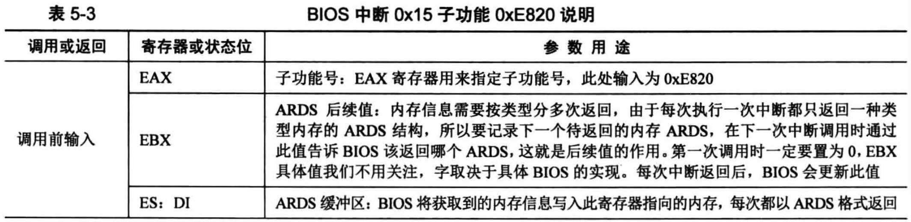
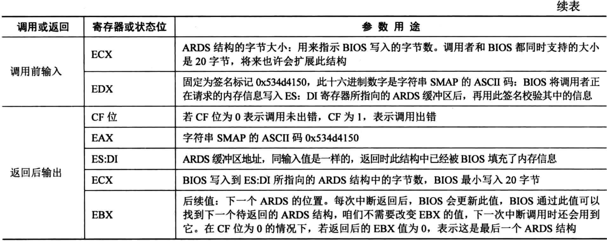
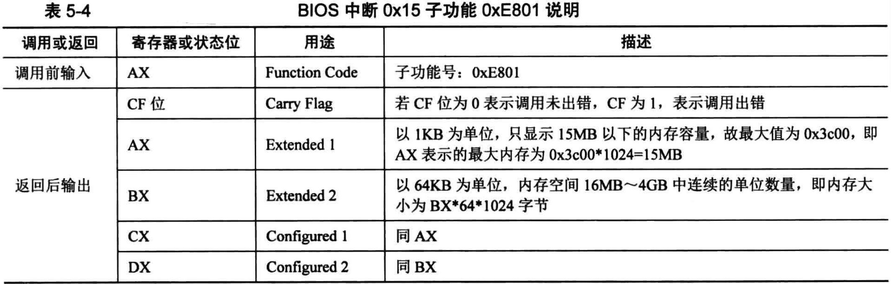
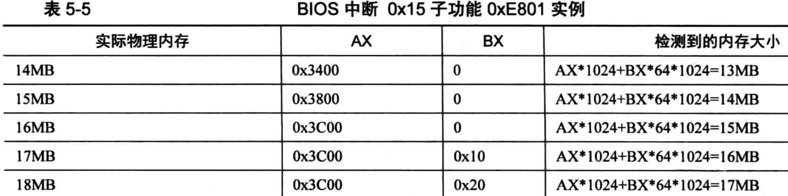
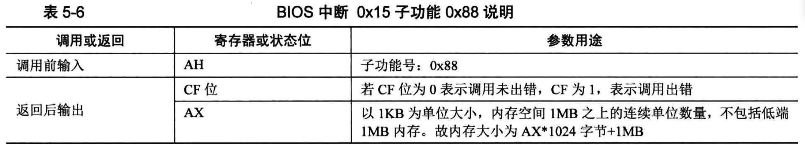

# 获取内存的方法
通过调用BIOS中断0x15实现的，分别是BIOS中断0x15的子功能，子功能号要存放到寄存器EAX或AX中
- EAX = 0xE820: 遍历主机上全部内存
- AX = 0xE801: 分别检测低15MB和16MB ~ 4GB的内存，最大支持4GB
- AH = 0x88: 最多检测出64MB内存，实际内存超过此容量也按照64MB返回

BIOS 中断是实模式下的方法，只能在进入保护模式前调用

BIOS 中断可以返回已安装的硬件信息，由于BIOS及其中断也只是一组软件，它要访问硬件也要依靠硬件提供的接口，所以，获取内存信息是通过连续调用硬件的应用程序接口(Application ProgramInterface, API)来获取内存信息的

另外，由于每次调用BIOS中断都是有一定的代价的(比如至少要将程序的上下文保护起来以便中断返回时可以回到原点继续向下执行)，所以尽量在一次中断中返回足量的信息，由用户程序自己挑出重点内容

BIOS 0x15中断提供了丰富的功能，具体要调用的功能，需要在寄存器ax中指定
- 0x15中断的子功能0xE820和0xE801都可以用来获取内存，区别是0xE820返回的是内存布局，信息量相对多一些，操作也相对复杂
- 而0xE801直接返回的是内存容量，操作适中，不繁不简
- 子功能0x88也能获取内存容量，不过操作越简单，功能也就越薄弱

# 利用BIOS中断0x15子功能0xe820获取内存
## 概述
BIOS中断0x15的子功能0xE820能够获取系统的内存布局，由于系统内存各部分的类型属性不同，BIOS就按照类型属性来划分这片系统内存，所以这种查询呈迭代式，每次BIOS只返回一种类型的内存信息，直到将所有内存类型返回完毕

子功能0xE820的强大之处是返回的内存信息较丰富，包括多个属性字段，所以需要一种格式结构来组织这些数据

内存信息的内容是用地址范围描述符来描述的，用于存储这种描述符的结构称之为地址范围描述符(Address Range Desciptor Structure, ARDS)

## ARDS解释

- 此结构中的字段大小都是4字节，共5个字段，所以此结构大小为20字节
- 每次int 0x15之后，BIOS就返回一个结构数据
- 注意，ARDS结构中用64位宽度的属性来描述符这段内存基地址(起始地址)及其长度，所以表中的基地址和长度都分为低32位和高32位两部分

其中的Type字段用来描述这段内存的类型，这里所谓的类型是说明这段内存的用途，即其是可以被操作系统使用，还是保留起来不能用


为什么BIOS会按类型来返回内存信息？原因是这段内存可能是
- 系统的ROM
- ROM用到了这部分内存
- 设备内存映射到了这部分内存
- 由于某种原因，这段内存不适合标准设备使用

由于在32位环境下工作，所以ARDS结构属性中，只用到低32位属性。BaseAddrLow + LengthLow是一片内存区域上限，单位是字节

正常情况下，不会出现较大的内存区域不可用的情况，除非安装的物理内存极其小。这意味着，在所有返回的ARDS结构里，此值最大的内存块一定是操作系统可使用的部分，即主板上配置的物理内存容量

## BIOS中断0x15子功能0xE820说明


表中的ECX寄存器和ES:DI寄存器,是典型的"值-结果"型参数，即调用方提供了两个变量作为被调用函数的参数，一个变量是缓冲区指针，另一个变量是缓冲区大小

被调用函数在缓冲区中写入数据后，将实际所写入的字节数记录到缓冲区大小变量中

中断调用步骤
- 填写好"调用前输入"中列出的寄存器
- 执行中断调用int 0x15
- 在CF位为0的情况下，"返回后输出"中对应的寄存器便会有对应的结果


# 利用BIOS中断0x15子功能0xE801获取内存
## 概述
另一个获取内存容量的方法是BIOS 0x15中断子功能0xE801

此方法虽然简单，功能也不强大，最大只能识别4GB内存

稍有不便的是此方法检测的内存是分别存放到两组寄存器的
- 低于15MB的内存以1KB为单位大小来记录，单位数量在寄存器AX和CX中记录，其中AX和CX的值是一样的，所以在15MB空间以下的实际内存容量=AX * 1024. AX、CX最大值为0x3c00，即0x3c00 * 1024 = 15MB
- 16MB ~ 4GB时以64KB为单位大小来记录的，单位数量在寄存器BX和DX中记录，其中BX和DX的值是一样的，所以16MB以上空间的内存实际大小=BX * 64 * 1024,不用在意BX和DX最大值是多少

## BIOS中断0x15子功能0xE801说明


### 为什么要分"前15MB"和"16MB以上"这两部分来展示4GB内存？

"实际物理内存"和"检测到的内存大小"，它们之间总是差1MB，言外之意是总有1MB内存不可用

多问题都是祖上传下来的，即著名的历史遗留问题。 80286 拥有 24 位地址线，其寻址空间是 16MB 

当时有一些 ISA 设备要用到地址 15MB以上的内存作为缓冲区，也就是此缓冲区为大小，所以硬件系统就把这部分内存保留下来，操作系统不可以用此段内存空间。保留的这部分内存区域就像不可以访问的黑洞,这就成了内存空洞 memory_hole

现在虽然很少很少能碰到这些老 ISA 设备了，但为了兼容，这部分空间还是保留下来，只不过是通过 BIOS 选项的方式由用户自己选择是否开启

memory hole at address 15m - 16m
- 将此选项设为 enable 或 disable 便开启或关闭对这类扩展 ISA 设备的支持
- 话说，起初定义这个 Oxe801 子功能，就是为了支持扩展 ISA 服务

问题回答
- 如果检测到的内存容量大于等于16MB,BIOS 0x15中断返回的结果中, AX * l024必然是小于等于15MB, 而BX * 64 * 1024肯定大于 0
- 所以，内存容量分成两部分展示，只要符合这两个结果，就能检查出内存空洞
- 当然如果物理内存在 16MB 以下，此方法就不灵了，但检测到的内存依然会小于实际内存1MB
- 所以实际的物理内存大小，在检测结果的基础上一定要加上1MB


### 为什么寄存器结果是重复的？如寄存器 AX 和 ex 相等， BX 和 DX 相等？
```
Not sure what this difference between the ”Extended” and ”Configured” numbers are, but they appear to beidentical, as reported from the BIOS
```
不清楚"Extended"和"Configured"之间的区别，但它们似乎是相同的， BIOS 就是这样说的


### 此中断步骤调用
- 将AX寄存器写入0xE801
- 执行中断调用int 0x15
- 在CF位为0的情况下，"返回后输出"中对应的寄存器便会有对应的结果

# 利用BIOS中断0x15子功能0x88获取内存


中断调用步骤
- 将AX寄存器写入0x88
- 执行中断调用int 0x15
- 在CF位为0的情况下，“返回后输出”中对应的寄存器便会有对应的结果